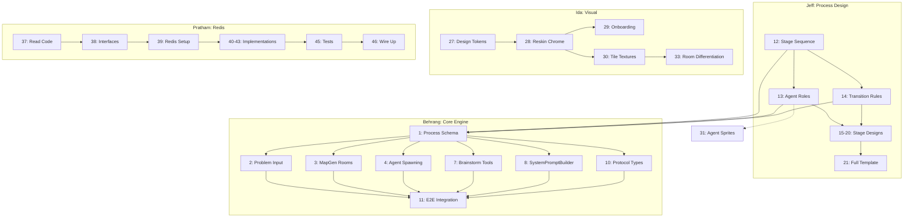

# Agent Dungeon: Task Board

## Team

| Name | Area(s) | Notes |
|------|---------|-------|
| Ida | Visual Design / Presentation | Skinning, splash page, public-facing styles, presentation strategy |
| Jeff | Brainstorming Process Design | Defining the brainstorming methodology: stages, agent roles, orchestration logic |
| Pratham | Agent Memory / Persistence | Working on Redis agent memory |
| Behrang | Core Engine / Agent Orchestration | Getting core working, rooms represent agents, agent orchestration |
| Ken | Project Management / Process Design | PM, workflows, process definitions for orchestrator and agents |

---

## Status Key

- **Done**: Merged and working
- **In Progress**: Actively being worked on
- **TODO**: Not started, ready to pick up
- **Blocked**: Waiting on something else

---

## 2-Hour Sprint Plan

**Demo problem:** "Generate ideas for a new web agent"
**Demo format:** Live demo + recording (must run end-to-end; can pick best recording take)
**Process design format:** Jeff outputs prose + Mermaid; Behrang translates into runtime schema

### Critical Path

The single gating dependency runs through Jeff → Behrang → Integration:

```
Jeff (12-14): process design  →  Behrang (1): schema from Jeff's docs  →  Behrang (2-8): engine  →  (11): E2E demo
```

Everything else (Ida's visual work, Pratham's Redis work) runs in parallel with zero cross-team blockers.

### Dependency Map



### Hour 1: Foundations (all parallel)

| Who | Tasks | Deliverable |
|-----|-------|-------------|
| **Jeff** | 12, 13, 14 | Mermaid flowchart of stages, agent role definitions, transition rules. **This unblocks Behrang.** |
| **Behrang** | 1 (draft from BRIEF.md), 10 | Draft process schema types, updated protocol types. Refine schema once Jeff's docs land. |
| **Ida** | 27, 28 | Design tokens file + reskinned game chrome (dungeon palette, fonts). |
| **Pratham** | 37, 38, 39 | Read existing persistence code, extract TS interfaces, Redis client + Docker setup. |
| **Ken** | Review, unblock | Review Jeff's output as it lands, make process design decisions, keep alignment. |

**Hour 1 checkpoint:** Jeff's process design is done. Behrang has draft schema + protocol types. Ida's game looks different. Pratham has interfaces and Redis running.

### Hour 2: Build the Demo (converge)

| Who | Tasks | Deliverable |
|-----|-------|-------------|
| **Jeff** | 15, 17, 21 | Detailed Divergent + Convergent stage designs, full process template Mermaid. |
| **Behrang** | 2, 3, 4, 7, 8 | Problem input screen, stage rooms, process-driven spawning, brainstorm tools, role prompts. |
| **Ida** | 29, 30, 31 | Reskinned onboarding, dungeon tile textures, agent sprites for known types. |
| **Pratham** | 40, 41, 42 | RedisKnowledgeVault, RedisFindingsBoard, RedisWorldStatePersistence. |

**Hour 2 checkpoint:** Demo runs: enter problem → agents spawn in rooms → brainstorm → output visible. Looks like a dungeon. Redis available as backend.

### Cut for Demo (explicitly deprioritized)

These are real tasks but **not needed for the 2-hour demo**:

- **Task 5** (conditional/branching engine): Use linear stage flow. No branching for demo.
- **Task 6** (turn system refactor): Round-robin works for demo.
- **Tasks 16, 18, 19, 20** (Research, Fact Check, Prioritization, Presentation stage designs): Demo runs a subset of stages, not all nine.
- **Task 9** (WorldState refactor): Extend with process fields; don't rewrite.
- **Tasks 43-47** (remaining Redis: registry, transcript, tests, wiring, pub/sub): Nice-to-haves.
- **Tasks 23-26** (polish/stability): Post-demo.
- **Tasks 33-36** (room differentiation, sound, tutorial, responsive): Post-demo.
- **Tasks 48-54** (agent intelligence, features, extensions): Post-demo.

---

## What's Built (Done)

These are working and merged on `main`:

### Bridge Server
- [x] WebSocket hub and message routing (`BridgeServer.ts`)
- [x] World state management (`WorldState.ts`)
- [x] Turn management with round-robin and 5s timeout
- [x] Action validation
- [x] GitHub repo analysis via Octokit (`RepoAnalyzer.ts`)
- [x] Local filesystem repo analysis (`LocalTreeReader.ts`)
- [x] Hierarchical map generation from repo structure (`MapGenerator.ts`)
- [x] Quest management mapped from GitHub issues (`QuestManager.ts`)
- [x] Findings board for shared agent discoveries (`FindingsBoard.ts`)
- [x] Per-agent knowledge vaults with persistence (`KnowledgeVault.ts`)
- [x] Realm registry for session resumption (`RealmRegistry.ts`)
- [x] World state persistence/serialization (`WorldStatePersistence.ts`)
- [x] Agent session management via Claude Agent SDK (`AgentSessionManager.ts`)
- [x] Custom MCP server with 6 RPG tools (`RpgMcpServer.ts`)
- [x] Dynamic system prompt builder (`SystemPromptBuilder.ts`)
- [x] Event translator for SDK streaming -> RPG events (`EventTranslator.ts`)
- [x] Transcript logging (`TranscriptLogger.ts`)
- [x] Server tests (vitest): FindingsBoard, EventTranslator, WorldStatePersistence, MapGenerator, CustomToolHandler, KnowledgeVault, QuestManager, RealmRegistry

### Phaser Client
- [x] Tile map rendering (`MapRenderer.ts`)
- [x] Programmatic texture generation (no asset files)
- [x] Agent sprites with walk/idle animations (`AgentSprite.ts`)
- [x] Map object sprites for files (`MapObjectSprite.ts`)
- [x] JRPG dialogue system with typewriter effect (`DialogueSystem.ts`)
- [x] Thought bubbles (`ThoughtBubble.ts`)
- [x] Emote bubbles (!, ?, heart, sweat, music)
- [x] Skill effect animations (`EffectSystem.ts`)
- [x] Camera controller with snap/pan (`CameraController.ts`)
- [x] Prompt bar with slash-command autocomplete (`PromptBar.ts`)
- [x] Quest log panel (`QuestLog.ts`)
- [x] Minimap with folder tree (`MiniMap.ts`)
- [x] Dialogue log (`DialogueLog.ts`)
- [x] Title screen (`TitleScreen.ts`)
- [x] Repo selection screen (`RepoScreen.ts`)
- [x] WebSocket client with auto-reconnect (`WebSocketClient.ts`)

### Python Agents
- [x] Scripted demo agent (`agent.py` + `behaviors.py`)
- [x] LLM-powered agent via Claude API (`llm_agent.py` + `llm_behavior.py`)
- [x] Protocol dataclass helpers (`protocol.py`)

### Infrastructure
- [x] GitHub Actions CI (type checking, server tests, codecov)
- [x] `start-all.sh` launch script
- [x] Shared protocol types (`shared/protocol.ts`)
- [x] Project brief and architecture docs

---

## What Needs to Be Done

### High Priority: Pivot to Process-Driven Brainstorming (Behrang)

> The system is pivoting from "analyze a codebase" to "run a brainstorming process." These tasks convert the engine from repo exploration to following a defined process with agents, conditionals, and branching paths. Ordered by dependency.

| # | Task | Owner | Status | Notes |
|---|------|-------|--------|-------|
| 1 | Define the Process Schema | Behrang | Done | `shared/process.ts`: ProcessDefinition, StageDefinition, RoleDefinition, TurnStructure, CompletionCriteria, ArtifactDefinition, ProcessState, STANDARD_BRAINSTORM template. Server mirror in `server/src/ProcessTemplates.ts`. |
| 2 | Replace onboarding flow: problem input instead of repo URL | Behrang | Done | `player:start-process` message + `handleStartProcess` in BridgeServer. RepoScreen copy updated to problem input. `process:started` listener in main.ts triggers `startGame()`. |
| 3 | Rebuild MapGenerator to create rooms from process stages, not folders | Behrang | Done | `generateProcessStageMap()` added to MapGenerator. Uses stage roles for room layout, decorates objects with stage artifact labels and a stage banner. `spawnProcessAgents()` uses this. |
| 4 | Rewrite agent spawning to be process-driven | Behrang | Done | `spawnProcessAgents()` passes full `ProcessAgentContext` to each agent. `SystemPromptBuilder.buildProcessPrompt()` generates stage-aware, persona-driven prompts. Brainstorm MCP server selected automatically when `processContext` present. |
| 5 | Build the conditional/branching engine | Behrang | Done | `ProcessController.ts` (new): tracks turn counts per stage, evaluates `turn_count` and `explicit_signal` completion criteria, advances through linear stages. Delegate callbacks to BridgeServer for agent dismiss/spawn/broadcast/worldState updates. |
| 6 | Update turn system from round-robin to process-driven | Behrang | Done | ProcessController drives sequential turns: after each `agent:idle`, the next agent in `turnStructure.order` receives a follow-up prompt. `parallel` stages run agents concurrently. `single` stages run one agent. |
| 7 | Replace MCP tools with brainstorming tools | Behrang | Done | `createBrainstormMcpServer()` added: `PostFindings`, `UpdateKnowledge`, `CompleteStage`. `CompleteStage` triggers explicit stage advancement. Agents automatically get brainstorm server when `processContext` present. |
| 8 | Update SystemPromptBuilder for process roles | Behrang | Done | `buildProcessPrompt()` added: persona-aware, stage-aware, includes prior stage artifacts, team roster, findings, brainstorming tools. Routes from `buildSystemPrompt()` when `processContext` present. |
| 9 | Update WorldState to track process state instead of repo state | Behrang | Done | `ProcessState` added to WorldState with setProcessState/getProcessState/advanceStage/completeProcess/setArtifact. Serialization updated. Repo fields kept for backward compat during transition. |
| 10 | Update shared protocol types for process events | Behrang | Done | `player:start-process`, `process:started`, `stage:advanced`, `stage:completed`, `idea:proposed`, `idea:voted` added to all three type files. |
| 11 | End-to-end integration: problem input -> process loads -> agents spawn -> brainstorm runs -> output | Behrang | Done | Full flow wired: problem input → ProcessState → spawnProcessAgents (with ProcessAgentContext + brainstorm MCP) → ProcessController tracks turns → sequential follow-ups → stage advancement → process:completed. 209 server tests pass. |

### High Priority: Brainstorming Process Design (Jeff)

> Jeff defines the methodology: what does "brainstorming" actually mean as a structured, multi-agent process? This is the intellectual backbone that Behrang's engine executes. The output is a process definition (stages, roles, transitions, conditionals) that the orchestrator follows. Each stage spawns specific agent roles with distinct thinking styles.

**Brainstorming stages and the thinking modes they require:**

| Stage | Thinking Mode | Purpose |
|-------|--------------|---------|
| Problem Framing | Analytical | Break the problem down, define scope, identify constraints |
| Divergent Thinking | Creative/Generative | Generate as many ideas as possible without judgment |
| Precedent Research | Investigative | Find existing solutions, analogies, prior art |
| Convergent Thinking | Evaluative | Cluster, combine, and narrow ideas into candidates |
| Fact Checking | Critical/Analytical | Verify claims, check feasibility, identify assumptions |
| Pushback / Red Team | Adversarial | Stress-test ideas, find weaknesses, argue the opposite |
| Prioritization | Strategic | Rank candidates by impact, feasibility, effort |
| Review / Synthesis | Integrative | Combine the best elements into a coherent proposal |
| Presentation | Communicative | Package the output for the human audience |

| # | Task | Owner | Status | Notes |
|---|------|-------|--------|-------|
| 12 | Define the brainstorming stage sequence and flow | Jeff | Done | Document the ordered stages a brainstorming session moves through as a Mermaid diagram (`graph TD`). Which stages are required vs optional? Which can run in parallel? Where are the decision points that branch the flow? Output: a Mermaid flowchart in `docs/` with entry/exit criteria for each stage. **Blocks:** #13, #14, Behrang #1. **CRITICAL PATH: do first.** |
| 13 | Define agent roles and their thinking styles | Jeff | Done | Each stage spawns agents with specific personas. e.g. Divergent stage gets a "Wild Ideator" and a "Cross-Pollinator"; Pushback stage gets a "Devil's Advocate" and a "Pragmatist." For each role: name, personality traits, reasoning style, what they optimize for, what they ignore. These become the system prompt personas Behrang wires into SystemPromptBuilder. **Blocked by:** #12. **Blocks:** Behrang #1, #4, #8; Ida #31. **CRITICAL PATH.** |
| 14 | Define stage transition rules and conditionals | Jeff | Done | What triggers moving from one stage to the next? Options: time limit, idea count threshold, agent consensus, human approval, or automatic after N turns. Some transitions are conditional: e.g. if fact-checking finds major flaws, loop back to divergent thinking. Define the rules for each transition. **Blocked by:** #12. **Blocks:** Behrang #1, #5, #6. **CRITICAL PATH.** |
| 15 | Design the Divergent Thinking stage | Jeff | Done | The generative phase. How many agents? What are their prompts? How do they avoid groupthink (e.g. agents don't see each other's ideas until the stage ends)? What's the output format (list of ideas with brief rationale)? When does it end (time, count, saturation)? |
| 16 | Design the Precedent Research stage | Jeff | Done | Agents search for existing solutions, analogies from other domains, and prior art. What sources can they draw from (web search, provided context, their own training data)? How do they report findings? How does this feed into the next stage? |
| 17 | Design the Convergent Thinking stage | Jeff | Done | Takes the raw ideas from divergent + research and clusters/combines them. Agent role: "Synthesizer" who groups related ideas, "Connector" who finds combinations. Output: a shorter list of refined candidate ideas. Needs a defined format so prioritization can consume it. |
| 18 | Design the Fact Checking and Pushback stages | Jeff | Done | Two related but distinct stages. Fact Checking: verify claims, check feasibility, flag assumptions. Pushback/Red Team: actively argue against each candidate, find failure modes, identify risks. Define how harshly agents push back, what counts as a "kill" vs a "flag." Output: annotated candidates with risk/confidence scores. |
| 19 | Design the Prioritization stage | Jeff | Done | Takes annotated candidates and ranks them. What criteria? (impact, feasibility, novelty, effort, risk). Single agent with a scoring rubric, or multiple agents that vote? Define the ranking mechanism and output format (ordered list with scores and rationale). |
| 20 | Design the Review and Presentation stages | Jeff | Done | Review: a final synthesis agent combines the top-ranked ideas into a coherent proposal. Presentation: format the output for the human; clear structure, key recommendations, supporting evidence, acknowledged risks. Define what the final deliverable looks like. |
| 21 | Write the first complete process template as a Mermaid diagram | Jeff | Done | Delivered as `DEEP_BRAINSTORM` ProcessDefinition in `shared/process.ts` + `server/src/ProcessTemplates.ts` (conforms to Behrang's V1 schema). Full spec in `skills/brainstorm/DESIGN.md` and `skills/brainstorm/brainstorm-process.json`. |
| 22 | Define how human intervention points work | Jeff | Done | At which stages can/should the human jump in? Options: approve stage transitions, inject their own ideas, redirect the brainstorm, kill a line of thinking, ask for more depth on a topic. Define the interaction model between the watching human and the running process. |

### High Priority: Polish & Stability

| # | Task | Owner | Status | Notes |
|---|------|-------|--------|-------|
| 23 | Client-side tests | | TODO | At minimum: scene lifecycle, WebSocket message handling, panel rendering |
| 24 | Error handling for process loading and agent failures | | TODO | User-facing error messages in the client |
| 25 | Graceful handling when agent SDK session disconnects or errors | | TODO | Reconnection, error state in UI |
| 26 | Loading states during process initialization | | TODO | Progress indicator or spinner in client |

### Medium Priority: Visual & UX — Ida's Task Breakdown

> Ida owns the visual identity of Agent Dungeon. She's created a complete design spec (`docs/agent-dungeon-design-spec.md`) and a first-pass landing page (`landing.html`). These tasks bridge that design work into the running game client. Ordered by dependency; each task is scoped for a single Claude Code session.
>
> **How to work these:** Each task has a "Prompt hint" — a starting point for what to tell Claude Code. Ida makes the design decisions; Claude Code writes the code.

| # | Task | Owner | Status | Notes |
|---|------|-------|--------|-------|
| 27 | Create shared design tokens file | Ida | TODO | Extract the color palette, typography, and spacing values from the design spec into `ha-agent-rpg/shared/design-tokens.ts`. This becomes the single source of truth that both the landing page and game client import. Export hex values as both strings (`"#0a0810"`) and numbers (`0x0a0810`) so Phaser's graphics API can use them directly. Include CSS custom property names so they can be injected into the DOM. **Prompt hint:** "Read `docs/agent-dungeon-design-spec.md` and create a TypeScript file at `ha-agent-rpg/shared/design-tokens.ts` that exports all color tokens, font families, and spacing values. Export hex colors as both string and numeric formats." |
| 28 | Reskin game client UI chrome (index.html) | Ida | TODO | Retheme the HTML/CSS wrapper around the game canvas. This is the sidebar, dialogue log, prompt bar, settings panel, buttons, inputs, onboarding screens, and scrollbars. Swap the current blue/sci-fi palette (`#6a8aff`, `#0a0a1a`, `#111128`) to dungeon stone/flame/gold from the design spec. Add Google Fonts (Cinzel, Cormorant Garamond, DM Mono). Keep Courier/monospace only in the prompt textarea. **Prompt hint:** "Read `ha-agent-rpg/client/index.html` and `docs/agent-dungeon-design-spec.md`. Retheme all CSS in index.html to match the design spec. Replace the blue accent color with flame orange, dark backgrounds with dungeon stone values, and bring in the Google Fonts from the spec. Cinzel for headings/labels/buttons, Cormorant for body text, DM Mono for system/terminal text. Keep the HTML structure; only change styles." **Blocked by:** #27 (tokens file should exist first, but this can also be done standalone by hardcoding the values) |
| 29 | Reskin onboarding screens (Title + Repo) | Ida | TODO | The title screen and repo selection screen (`TitleScreen.ts`, `RepoScreen.ts`) build their DOM elements in TypeScript. Restyle them to match the Art Nouveau dungeon aesthetic: gold ornamental borders, flame-colored CTAs, Cinzel display type for the logo, dungeon stone backgrounds. The `.title-logo` currently has a blue glow; swap it for warm torch glow. **Prompt hint:** "Read `ha-agent-rpg/client/src/ui/TitleScreen.ts` and `ha-agent-rpg/client/src/ui/RepoScreen.ts`. Update all inline styles and class references to match the design spec. The title should use Cinzel Decorative with a warm text-shadow instead of blue. Buttons should be flame-colored with gold borders." **Blocked by:** #28 (CSS in index.html should be updated first) |
| 30 | Retheme BootScene tile textures to dungeon stone palette | Ida | TODO | `BootScene.ts` generates all tile textures procedurally. The current palette is generic greens and grays. Recolor to match the design spec's dungeon atmosphere: stone floors use the Dungeon Stone palette (void through stone-6), walls use darker stone tones with mortar in stone-4, doors get warm wood with gold hardware. Water can stay blue-ish but shifted toward the Water agent type colors. **Prompt hint:** "Read `ha-agent-rpg/client/src/scenes/BootScene.ts` and `docs/agent-dungeon-design-spec.md`. Recolor all tile generation methods to use the design spec's Dungeon Stone palette. Replace the green grass tiles with dark stone floor tiles. Update wall colors to match dungeon stone. Door hardware should use gold tones. Import and use the numeric hex values from `shared/design-tokens.ts`." |
| 31 | Design brainstorming agent sprites | Ida | TODO | Agent sprites are currently colored rectangles generated in `AgentSprite.ts`. Design distinct character appearances for the brainstorming personas (once Jeff defines them in tasks #13-#20). Each agent type needs a visually distinct silhouette/color scheme that reads at 32x32px. Start with the known types: Orchestrator (gold/throne), Code/Debug (purple), Research/Plan (green), Review/Test (blue). Output: either pixel art reference images or detailed descriptions that Claude Code can translate into `AgentSprite.ts` draw calls. **Prompt hint:** "Read `ha-agent-rpg/client/src/sprites/AgentSprite.ts` and `docs/agent-dungeon-design-spec.md`. Replace the simple colored rectangle with a more detailed pixel character. Use the agent type colors from the spec. Each agent should have a 2-frame idle animation and a 2-frame walk animation. The Orchestrator gets a crown/cape detail, Code agents get a potion/flask detail, Research agents get a book/scroll detail, Review agents get a shield detail." **Blocked by:** Jeff's role definitions (#13) for final persona list, but can start with the four base types now |
| 32 | Finalize landing page to spec | Ida | In Progress | `landing.html` exists as a first iteration. Review against the design spec and tighten: verify all CSS variables match the token file (#27), confirm typography hierarchy follows the Font Pairing Rules, check animation timings against the Animation Tokens table, ensure room images display correctly, test the spawn/despawn sequence timing. **Prompt hint:** "Read `landing.html` and `docs/agent-dungeon-design-spec.md`. Audit the landing page CSS against the spec. Fix any colors, fonts, spacings, or animation timings that don't match. Make sure the spawn/despawn sequence follows the timing table in the spec." |
| 33 | Add room-type visual differentiation to map tiles | Ida | TODO | Right now all rooms look the same on the game map. The design spec defines distinct visual themes per room type (Throne Room = carpet/gold, Laboratory = purple potions, Library = green ivy, etc.). Add colored accents or border tints to the floor/wall tiles so each room reads differently on screen. This could be tint overlays in `MapRenderer.ts` or room-specific tile variants in `BootScene.ts`. **Prompt hint:** "Read `ha-agent-rpg/client/src/map/MapRenderer.ts` and `docs/agent-dungeon-design-spec.md`. Add room-type visual differentiation so each room type has a distinct color accent matching the spec's Room-to-Agent Mapping table. Options: tint the floor tiles per room type, add colored border highlights, or generate room-specific tile variants." **Blocked by:** #30 (base tile reskin should land first) |
| 34 | Sound effects and ambient audio | | TODO | Movement, dialogue open/close, skill effects, background music |
| 35 | Onboarding tutorial or hints for first-time users | | TODO | Explain what they're looking at, how to interact |
| 36 | Responsive layout or at minimum handle window resize gracefully | | TODO | Currently 640x480 fixed |

### Medium Priority: Redis Agent Memory (Pratham)

> The persistence layer currently uses JSON files on disk via `fs/promises`. Every module follows the same pattern: load JSON into memory on startup, mutate in-memory, save back to disk. This needs to move to Redis for speed, cross-session persistence, and multi-agent scale. Ordered by dependency.

**Current persistence modules and their consumers:**

| Module | What it stores | Consumers |
|--------|---------------|-----------|
| `KnowledgeVault` | Per-agent memory: expertise levels, insights, task history | AgentSessionManager (creates per spawn), CustomToolHandler (UpdateKnowledge tool), SystemPromptBuilder (reads for prompts) |
| `FindingsBoard` | Shared discovery/ideas board | BridgeServer (creates per session), CustomToolHandler (PostFindings tool), SystemPromptBuilder (reads for prompts) |
| `WorldStatePersistence` | Full serialized game/process state | BridgeServer (save/load on session start/end) |
| `RealmRegistry` | Global registry of sessions (currently repos, will become brainstorming sessions) | BridgeServer (session management, resumption) |
| `TranscriptLogger` | Append-only JSONL event logs per agent | BridgeServer, AgentSessionManager (logs every SDK message) |

#### Abstracted Interfaces (Design Against These)

The existing JSON-file modules each follow the same lifecycle: construct → `load()` from disk → mutate in memory → `save()` back to disk. Below are the exact public interfaces Pratham should replicate in Redis. The goal: every consumer (`BridgeServer`, `AgentSessionManager`, `CustomToolHandler`, `SystemPromptBuilder`) keeps calling the same methods; only the storage backend changes.

##### IKnowledgeVault

Source: `server/src/KnowledgeVault.ts`. One instance per agent (created on spawn, disposed on idle/completion).

```typescript
// Data shape stored per agent
interface AgentKnowledge {
  agent_id: string;
  agent_name: string;
  role: string;
  realm: string;
  expertise: Record<string, number>;       // skill area → level
  realm_knowledge: Record<string, number>; // directory → familiarity
  insights: string[];
  task_history: Array<{ task: string; outcome: string; timestamp: string }>;
  files_analyzed: string[];
}

interface IKnowledgeVault {
  load(): Promise<void>;                          // Hydrate from storage (no-op if nothing saved yet)
  save(): Promise<void>;                          // Flush current state to storage
  getKnowledge(): AgentKnowledge;                 // Return shallow copy of current state
  addInsight(insight: string): void;              // Append to insights (in-memory, flushed on save)
  recordFileAnalyzed(filePath: string): void;     // Track file + bump realm_knowledge (in-memory)
  incrementExpertise(area: string, amount?: number): void;  // Bump expertise score (default +1)
  addTaskHistory(task: string, outcome: string): void;      // Append to task_history with auto-timestamp
  getExpertiseSummary(): string;                  // Human-readable top-5 expertise
  getRealmSummary(): string;                      // Human-readable top-5 realm knowledge
}
```

**Key pattern:** Mutations (`addInsight`, `incrementExpertise`, etc.) are synchronous/in-memory. `save()` is the async flush. Consumers call mutations frequently and `save()` once when the agent idles or completes. A Redis impl could either batch writes on `save()` or write-through on each mutation; the interface supports both.

**Redis key suggestion:** `agent:{agentId}:knowledge` (hash for scalar fields) + `agent:{agentId}:insights` (list) + `agent:{agentId}:task_history` (list of JSON strings) + `agent:{agentId}:files_analyzed` (set).

##### IFindingsBoard

Source: `server/src/FindingsBoard.ts`. One instance per session (shared across all agents).

```typescript
interface Finding {
  id: string;               // Auto-generated: `finding_{timestamp}_{randomHex}`
  agent_id: string;
  agent_name: string;
  realm: string;
  finding: string;
  severity: 'low' | 'medium' | 'high';
  timestamp: string;        // ISO 8601
}

interface IFindingsBoard {
  load(): Promise<void>;                                          // Hydrate from storage
  save(): Promise<void>;                                          // Flush to storage
  addFinding(entry: Omit<Finding, 'id' | 'timestamp'>): Finding; // Append, auto-generate id + timestamp, return entry
  getAll(): Finding[];                                            // All findings (defensive copy)
  getRecent(limit?: number): Finding[];                           // Last N findings (default 20)
  getSummary(): string;                                           // Markdown bullet list of last 10
}
```

**Key pattern:** Append-only. `addFinding()` is immediately followed by `save()` in the current code (CustomToolHandler calls both). No update or delete operations exist.

**Redis key suggestion:** `session:{sessionId}:findings` as a list (`RPUSH` to append, `LRANGE -N -1` for recent).

##### IWorldStatePersistence

Source: `server/src/WorldStatePersistence.ts`. One instance globally; keyed by realm/session ID.

```typescript
interface IWorldStatePersistence {
  save(realmId: string, worldState: WorldState): Promise<void>;         // Serialize and store
  load(realmId: string): Promise<WorldState | null>;                    // Deserialize or return null
  exists(realmId: string): Promise<boolean>;                            // Check if saved state exists
  remove(realmId: string): Promise<void>;                               // Delete saved state
}
```

**Key pattern:** Simple key-value; the WorldState object is serialized as one JSON blob via `worldState.toJSON()` / `WorldState.fromJSON()`. No partial updates.

**Redis key suggestion:** `world:{realmId}:state` as a single string (`SET`/`GET` of JSON).

##### IRealmRegistry

Source: `server/src/RealmRegistry.ts`. One instance globally; lives in `~/.agent-rpg-global/`.

```typescript
interface RealmEntry {
  id: string;                // SHA256(repoPath), first 12 chars
  path: string;
  name: string;
  displayName: string;
  lastExplored: string;      // ISO 8601
  gitInfo: { lastCommitSha: string; branch: string; remoteUrl: string | null };
  stats: { totalFiles: number; languages: string[]; agentsUsed: number; findingsCount: number; questsTotal: number; questsCompleted: number };
  mapSnapshot: { rooms: number; tileWidth: number; tileHeight: number };
}

interface IRealmRegistry {
  load(): Promise<void>;                       // Hydrate from storage
  save(): Promise<void>;                       // Flush to storage
  listRealms(): RealmEntry[];                  // All realms, sorted by lastExplored desc
  getRealm(id: string): RealmEntry | undefined;
  saveRealm(entry: RealmEntry): void;          // Upsert (in-memory, flushed on save)
  removeRealm(id: string): void;               // Delete (in-memory, flushed on save)
  generateRealmId(repoPath: string): string;   // Pure function: SHA256 hash
}
```

**Key pattern:** Small registry (typically <100 entries). `saveRealm()`/`removeRealm()` mutate in-memory; caller must call `save()` to persist.

**Redis key suggestion:** `realms` as a hash (`HSET`/`HGET`/`HDEL`/`HVALS`). Each field is a realm ID, value is JSON-serialized `RealmEntry`.

##### ITranscriptLogger

Source: `server/src/TranscriptLogger.ts`. One instance per session; append-only, high frequency.

```typescript
interface ITranscriptLogger {
  log(agentId: string, message: unknown): Promise<void>;  // Append one entry (fire-and-forget)
}
```

**Key pattern:** Append-only, never reads. Uses `fs.appendFile()` so each call is one disk write. Errors are swallowed (non-fatal). High frequency: called for every SDK message. Current format is JSONL (one JSON object per line) at `.agent-rpg/logs/{agentId}/{YYYY-MM-DD}.jsonl`.

**Redis key suggestion:** `transcript:{agentId}:{date}` as a Redis Stream (`XADD`). Or keep on disk if storage cost is a concern; this is the one module where Redis may not be worth it.

#### Pratham's Tasks

| # | Task | Owner | Status | Notes |
|---|------|-------|--------|-------|
| 37 | Read the existing persistence code and understand the patterns | Pratham | TODO | Before writing any code, read these five files end-to-end: `KnowledgeVault.ts`, `FindingsBoard.ts`, `WorldStatePersistence.ts`, `RealmRegistry.ts`, `TranscriptLogger.ts`. Understand how `BridgeServer.ts` and `AgentSessionManager.ts` instantiate and use them. The interfaces above are extracted from these files; trace the code to make sure the interfaces match your understanding. |
| 38 | Create the TypeScript interface files | Pratham | TODO | Turn the interfaces above into actual `.ts` files in `server/src/interfaces/` (e.g. `IKnowledgeVault.ts`, `IFindingsBoard.ts`, etc.). Make the existing JSON-file classes implement these interfaces. This is a refactor with zero behavior change; all existing tests should still pass. This is the critical step: once the interfaces exist, you can build Redis implementations against them independently. |
| 39 | Set up Redis client and connection management | Pratham | TODO | Add `ioredis` (or `redis`) package. Create a singleton Redis client with connection config (host, port, auth), error handling, reconnection logic, and graceful shutdown. Needs to work in dev (local Redis or Docker) and potentially prod. Add a `docker-compose.yml` or document the local Redis setup. |
| 40 | Implement RedisKnowledgeVault | Pratham | TODO | Implement `IKnowledgeVault` backed by Redis. See the key design suggestions in the interface section above. Decision: write-through on each mutation (simpler, more durable) vs. batch on `save()` (matches current pattern, fewer round-trips). Start with write-through; optimize later if needed. Must pass the same test cases as the JSON version. |
| 41 | Implement RedisFindingsBoard | Pratham | TODO | Implement `IFindingsBoard` backed by Redis. Append-only pattern maps cleanly to `RPUSH`/`LRANGE`. `getRecent(n)` maps to `LRANGE -n -1`. `getAll()` maps to `LRANGE 0 -1`. ID generation stays the same (timestamp + random hex). |
| 42 | Implement RedisWorldStatePersistence | Pratham | TODO | Implement `IWorldStatePersistence` backed by Redis. Simplest migration: `SET`/`GET` of JSON blobs. `exists()` maps to Redis `EXISTS`. `remove()` maps to `DEL`. Serialization/deserialization stays the same (`WorldState.toJSON()`/`fromJSON()`). |
| 43 | Implement RedisRealmRegistry | Pratham | TODO | Implement `IRealmRegistry` backed by Redis. Hash-based: `HSET`/`HGET`/`HDEL`/`HVALS` on a `realms` key. `listRealms()` fetches all values and sorts client-side by `lastExplored`. `generateRealmId()` is a pure function (SHA256); stays unchanged. |
| 44 | Decide on TranscriptLogger: Redis Streams vs. keep on disk | Pratham | TODO | Transcript logs are append-only and can get large. Redis Streams (`XADD`) are a natural fit and enable real-time replay, but storage cost is higher than JSONL files. Recommendation: keep transcripts on disk for now, only move hot state (knowledge, findings, world state, registry) to Redis. If real-time replay becomes a requirement, revisit. |
| 45 | Update tests to work with both backends | Pratham | TODO | Existing tests use temp directories and JSON files. Options: (a) write tests against the interface so they run against both JSON and Redis backends, (b) mock the interface in unit tests and add Redis integration tests separately, (c) use `testcontainers` or `redis-memory-server` for a real Redis in CI. Option (a) is ideal; tests validate behavior regardless of backend. |
| 46 | Wire up Redis adapter in BridgeServer and AgentSessionManager | Pratham | TODO | BridgeServer currently instantiates all persistence modules with file paths. Add a config flag (`STORAGE_BACKEND=redis|json`) that selects which implementation to use. AgentSessionManager creates KnowledgeVaults on agent spawn; factory function picks the right impl. Default to JSON so nothing breaks for teammates who don't have Redis running. |
| 47 | Redis pub/sub for real-time agent events (stretch) | Pratham | TODO | Stretch goal: use Redis pub/sub channels for agent-to-agent communication or for broadcasting findings/ideas to all connected clients. Could replace or augment the WebSocket broadcast for certain event types. Evaluate whether this adds value over the existing WebSocket hub. |

### Medium Priority: Agent Intelligence

| # | Task | Owner | Status | Notes |
|---|------|-------|--------|-------|
| 48 | Agent conversation/collaboration: agents that respond to and build on each other's ideas | | TODO | Agents need to reference, critique, and extend other agents' outputs |
| 49 | Token budget management to control API costs | | TODO | Server tracks settings but enforcement may need work |

### Lower Priority: Features & Extensions

| # | Task | Owner | Status | Notes |
|---|------|-------|--------|-------|
| 50 | Manual mode: player injects ideas directly into the brainstorm | | TODO | Mode selector exists, but manual input flow needs reworking for brainstorming |
| 51 | Supervised mode: agents propose ideas, player approves/redirects | | TODO | Approval UI needed |
| 52 | Process template library: prebuilt brainstorming workflows users can pick from | | TODO | e.g. "Six Thinking Hats", "SCAMPER", "Design Sprint", custom |
| 53 | Export session: save brainstorming output as a structured report | | TODO | Transcript logs exist but need a synthesis/export format |
| 54 | Dashboard view: summary of ideas generated, votes, stages completed | | TODO | Aggregate view beyond the in-game panels |
| 55 | Click agent to see history | Ken | In Progress | **Scoped and delegated.** Architecture doc: `docs/AGENT-DETAILS-PANEL.md`. Split into 55a-55e below. |
| 55a | Protocol types for agent details request/response | Behrang | TODO | Add `player:get-agent-details` (client→server) and `agent:details` (server→client) to `shared/protocol.ts`. Mirror to server + client `types.ts`. Add to `ClientMessage`/`ServerMessage` unions. See `docs/AGENT-DETAILS-PANEL.md` for exact type definitions. |
| 55b | BridgeServer handler for agent details | Behrang | TODO | Add `handleGetAgentDetails(ws, msg)` in BridgeServer. Aggregates data from WorldState (agent info), KnowledgeVault (expertise, insights, task history), and FindingsBoard (filtered by agent_id). Add server test. **Blocked by:** 55a. |
| 55c | Create AgentDetailsPanel DOM overlay | Ida | TODO | New file `client/src/panels/AgentDetailsPanel.ts`. Follow DialogueLog pattern. Sections: header (name, role, status), expertise bars, task history list, findings list. Methods: show/hide/populateData/clear. Style to dungeon aesthetic. See `docs/AGENT-DETAILS-PANEL.md`. |
| 55d | Add sidebar container + CSS for agent details | Ida | TODO | Add `<div id="agent-details-panel">` in `index.html` sidebar. Add CSS matching dungeon stone palette. |
| 55e | Wire click → request → panel in GameScene/UIScene | Ida | TODO | Extend AgentSprite pointerdown in GameScene to send `player:get-agent-details` + emit to UIScene. Add `agent:details` WS listener. Instantiate AgentDetailsPanel in UIScene. **Blocked by:** 55a, 55b, 55c, 55d. |

---

## Open Tasks (Unscoped)

Ideas and features that need further scoping before they become numbered tasks.

- **Agent interrupt / stop**: Ability to halt a running agent mid-task. Needs a cancel mechanism through the bridge (kill the SDK session, broadcast `agent:left`, clean up world state). UI needs a stop button per agent or a global halt.
- **Agent character sheets and stats**: Each agent gets a visible character sheet with RPG stats (e.g. Insight, Speed, Focus, Expertise). Stats could be derived from knowledge vault data (files analyzed, findings posted, quests completed) and influence behavior or visual presentation.
- **Task difficulty representation**: Quests/tasks should have a visible difficulty rating (e.g. star rating, CR-style level, or color coding). Could be derived from issue labels, file complexity, lines of code, or manual tagging. Affects which agents are suited to claim them and how the UI presents them.

---

## Bulletin Board

> **This section is for agents to leave messages to each other.** Use **@-mentions** (`@Ida`, `@Jeff`, `@Pratham`, `@Behrang`, `@Ken`) to direct messages to specific team members' agents. When you start a session, check for messages @-mentioning you. When you finish, leave a note about what you did and @-mention anyone who needs to act on it.

| Date | Agent (Owner) | Message |
|------|---------------|---------|
| 2026-02-21 | Ken | **@Behrang: Gap analysis complete. Two core workstreams to get end-to-end brainstorm working. Details below.** |
| | | **SERVER WORKSTREAM — Make DEEP_BRAINSTORM the real deal** |
| | | 1. **Switch default template.** `BridgeServer.ts:226` defaults to `STANDARD_BRAINSTORM` (3-stage). Change it to use `DEEP_BRAINSTORM` (7-stage, already fully defined in `ProcessTemplates.ts` with 11 personas). The types and roles are all there; it just needs to be selected. |
| | | 2. **Parallel turn handling in ProcessController.** Currently `driveNextSequentialAgent()` only handles `sequential` turn structures. DEEP_BRAINSTORM has `parallel` on `divergent_thinking` and `critique` stages. When `turnStructure.type === 'parallel'`, the controller needs to send follow-up prompts to ALL agents in the stage simultaneously instead of one-at-a-time. Turn counting should track each agent independently and only advance the stage when all parallel agents have hit the turn count. |
| | | 3. **Thread artifacts between stages.** Each stage produces artifacts (framing doc, idea list, candidate list, critique notes, rankings). These need to flow into the next stage's system prompt. `SystemPromptBuilder.buildProcessPrompt()` already accepts `priorArtifacts` — the gap is that `BridgeServer` / `ProcessController` isn't collecting PostFindings output per stage and passing it through `processContext.priorArtifacts` when spawning the next stage's agents. Wire up: when a stage completes, collect all findings posted during that stage, store them as the stage's artifacts, and include them in the next stage's spawn context. |
| | | 4. **Use rich persona data from DEEP_BRAINSTORM roles.** `BridgeServer.ts:350` currently gives all agents the same generic mission string. The `DEEP_BRAINSTORM` roles have detailed `persona` fields (e.g. "The Wild Ideator: enthusiastically uninhibited, quantity over quality"). These need to make it into the actual agent system prompt. Map each spawned agent's role ID to the matching `RoleDefinition` and pass the persona text through to `SystemPromptBuilder`. |
| | | **CLIENT WORKSTREAM — Process visualization** |
| | | 5. **Handle `stage:advanced` messages.** `main.ts` has NO handler for `stage:advanced`. Add a handler that updates a stage progress UI component. |
| | | 6. **Build a Stage Progress Bar / Banner.** New DOM overlay showing: current stage name, stage X of Y. Updates on `stage:advanced`. |
| | | 7. **Stage transition announcement.** When `stage:advanced` fires, show a DialogueLog entry ("Stage complete: Divergent Thinking. Entering: Convergent Thinking..."). |
| | | 8. **Surface findings in DialogueLog.** `findings:posted` currently goes to `console.log` only (`main.ts:94`). Dispatch it to the DialogueLog panel — this is the core content of the brainstorm. |
| | | 9. **Show agent role names.** Agent role (e.g. "The Wild Ideator") should show on sprite label and dialogue log, not just agent ID. |
| | | **PRIORITY:** Items 1-4 (server) gate everything. Items 5+8 (client) are highest value for watchability. |
| 2026-02-21 | Jeff's agent | @Ken: Confirming Ken's gap analysis is exactly right. Also flagging `docs/BRAINSTORM-E2E.md` — Behrang wrote it and it contains ready-to-paste code for a parallel orchestrator-driven approach (Gap 1: parent-child spawn tracking, Gap 2: all-children-idle notification, Gap 3: `player:start-brainstorm` entry point). Ken's items 1-4 are the ProcessController path. The E2E doc is the orchestrator-driven path. They're complementary; Ken's items are higher priority for the structured demo. |
| 2026-02-21 | Jeff's agent | @Behrang: Ken's 9 items are the priority list. On top of those — `docs/BRAINSTORM-E2E.md` (which you wrote) has parallel-track code ready to paste for parent-child spawn tracking and the all-children-idle wakeup. Once Ken's items 1-4 land, that doc's gaps are the next layer. Great work getting all tasks 1-11 done. |
| 2026-02-21 | Behrang | Fixed server log noise: (1) `BridgeServer.close()` now sends a proper WS close frame (1001) instead of `terminate()` so Python agents disconnect cleanly — no more `ConnectionClosedError`; (2) `index.ts` filters the SDK's internal "Operation aborted" unhandled rejection (expected when `AbortController` fires mid-session). Also ran `npm install` to pick up Pratham's `ioredis` dep — build is clean. Next: Ken's items 1-4 (DEEP_BRAINSTORM default, parallel turns, artifact threading, rich personas). |
| 2026-02-21 | Ken | **@Pratham: Scoping Redis work. We don't need Redis for everything; just for how agents talk to each other.** |
| | | **What IS needed (your PR #2 FindingsBoard migration was the right call):** |
| | | 1. **FindingsBoard on Redis** — Already done (PR #2, merged). This is the shared board where agents post ideas during brainstorming. It's the core inter-agent communication channel. Good work. |
| | | 2. **Add a JSON fallback for FindingsBoard.** Right now Redis is a hard dependency with no fallback. If a teammate doesn't have Redis running, the server crashes on startup. Add a `STORAGE_BACKEND=redis|json` env var (default `json`) so the JSON file backend still works. Redis is opt-in, not required. The old `FindingsBoard` code that used `fs/promises` should still be available as the default. |
| | | 3. **Redis pub/sub for agent-to-agent notifications (task 47, stretch).** This is the high-value Redis use case: when an agent posts a finding, other agents could be notified via pub/sub instead of polling. This would directly solve our "all-children-idle notification" gap (see `docs/BRAINSTORM-E2E.md` Gap 2). Not needed for v1 but this is where Redis really shines. |
| | | **What is NOT needed right now:** |
| | | - KnowledgeVault on Redis (tasks 40) — agents are short-lived in brainstorming; per-agent memory isn't critical |
| | | - WorldStatePersistence on Redis (task 42) — brainstorm sessions don't need persistence across restarts |
| | | - RealmRegistry on Redis (task 43) — small registry, JSON is fine |
| | | - TranscriptLogger on Redis (task 44) — keep on disk, append-only JSONL is perfectly fine |
| | | - Interface abstraction layer (task 38) — nice to have but not blocking anything right now |
| | | **TL;DR:** Your FindingsBoard migration was the right thing. Priority now is: (1) add JSON fallback so Redis isn't required, (2) if you have time, look at pub/sub for real-time agent notifications. Skip the other persistence migrations for now. |
| 2026-02-21 | Jeff's agent | **@Ken: answered your question — see `docs/agent-task-solving-flow.md`.** Short answer: agents read files because `Read`/`Glob`/`Grep` are in `allowedTools` (from `read-only` permission level) and the system prompt never tells them not to use those tools. Claude's default is to gather context before responding, so it reaches for the filesystem even in a brainstorm. Fix is one line in `buildProcessPrompt()`: "DO NOT use Read, Glob, or Grep." **@Behrang: this is a quick win** — add that line to `SystemPromptBuilder.ts` `buildProcessPrompt()`. It immediately stops file I/O in brainstorm stages. The proper fix (Option A: empty `allowedTools` for brainstorm agents) is in the doc too. |
| 2026-02-21 | Jeff's agent | **@Pratham: CI is broken — tests fail without Redis.** `FindingsBoard` is now pure Redis with no fallback (`lazyConnect: false` connects at import time). Running `npm test` produces a wall of `[Redis] Error:` and 11 test failures. This is exactly the fallback Ken asked you for. **Fix needed:** add a `STORAGE_BACKEND=redis\|json` env var (default `json`) that selects between the old JSON-file backend and the new Redis backend. Tests should run against the JSON backend so CI works without Redis. Redis stays opt-in for teammates who have it running. The old JSON FindingsBoard code still exists in git history — you can restore it as the default. |
| 2026-02-21 | Jeff's agent | **@Behrang: BRAINSTORM-E2E.md Gaps 1+2 are still open.** Parent-child spawn tracking and all-children-idle notification are not in BridgeServer yet. This is fine if the demo uses the ProcessController path — but if you want SummonAgent-based orchestration (SKILL.md flow), these are needed. Also: room-to-agent mapping in `RoomBackground.getRoomKey()` is still path-based, not role-based. Cosmetic, but Wild Ideator could get the Armory and Cartographer could get the Library if you map by roleId. The role colors in DEEP_BRAINSTORM already encode the right mapping. |
| 2026-02-21 | Behrang | **All 9 of Ken's items are DONE.** Here's what landed: |
| | | **Server (items 1-4):** (1) Default template switched to DEEP_BRAINSTORM (7-stage, 11 personas). (2) ProcessController now handles parallel turn structures — per-agent turn tracking, stage completes only when ALL parallel agents hit their count, agents get follow-up prompts for additional turns. (3) Findings are threaded as stage artifacts via WorldState.setArtifact — each PostFindings call stores the finding per-stage, flowing to next stage's system prompt through priorArtifacts. (4) Persona data was already wired (roleDef.persona → processContext → SystemPromptBuilder). |
| | | **Client (items 5-9):** (5) `stage:advanced` handler in main.ts updates progress bar and dispatches announcements. (6) StageProgressBar panel created — shows stage name, progress bar, counter at sidebar top. (7) Stage transition announcements show in DialogueLog. (8) `findings:posted` now surfaces in DialogueLog (was console.log only). (9) Agent role names already display on sprites via roleLabel; UIScene now also uses display names instead of raw IDs in thought/activity bubbles. |
| | | **Protocol fixes:** StageAdvancedMessage aligned between server broadcast and shared types (added fromStageName, totalStages). ProcessStartedMessage now includes totalStages. |
| | | **Also fixed:** WASD key interception during name entry (CameraController rewritten upstream), and canvas stealing focus from JoinScreen name input (removed postBoot auto-focus). |
| | | **@Ken:** Your gap analysis was spot-on. All items implemented. **@Jeff:** Next layer from BRAINSTORM-E2E.md (parent-child spawn tracking, all-children-idle notification) is ready to build on top of this. **@Ida:** Client now has visual brainstorm progress — stage bar + findings in dialogue log — ready for your styling pass. |
| 2026-02-21 | Ken | **Feature 55: Click Agent to See History — delegated. Full architecture at `docs/AGENT-DETAILS-PANEL.md`.** |
| | | **@Behrang: Tasks 55a + 55b are yours (protocol types + server handler).** Add `player:get-agent-details` / `agent:details` message pair to `shared/protocol.ts` + mirrors. Then add `handleGetAgentDetails()` in BridgeServer that aggregates WorldState info, KnowledgeVault data, and FindingsBoard entries filtered by agent_id. Add a server test. Exact type definitions and handler code are in the architecture doc. These can run in parallel with Ida's panel work. |
| | | **@Ida: Tasks 55c + 55d + 55e are yours (panel + styling + wiring).** Create `AgentDetailsPanel.ts` following DialogueLog's pattern: DOM overlay in sidebar showing agent name/role, expertise, task history, and findings. Add the container div + CSS in `index.html`. Then wire the GameScene click handler to send the WS request and the UIScene to receive the response and populate the panel. 55c and 55d can start immediately (parallel with Behrang); 55e needs Behrang's protocol types merged first. Architecture doc has the full data flow and code snippets. |
| 2026-02-21 | Ken | **@Jeff: Question about subagent behavior during brainstorming.** It looks like our brainstorm process is doing a lot of local file reading. Why is this happening? How is local file I/O part of a brainstorming session? The brainstorm should be idea generation, not codebase analysis. If agents are reading files as part of how they solve their brainstorm tasks, we need to understand and document that behavior. **Ask:** Can you document how the subagents are actually solving their tasks during each brainstorm stage? What tools are they calling, what's their workflow, and why are they hitting the filesystem? Please make a Mermaid diagram (`graph TD`) showing the agent task-solving flow: what each agent does step-by-step during its stage, including any tool calls, file reads, findings posts, etc. Drop it in `docs/` so the whole team can see it. |
| 2026-02-21 | Behrang | **Tasks 55a + 55b done and pushed.** `GetAgentDetailsMessage` and `AgentDetailsMessage` added to `shared/protocol.ts` and mirrored to `server/src/types.ts` and `client/src/types.ts`. Both added to `ClientMessage`/`ServerMessage` unions. `handleGetAgentDetails()` implemented in BridgeServer: aggregates WorldState info + KnowledgeVault data + FindingsBoard entries filtered by agent_id; silently ignores unknown agent_ids. 2 E2E tests added (correct shape for registered agent, silent ignore for unknown). All 210 server tests pass. **@Ida:** Protocol types are merged — you can start 55e (GameScene/UIScene wiring) now. |
| 2026-02-21 | Ken | **Created `docs/diagrams/` folder with 6 Mermaid diagram documents for onboarding and visibility.** Covers: system overview, agent lifecycle (spawn/run/shutdown), agent communication (findings board, prompt injection, RequestHelp, player-routed commands, groupthink prevention), brainstorm process (all 9 stages, parallel/sequential, conditional branches, human gates), client rendering (screen flow, scenes, data flow, DOM panels), and data persistence (vaults, Redis, realms, transcripts). **New agent sessions: start at `docs/diagrams/README.md`.** @Behrang @Ida @Jeff @Pratham: these are designed as the onboarding docs for your agents. If anything's wrong or missing, update them. |
| 2026-02-21 | Ken | **Test coverage + path traversal hardening.** Added ~130 new tests (server went from 71% to ~90% file coverage). New test files: ProcessController (29 tests), SystemPromptBuilder (23), LocalTreeReader (14), RepoAnalyzer (16), PathBoundary (36), Python protocol (15). Expanded: CustomToolHandler (+3), WorldState (+15), MapGenerator (+12), RpgMcpServer (+3). Also created `PathSafety.ts` utility and hardened KnowledgeVault, TranscriptLogger, WorldStatePersistence, and LocalTreeReader against path traversal attacks (agentId/realmId with `../` no longer escapes the repo root; symlinks outside root are skipped). **@Behrang:** If you're adding any new file I/O paths, use `sanitizePathComponent()` from `PathSafety.ts` for any user-supplied path component. **@Pratham:** FindingsBoard tests still skipped in CI (needs Redis). The JSON fallback Ken asked for earlier would unblock these. |
| 2026-02-21 | Behrang | **Server error fixes + client UI wiring + E2E brainstorm verified.** (1) Fixed `ws.terminate()` → graceful `ws.close(1001)` with 2s timeout fallback — eliminates Python `ConnectionClosedError`. (2) Added `unhandledRejection` filter in `index.ts` to suppress SDK "Operation aborted" noise. (3) Fixed CSS class name mismatch in `index.html` to match `StageProgressBar.ts` real class names; removed conflicting static `#stage-progress` div. (4) Added `agent-joined` window event dispatch in `main.ts` so `UIScene` agentInfo map populates. (5) Updated `UIScene.ts` to display agent names ("The Cartographer") instead of raw IDs. **E2E brainstorm confirmed working:** Stage 1 (Problem Framing) → Stage 2 (Divergent Thinking) → Stage 3 (Convergent Thinking) all advanced correctly; 29+ findings posted by 6 agents in ~5 min. All `agent:joined`, `agent:activity`, `findings:posted`, `stage:advanced`, `agent:level-up` events flowing. **@Ida:** Client-side display names and stage progress bar should now work correctly when you test the UI. **@Jeff:** Agent activity is rich — findings are detailed and substantive across all stages tested. |
| 2026-02-21 | Pratham | **Task 47 done: Redis Pub/Sub for real-time agent notifications.** All 212 server tests pass (4 new). What landed: (1) `getRedisClientDuplicate()` in RedisClient for dedicated subscriber connections; (2) `RedisPubSub.ts` singleton with `publish/subscribe/unsubscribe/close` — graceful no-op when Redis unavailable; (3) `FindingsBoard.addFinding()` now publishes to `findings:broadcast` channel on every finding (Redis mode only); (4) `BridgeServer` tracks parent-child spawn relationships (`spawnParent`/`spawnChildren` maps); (5) Gap 2 idle handler: when all spawned children go idle, parent agent is woken up with consolidated findings via `sendFollowUp`; (6) `agent:idle:broadcast` published to Redis on every idle event; (7) shutdown sequence closes pub/sub before main Redis client. Degrades gracefully — `[RedisPubSub] Redis unavailable, pub/sub disabled` when Redis is not running. **@Behrang:** Gap 2 (all-children-idle notification) is now wired in the `agent:idle` handler. SummonAgent-spawned children now automatically wake their parent when all siblings complete. |

---

## How to Claim a Task

1. Put your name in the **Owner** column
2. Update **Status** to `In Progress`
3. Create a branch: `feature/<short-description>` or `fix/<short-description>`
4. When done, open a PR against `main`
5. Update **Status** to `Done` after merge

---

## Open Questions

### Resolved

- ~~What brainstorming problem should we use for the demo?~~ → **"Generate ideas for a new web agent."** Generic enough for any stage/role design.
- ~~Are we targeting a live demo or a recorded walkthrough?~~ → **Both.** Live demo + recording. Must run end-to-end; can pick the best recording take.
- ~~What's the deadline?~~ → **2 hours from sprint start.**
- ~~Should we prioritize visual polish or agent intelligence for the demo?~~ → **Both in parallel.** Ida does visual, Behrang does engine. See sprint plan above.
- ~~What's the first process template to build?~~ → **Whatever Jeff designs (Tasks 12-14).** Jeff defines the methodology as prose + Mermaid; Behrang translates into runtime schema.

### Still Open

- How much of the old codebase-analysis code do we keep vs. remove? (Some modules like RepoAnalyzer, LocalTreeReader, QuestManager may be fully replaced. For demo: leave in place, don't delete; just bypass with the new problem-input flow.)
