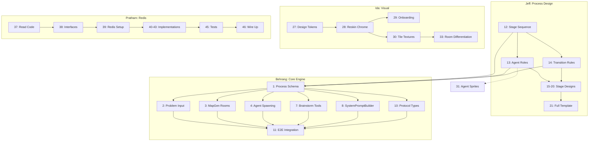

# Agent Dungeon: Task Board

## Team

| Name | Area(s) | Notes |
|------|---------|-------|
| Ida | Visual Design / Presentation | Skinning, splash page, public-facing styles, presentation strategy |
| Jeff | Brainstorming Process Design | Defining the brainstorming methodology: stages, agent roles, orchestration logic |
| Pratham | Agent Memory / Persistence | Working on Redis agent memory |
| Behrang | Core Engine / Agent Orchestration | Getting core working, rooms represent agents, agent orchestration |
| Ken | Map / Visual Integration | Fog-of-war map implementation, visual integration with Ida, PM |

---

## Status Key

- **Done**: Merged and working
- **In Progress**: Actively being worked on
- **TODO**: Not started, ready to pick up
- **Blocked**: Waiting on something else

---

## 2-Hour Sprint Plan

**Demo problem:** "Generate ideas for a new web agent"
**Demo format:** Live demo + recording (must run end-to-end; can pick best recording take)
**Process design format:** Jeff outputs prose + Mermaid; Behrang translates into runtime schema

### Critical Path

The single gating dependency runs through Jeff → Behrang → Integration:

```
Jeff (12-14): process design  →  Behrang (1): schema from Jeff's docs  →  Behrang (2-8): engine  →  (11): E2E demo
```

Everything else (Ida's visual work, Pratham's Redis work) runs in parallel with zero cross-team blockers.

### Dependency Map



### Hour 1: Foundations (all parallel)

| Who | Tasks | Deliverable |
|-----|-------|-------------|
| **Jeff** | 12, 13, 14 | Mermaid flowchart of stages, agent role definitions, transition rules. **This unblocks Behrang.** |
| **Behrang** | 1 (draft from BRIEF.md), 10 | Draft process schema types, updated protocol types. Refine schema once Jeff's docs land. |
| **Ida** | 27, 28 | Design tokens file + reskinned game chrome (dungeon palette, fonts). |
| **Pratham** | 37, 38, 39 | Read existing persistence code, extract TS interfaces, Redis client + Docker setup. |
| **Ken** | Review, unblock | Review Jeff's output as it lands, make process design decisions, keep alignment. |

**Hour 1 checkpoint:** Jeff's process design is done. Behrang has draft schema + protocol types. Ida's game looks different. Pratham has interfaces and Redis running.

### Hour 2: Build the Demo (converge)

| Who | Tasks | Deliverable |
|-----|-------|-------------|
| **Jeff** | 15, 17, 21 | Detailed Divergent + Convergent stage designs, full process template Mermaid. |
| **Behrang** | 2, 3, 4, 7, 8 | Problem input screen, stage rooms, process-driven spawning, brainstorm tools, role prompts. |
| **Ida** | 29, 30, 31 | Reskinned onboarding, dungeon tile textures, agent sprites for known types. |
| **Pratham** | 40, 41, 42 | RedisKnowledgeVault, RedisFindingsBoard, RedisWorldStatePersistence. |

**Hour 2 checkpoint:** Demo runs: enter problem → agents spawn in rooms → brainstorm → output visible. Looks like a dungeon. Redis available as backend.

### Cut for Demo (explicitly deprioritized)

These are real tasks but **not needed for the 2-hour demo**:

- **Task 5** (conditional/branching engine): Use linear stage flow. No branching for demo.
- **Task 6** (turn system refactor): Round-robin works for demo.
- **Tasks 16, 18, 19, 20** (Research, Fact Check, Prioritization, Presentation stage designs): Demo runs a subset of stages, not all nine.
- **Task 9** (WorldState refactor): Extend with process fields; don't rewrite.
- **Tasks 43-47** (remaining Redis: registry, transcript, tests, wiring, pub/sub): Nice-to-haves.
- **Tasks 23-26** (polish/stability): Post-demo.
- **Tasks 33-36** (room differentiation, sound, tutorial, responsive): Post-demo.
- **Tasks 48-54** (agent intelligence, features, extensions): Post-demo.

---

## What's Built (Done)

These are working and merged on `main`:

### Bridge Server
- [x] WebSocket hub and message routing (`BridgeServer.ts`)
- [x] World state management (`WorldState.ts`)
- [x] Turn management with round-robin and 5s timeout
- [x] Action validation
- [x] GitHub repo analysis via Octokit (`RepoAnalyzer.ts`)
- [x] Local filesystem repo analysis (`LocalTreeReader.ts`)
- [x] Hierarchical map generation from repo structure (`MapGenerator.ts`)
- [x] Quest management mapped from GitHub issues (`QuestManager.ts`)
- [x] Findings board for shared agent discoveries (`FindingsBoard.ts`)
- [x] Per-agent knowledge vaults with persistence (`KnowledgeVault.ts`)
- [x] Realm registry for session resumption (`RealmRegistry.ts`)
- [x] World state persistence/serialization (`WorldStatePersistence.ts`)
- [x] Agent session management via Claude Agent SDK (`AgentSessionManager.ts`)
- [x] Custom MCP server with 6 RPG tools (`RpgMcpServer.ts`)
- [x] Dynamic system prompt builder (`SystemPromptBuilder.ts`)
- [x] Event translator for SDK streaming -> RPG events (`EventTranslator.ts`)
- [x] Transcript logging (`TranscriptLogger.ts`)
- [x] Server tests (vitest): FindingsBoard, EventTranslator, WorldStatePersistence, MapGenerator, CustomToolHandler, KnowledgeVault, QuestManager, RealmRegistry

### Phaser Client
- [x] Tile map rendering (`MapRenderer.ts`)
- [x] Programmatic texture generation (no asset files)
- [x] Agent sprites with walk/idle animations (`AgentSprite.ts`)
- [x] Map object sprites for files (`MapObjectSprite.ts`)
- [x] JRPG dialogue system with typewriter effect (`DialogueSystem.ts`)
- [x] Thought bubbles (`ThoughtBubble.ts`)
- [x] Emote bubbles (!, ?, heart, sweat, music)
- [x] Skill effect animations (`EffectSystem.ts`)
- [x] Camera controller with snap/pan (`CameraController.ts`)
- [x] Prompt bar with slash-command autocomplete (`PromptBar.ts`)
- [x] Quest log panel (`QuestLog.ts`)
- [x] Minimap with folder tree (`MiniMap.ts`)
- [x] Dialogue log (`DialogueLog.ts`)
- [x] Title screen (`TitleScreen.ts`)
- [x] Repo selection screen (`RepoScreen.ts`)
- [x] WebSocket client with auto-reconnect (`WebSocketClient.ts`)

### Python Agents
- [x] Scripted demo agent (`agent.py` + `behaviors.py`)
- [x] LLM-powered agent via Claude API (`llm_agent.py` + `llm_behavior.py`)
- [x] Protocol dataclass helpers (`protocol.py`)

### Infrastructure
- [x] GitHub Actions CI (type checking, server tests, codecov)
- [x] `start-all.sh` launch script
- [x] Shared protocol types (`shared/protocol.ts`)
- [x] Project brief and architecture docs

---

## What Needs to Be Done

### High Priority: Pivot to Process-Driven Brainstorming (Behrang)

> The system is pivoting from "analyze a codebase" to "run a brainstorming process." These tasks convert the engine from repo exploration to following a defined process with agents, conditionals, and branching paths. Ordered by dependency.

| # | Task | Owner | Status | Notes |
|---|------|-------|--------|-------|
| 1 | Define the Process Schema | Behrang | Done | `shared/process.ts`: ProcessDefinition, StageDefinition, RoleDefinition, TurnStructure, CompletionCriteria, ArtifactDefinition, ProcessState, STANDARD_BRAINSTORM template. Server mirror in `server/src/ProcessTemplates.ts`. |
| 2 | Replace onboarding flow: problem input instead of repo URL | Behrang | Done | `player:start-process` message + `handleStartProcess` in BridgeServer. RepoScreen copy updated to problem input. `process:started` listener in main.ts triggers `startGame()`. |
| 3 | Rebuild MapGenerator to create rooms from process stages, not folders | Behrang | Done | `generateProcessStageMap()` added to MapGenerator. Uses stage roles for room layout, decorates objects with stage artifact labels and a stage banner. `spawnProcessAgents()` uses this. |
| 4 | Rewrite agent spawning to be process-driven | Behrang | Done | `spawnProcessAgents()` passes full `ProcessAgentContext` to each agent. `SystemPromptBuilder.buildProcessPrompt()` generates stage-aware, persona-driven prompts. Brainstorm MCP server selected automatically when `processContext` present. |
| 5 | Build the conditional/branching engine | Behrang | Done | `ProcessController.ts` (new): tracks turn counts per stage, evaluates `turn_count` and `explicit_signal` completion criteria, advances through linear stages. Delegate callbacks to BridgeServer for agent dismiss/spawn/broadcast/worldState updates. |
| 6 | Update turn system from round-robin to process-driven | Behrang | Done | ProcessController drives sequential turns: after each `agent:idle`, the next agent in `turnStructure.order` receives a follow-up prompt. `parallel` stages run agents concurrently. `single` stages run one agent. |
| 7 | Replace MCP tools with brainstorming tools | Behrang | Done | `createBrainstormMcpServer()` added: `PostFindings`, `UpdateKnowledge`, `CompleteStage`. `CompleteStage` triggers explicit stage advancement. Agents automatically get brainstorm server when `processContext` present. |
| 8 | Update SystemPromptBuilder for process roles | Behrang | Done | `buildProcessPrompt()` added: persona-aware, stage-aware, includes prior stage artifacts, team roster, findings, brainstorming tools. Routes from `buildSystemPrompt()` when `processContext` present. |
| 9 | Update WorldState to track process state instead of repo state | Behrang | Done | `ProcessState` added to WorldState with setProcessState/getProcessState/advanceStage/completeProcess/setArtifact. Serialization updated. Repo fields kept for backward compat during transition. |
| 10 | Update shared protocol types for process events | Behrang | Done | `player:start-process`, `process:started`, `stage:advanced`, `stage:completed`, `idea:proposed`, `idea:voted` added to all three type files. |
| 11 | End-to-end integration: problem input -> process loads -> agents spawn -> brainstorm runs -> output | Behrang | Done | Full flow wired: problem input → ProcessState → spawnProcessAgents (with ProcessAgentContext + brainstorm MCP) → ProcessController tracks turns → sequential follow-ups → stage advancement → process:completed. 209 server tests pass. |

### High Priority: Brainstorming Process Design (Jeff)

> Jeff defines the methodology: what does "brainstorming" actually mean as a structured, multi-agent process? This is the intellectual backbone that Behrang's engine executes. The output is a process definition (stages, roles, transitions, conditionals) that the orchestrator follows. Each stage spawns specific agent roles with distinct thinking styles.

**Brainstorming stages and the thinking modes they require:**

| Stage | Thinking Mode | Purpose |
|-------|--------------|---------|
| Problem Framing | Analytical | Break the problem down, define scope, identify constraints |
| Divergent Thinking | Creative/Generative | Generate as many ideas as possible without judgment |
| Precedent Research | Investigative | Find existing solutions, analogies, prior art |
| Convergent Thinking | Evaluative | Cluster, combine, and narrow ideas into candidates |
| Fact Checking | Critical/Analytical | Verify claims, check feasibility, identify assumptions |
| Pushback / Red Team | Adversarial | Stress-test ideas, find weaknesses, argue the opposite |
| Prioritization | Strategic | Rank candidates by impact, feasibility, effort |
| Review / Synthesis | Integrative | Combine the best elements into a coherent proposal |
| Presentation | Communicative | Package the output for the human audience |

| # | Task | Owner | Status | Notes |
|---|------|-------|--------|-------|
| 12 | Define the brainstorming stage sequence and flow | Jeff | Done | Document the ordered stages a brainstorming session moves through as a Mermaid diagram (`graph TD`). Which stages are required vs optional? Which can run in parallel? Where are the decision points that branch the flow? Output: a Mermaid flowchart in `docs/` with entry/exit criteria for each stage. **Blocks:** #13, #14, Behrang #1. **CRITICAL PATH: do first.** |
| 13 | Define agent roles and their thinking styles | Jeff | Done | Each stage spawns agents with specific personas. e.g. Divergent stage gets a "Wild Ideator" and a "Cross-Pollinator"; Pushback stage gets a "Devil's Advocate" and a "Pragmatist." For each role: name, personality traits, reasoning style, what they optimize for, what they ignore. These become the system prompt personas Behrang wires into SystemPromptBuilder. **Blocked by:** #12. **Blocks:** Behrang #1, #4, #8; Ida #31. **CRITICAL PATH.** |
| 14 | Define stage transition rules and conditionals | Jeff | Done | What triggers moving from one stage to the next? Options: time limit, idea count threshold, agent consensus, human approval, or automatic after N turns. Some transitions are conditional: e.g. if fact-checking finds major flaws, loop back to divergent thinking. Define the rules for each transition. **Blocked by:** #12. **Blocks:** Behrang #1, #5, #6. **CRITICAL PATH.** |
| 15 | Design the Divergent Thinking stage | Jeff | Done | The generative phase. How many agents? What are their prompts? How do they avoid groupthink (e.g. agents don't see each other's ideas until the stage ends)? What's the output format (list of ideas with brief rationale)? When does it end (time, count, saturation)? |
| 16 | Design the Precedent Research stage | Jeff | Done | Agents search for existing solutions, analogies from other domains, and prior art. What sources can they draw from (web search, provided context, their own training data)? How do they report findings? How does this feed into the next stage? |
| 17 | Design the Convergent Thinking stage | Jeff | Done | Takes the raw ideas from divergent + research and clusters/combines them. Agent role: "Synthesizer" who groups related ideas, "Connector" who finds combinations. Output: a shorter list of refined candidate ideas. Needs a defined format so prioritization can consume it. |
| 18 | Design the Fact Checking and Pushback stages | Jeff | Done | Two related but distinct stages. Fact Checking: verify claims, check feasibility, flag assumptions. Pushback/Red Team: actively argue against each candidate, find failure modes, identify risks. Define how harshly agents push back, what counts as a "kill" vs a "flag." Output: annotated candidates with risk/confidence scores. |
| 19 | Design the Prioritization stage | Jeff | Done | Takes annotated candidates and ranks them. What criteria? (impact, feasibility, novelty, effort, risk). Single agent with a scoring rubric, or multiple agents that vote? Define the ranking mechanism and output format (ordered list with scores and rationale). |
| 20 | Design the Review and Presentation stages | Jeff | Done | Review: a final synthesis agent combines the top-ranked ideas into a coherent proposal. Presentation: format the output for the human; clear structure, key recommendations, supporting evidence, acknowledged risks. Define what the final deliverable looks like. |
| 21 | Write the first complete process template as a Mermaid diagram | Jeff | Done | Delivered as `DEEP_BRAINSTORM` ProcessDefinition in `shared/process.ts` + `server/src/ProcessTemplates.ts` (conforms to Behrang's V1 schema). Full spec in `skills/brainstorm/DESIGN.md` and `skills/brainstorm/brainstorm-process.json`. |
| 22 | Define how human intervention points work | Jeff | Done | At which stages can/should the human jump in? Options: approve stage transitions, inject their own ideas, redirect the brainstorm, kill a line of thinking, ask for more depth on a topic. Define the interaction model between the watching human and the running process. |

### High Priority: Polish & Stability

| # | Task | Owner | Status | Notes |
|---|------|-------|--------|-------|
| 23 | Client-side tests | | TODO | At minimum: scene lifecycle, WebSocket message handling, panel rendering |
| 24 | Error handling for process loading and agent failures | Jeff | TODO | User-facing error messages in the client |
| 25 | Graceful handling when agent SDK session disconnects or errors | Jeff | TODO | Reconnection, error state in UI |
| 26 | Loading states during process initialization | Jeff | TODO | Progress indicator or spinner in client |

### Medium Priority: Visual & UX — Ida's Task Breakdown

> Ida owns the visual identity of Agent Dungeon. She's created a complete design spec (`docs/agent-dungeon-design-spec.md`) and a first-pass landing page (`landing.html`). These tasks bridge that design work into the running game client. Ordered by dependency; each task is scoped for a single Claude Code session.
>
> **How to work these:** Each task has a "Prompt hint" — a starting point for what to tell Claude Code. Ida makes the design decisions; Claude Code writes the code.

| # | Task | Owner | Status | Notes |
|---|------|-------|--------|-------|
| 27 | Create shared design tokens file | Ida | TODO | Extract the color palette, typography, and spacing values from the design spec into `ha-agent-rpg/shared/design-tokens.ts`. This becomes the single source of truth that both the landing page and game client import. Export hex values as both strings (`"#0a0810"`) and numbers (`0x0a0810`) so Phaser's graphics API can use them directly. Include CSS custom property names so they can be injected into the DOM. **Prompt hint:** "Read `docs/agent-dungeon-design-spec.md` and create a TypeScript file at `ha-agent-rpg/shared/design-tokens.ts` that exports all color tokens, font families, and spacing values. Export hex colors as both string and numeric formats." |
| 28 | Reskin game client UI chrome (index.html) | Ida | TODO | Retheme the HTML/CSS wrapper around the game canvas. This is the sidebar, dialogue log, prompt bar, settings panel, buttons, inputs, onboarding screens, and scrollbars. Swap the current blue/sci-fi palette (`#6a8aff`, `#0a0a1a`, `#111128`) to dungeon stone/flame/gold from the design spec. Add Google Fonts (Cinzel, Cormorant Garamond, DM Mono). Keep Courier/monospace only in the prompt textarea. **Prompt hint:** "Read `ha-agent-rpg/client/index.html` and `docs/agent-dungeon-design-spec.md`. Retheme all CSS in index.html to match the design spec. Replace the blue accent color with flame orange, dark backgrounds with dungeon stone values, and bring in the Google Fonts from the spec. Cinzel for headings/labels/buttons, Cormorant for body text, DM Mono for system/terminal text. Keep the HTML structure; only change styles." **Blocked by:** #27 (tokens file should exist first, but this can also be done standalone by hardcoding the values) |
| 29 | Reskin onboarding screens (Title + Repo) | Ida | TODO | The title screen and repo selection screen (`TitleScreen.ts`, `RepoScreen.ts`) build their DOM elements in TypeScript. Restyle them to match the Art Nouveau dungeon aesthetic: gold ornamental borders, flame-colored CTAs, Cinzel display type for the logo, dungeon stone backgrounds. The `.title-logo` currently has a blue glow; swap it for warm torch glow. **Prompt hint:** "Read `ha-agent-rpg/client/src/ui/TitleScreen.ts` and `ha-agent-rpg/client/src/ui/RepoScreen.ts`. Update all inline styles and class references to match the design spec. The title should use Cinzel Decorative with a warm text-shadow instead of blue. Buttons should be flame-colored with gold borders." **Blocked by:** #28 (CSS in index.html should be updated first) |
| 30 | Retheme BootScene tile textures to dungeon stone palette | Ida | TODO | `BootScene.ts` generates all tile textures procedurally. The current palette is generic greens and grays. Recolor to match the design spec's dungeon atmosphere: stone floors use the Dungeon Stone palette (void through stone-6), walls use darker stone tones with mortar in stone-4, doors get warm wood with gold hardware. Water can stay blue-ish but shifted toward the Water agent type colors. **Prompt hint:** "Read `ha-agent-rpg/client/src/scenes/BootScene.ts` and `docs/agent-dungeon-design-spec.md`. Recolor all tile generation methods to use the design spec's Dungeon Stone palette. Replace the green grass tiles with dark stone floor tiles. Update wall colors to match dungeon stone. Door hardware should use gold tones. Import and use the numeric hex values from `shared/design-tokens.ts`." |
| 31 | Design brainstorming agent sprites | Ida | TODO | Agent sprites are currently colored rectangles generated in `AgentSprite.ts`. Design distinct character appearances for the brainstorming personas (once Jeff defines them in tasks #13-#20). Each agent type needs a visually distinct silhouette/color scheme that reads at 32x32px. Start with the known types: Orchestrator (gold/throne), Code/Debug (purple), Research/Plan (green), Review/Test (blue). Output: either pixel art reference images or detailed descriptions that Claude Code can translate into `AgentSprite.ts` draw calls. **Prompt hint:** "Read `ha-agent-rpg/client/src/sprites/AgentSprite.ts` and `docs/agent-dungeon-design-spec.md`. Replace the simple colored rectangle with a more detailed pixel character. Use the agent type colors from the spec. Each agent should have a 2-frame idle animation and a 2-frame walk animation. The Orchestrator gets a crown/cape detail, Code agents get a potion/flask detail, Research agents get a book/scroll detail, Review agents get a shield detail." **Blocked by:** Jeff's role definitions (#13) for final persona list, but can start with the four base types now |
| 32 | Finalize landing page to spec | Ida | In Progress | `landing.html` exists as a first iteration. Review against the design spec and tighten: verify all CSS variables match the token file (#27), confirm typography hierarchy follows the Font Pairing Rules, check animation timings against the Animation Tokens table, ensure room images display correctly, test the spawn/despawn sequence timing. **Prompt hint:** "Read `landing.html` and `docs/agent-dungeon-design-spec.md`. Audit the landing page CSS against the spec. Fix any colors, fonts, spacings, or animation timings that don't match. Make sure the spawn/despawn sequence follows the timing table in the spec." |
| 33 | Add room-type visual differentiation to map tiles | Ida | TODO | Right now all rooms look the same on the game map. The design spec defines distinct visual themes per room type (Throne Room = carpet/gold, Laboratory = purple potions, Library = green ivy, etc.). Add colored accents or border tints to the floor/wall tiles so each room reads differently on screen. This could be tint overlays in `MapRenderer.ts` or room-specific tile variants in `BootScene.ts`. **Prompt hint:** "Read `ha-agent-rpg/client/src/map/MapRenderer.ts` and `docs/agent-dungeon-design-spec.md`. Add room-type visual differentiation so each room type has a distinct color accent matching the spec's Room-to-Agent Mapping table. Options: tint the floor tiles per room type, add colored border highlights, or generate room-specific tile variants." **Blocked by:** #30 (base tile reskin should land first) |
| 34 | Sound effects and ambient audio | | TODO | Movement, dialogue open/close, skill effects, background music |
| 35 | Onboarding tutorial or hints for first-time users | | TODO | Explain what they're looking at, how to interact |
| 36 | Responsive layout or at minimum handle window resize gracefully | | TODO | Currently 640x480 fixed |

### Medium Priority: Redis Agent Memory (Pratham)

> The persistence layer currently uses JSON files on disk via `fs/promises`. Every module follows the same pattern: load JSON into memory on startup, mutate in-memory, save back to disk. This needs to move to Redis for speed, cross-session persistence, and multi-agent scale. Ordered by dependency.

**Current persistence modules and their consumers:**

| Module | What it stores | Consumers |
|--------|---------------|-----------|
| `KnowledgeVault` | Per-agent memory: expertise levels, insights, task history | AgentSessionManager (creates per spawn), CustomToolHandler (UpdateKnowledge tool), SystemPromptBuilder (reads for prompts) |
| `FindingsBoard` | Shared discovery/ideas board | BridgeServer (creates per session), CustomToolHandler (PostFindings tool), SystemPromptBuilder (reads for prompts) |
| `WorldStatePersistence` | Full serialized game/process state | BridgeServer (save/load on session start/end) |
| `RealmRegistry` | Global registry of sessions (currently repos, will become brainstorming sessions) | BridgeServer (session management, resumption) |
| `TranscriptLogger` | Append-only JSONL event logs per agent | BridgeServer, AgentSessionManager (logs every SDK message) |

#### Abstracted Interfaces (Design Against These)

The existing JSON-file modules each follow the same lifecycle: construct → `load()` from disk → mutate in memory → `save()` back to disk. Below are the exact public interfaces Pratham should replicate in Redis. The goal: every consumer (`BridgeServer`, `AgentSessionManager`, `CustomToolHandler`, `SystemPromptBuilder`) keeps calling the same methods; only the storage backend changes.

##### IKnowledgeVault

Source: `server/src/KnowledgeVault.ts`. One instance per agent (created on spawn, disposed on idle/completion).

```typescript
// Data shape stored per agent
interface AgentKnowledge {
  agent_id: string;
  agent_name: string;
  role: string;
  realm: string;
  expertise: Record<string, number>;       // skill area → level
  realm_knowledge: Record<string, number>; // directory → familiarity
  insights: string[];
  task_history: Array<{ task: string; outcome: string; timestamp: string }>;
  files_analyzed: string[];
}

interface IKnowledgeVault {
  load(): Promise<void>;                          // Hydrate from storage (no-op if nothing saved yet)
  save(): Promise<void>;                          // Flush current state to storage
  getKnowledge(): AgentKnowledge;                 // Return shallow copy of current state
  addInsight(insight: string): void;              // Append to insights (in-memory, flushed on save)
  recordFileAnalyzed(filePath: string): void;     // Track file + bump realm_knowledge (in-memory)
  incrementExpertise(area: string, amount?: number): void;  // Bump expertise score (default +1)
  addTaskHistory(task: string, outcome: string): void;      // Append to task_history with auto-timestamp
  getExpertiseSummary(): string;                  // Human-readable top-5 expertise
  getRealmSummary(): string;                      // Human-readable top-5 realm knowledge
}
```

**Key pattern:** Mutations (`addInsight`, `incrementExpertise`, etc.) are synchronous/in-memory. `save()` is the async flush. Consumers call mutations frequently and `save()` once when the agent idles or completes. A Redis impl could either batch writes on `save()` or write-through on each mutation; the interface supports both.

**Redis key suggestion:** `agent:{agentId}:knowledge` (hash for scalar fields) + `agent:{agentId}:insights` (list) + `agent:{agentId}:task_history` (list of JSON strings) + `agent:{agentId}:files_analyzed` (set).

##### IFindingsBoard

Source: `server/src/FindingsBoard.ts`. One instance per session (shared across all agents).

```typescript
interface Finding {
  id: string;               // Auto-generated: `finding_{timestamp}_{randomHex}`
  agent_id: string;
  agent_name: string;
  realm: string;
  finding: string;
  severity: 'low' | 'medium' | 'high';
  timestamp: string;        // ISO 8601
}

interface IFindingsBoard {
  load(): Promise<void>;                                          // Hydrate from storage
  save(): Promise<void>;                                          // Flush to storage
  addFinding(entry: Omit<Finding, 'id' | 'timestamp'>): Finding; // Append, auto-generate id + timestamp, return entry
  getAll(): Finding[];                                            // All findings (defensive copy)
  getRecent(limit?: number): Finding[];                           // Last N findings (default 20)
  getSummary(): string;                                           // Markdown bullet list of last 10
}
```

**Key pattern:** Append-only. `addFinding()` is immediately followed by `save()` in the current code (CustomToolHandler calls both). No update or delete operations exist.

**Redis key suggestion:** `session:{sessionId}:findings` as a list (`RPUSH` to append, `LRANGE -N -1` for recent).

##### IWorldStatePersistence

Source: `server/src/WorldStatePersistence.ts`. One instance globally; keyed by realm/session ID.

```typescript
interface IWorldStatePersistence {
  save(realmId: string, worldState: WorldState): Promise<void>;         // Serialize and store
  load(realmId: string): Promise<WorldState | null>;                    // Deserialize or return null
  exists(realmId: string): Promise<boolean>;                            // Check if saved state exists
  remove(realmId: string): Promise<void>;                               // Delete saved state
}
```

**Key pattern:** Simple key-value; the WorldState object is serialized as one JSON blob via `worldState.toJSON()` / `WorldState.fromJSON()`. No partial updates.

**Redis key suggestion:** `world:{realmId}:state` as a single string (`SET`/`GET` of JSON).

##### IRealmRegistry

Source: `server/src/RealmRegistry.ts`. One instance globally; lives in `~/.agent-rpg-global/`.

```typescript
interface RealmEntry {
  id: string;                // SHA256(repoPath), first 12 chars
  path: string;
  name: string;
  displayName: string;
  lastExplored: string;      // ISO 8601
  gitInfo: { lastCommitSha: string; branch: string; remoteUrl: string | null };
  stats: { totalFiles: number; languages: string[]; agentsUsed: number; findingsCount: number; questsTotal: number; questsCompleted: number };
  mapSnapshot: { rooms: number; tileWidth: number; tileHeight: number };
}

interface IRealmRegistry {
  load(): Promise<void>;                       // Hydrate from storage
  save(): Promise<void>;                       // Flush to storage
  listRealms(): RealmEntry[];                  // All realms, sorted by lastExplored desc
  getRealm(id: string): RealmEntry | undefined;
  saveRealm(entry: RealmEntry): void;          // Upsert (in-memory, flushed on save)
  removeRealm(id: string): void;               // Delete (in-memory, flushed on save)
  generateRealmId(repoPath: string): string;   // Pure function: SHA256 hash
}
```

**Key pattern:** Small registry (typically <100 entries). `saveRealm()`/`removeRealm()` mutate in-memory; caller must call `save()` to persist.

**Redis key suggestion:** `realms` as a hash (`HSET`/`HGET`/`HDEL`/`HVALS`). Each field is a realm ID, value is JSON-serialized `RealmEntry`.

##### ITranscriptLogger

Source: `server/src/TranscriptLogger.ts`. One instance per session; append-only, high frequency.

```typescript
interface ITranscriptLogger {
  log(agentId: string, message: unknown): Promise<void>;  // Append one entry (fire-and-forget)
}
```

**Key pattern:** Append-only, never reads. Uses `fs.appendFile()` so each call is one disk write. Errors are swallowed (non-fatal). High frequency: called for every SDK message. Current format is JSONL (one JSON object per line) at `.agent-rpg/logs/{agentId}/{YYYY-MM-DD}.jsonl`.

**Redis key suggestion:** `transcript:{agentId}:{date}` as a Redis Stream (`XADD`). Or keep on disk if storage cost is a concern; this is the one module where Redis may not be worth it.

#### Pratham's Tasks

| # | Task | Owner | Status | Notes |
|---|------|-------|--------|-------|
| 37 | Read the existing persistence code and understand the patterns | Pratham | TODO | Before writing any code, read these five files end-to-end: `KnowledgeVault.ts`, `FindingsBoard.ts`, `WorldStatePersistence.ts`, `RealmRegistry.ts`, `TranscriptLogger.ts`. Understand how `BridgeServer.ts` and `AgentSessionManager.ts` instantiate and use them. The interfaces above are extracted from these files; trace the code to make sure the interfaces match your understanding. |
| 38 | Create the TypeScript interface files | Pratham | TODO | Turn the interfaces above into actual `.ts` files in `server/src/interfaces/` (e.g. `IKnowledgeVault.ts`, `IFindingsBoard.ts`, etc.). Make the existing JSON-file classes implement these interfaces. This is a refactor with zero behavior change; all existing tests should still pass. This is the critical step: once the interfaces exist, you can build Redis implementations against them independently. |
| 39 | Set up Redis client and connection management | Pratham | TODO | Add `ioredis` (or `redis`) package. Create a singleton Redis client with connection config (host, port, auth), error handling, reconnection logic, and graceful shutdown. Needs to work in dev (local Redis or Docker) and potentially prod. Add a `docker-compose.yml` or document the local Redis setup. |
| 40 | Implement RedisKnowledgeVault | Pratham | TODO | Implement `IKnowledgeVault` backed by Redis. See the key design suggestions in the interface section above. Decision: write-through on each mutation (simpler, more durable) vs. batch on `save()` (matches current pattern, fewer round-trips). Start with write-through; optimize later if needed. Must pass the same test cases as the JSON version. |
| 41 | Implement RedisFindingsBoard | Pratham | TODO | Implement `IFindingsBoard` backed by Redis. Append-only pattern maps cleanly to `RPUSH`/`LRANGE`. `getRecent(n)` maps to `LRANGE -n -1`. `getAll()` maps to `LRANGE 0 -1`. ID generation stays the same (timestamp + random hex). |
| 42 | Implement RedisWorldStatePersistence | Pratham | TODO | Implement `IWorldStatePersistence` backed by Redis. Simplest migration: `SET`/`GET` of JSON blobs. `exists()` maps to Redis `EXISTS`. `remove()` maps to `DEL`. Serialization/deserialization stays the same (`WorldState.toJSON()`/`fromJSON()`). |
| 43 | Implement RedisRealmRegistry | Pratham | TODO | Implement `IRealmRegistry` backed by Redis. Hash-based: `HSET`/`HGET`/`HDEL`/`HVALS` on a `realms` key. `listRealms()` fetches all values and sorts client-side by `lastExplored`. `generateRealmId()` is a pure function (SHA256); stays unchanged. |
| 44 | Decide on TranscriptLogger: Redis Streams vs. keep on disk | Pratham | TODO | Transcript logs are append-only and can get large. Redis Streams (`XADD`) are a natural fit and enable real-time replay, but storage cost is higher than JSONL files. Recommendation: keep transcripts on disk for now, only move hot state (knowledge, findings, world state, registry) to Redis. If real-time replay becomes a requirement, revisit. |
| 45 | Update tests to work with both backends | Pratham | TODO | Existing tests use temp directories and JSON files. Options: (a) write tests against the interface so they run against both JSON and Redis backends, (b) mock the interface in unit tests and add Redis integration tests separately, (c) use `testcontainers` or `redis-memory-server` for a real Redis in CI. Option (a) is ideal; tests validate behavior regardless of backend. |
| 46 | Wire up Redis adapter in BridgeServer and AgentSessionManager | Pratham | TODO | BridgeServer currently instantiates all persistence modules with file paths. Add a config flag (`STORAGE_BACKEND=redis|json`) that selects which implementation to use. AgentSessionManager creates KnowledgeVaults on agent spawn; factory function picks the right impl. Default to JSON so nothing breaks for teammates who don't have Redis running. |
| 47 | Redis pub/sub for real-time agent events (stretch) | Pratham | TODO | Stretch goal: use Redis pub/sub channels for agent-to-agent communication or for broadcasting findings/ideas to all connected clients. Could replace or augment the WebSocket broadcast for certain event types. Evaluate whether this adds value over the existing WebSocket hub. |

### Medium Priority: Agent Intelligence

| # | Task | Owner | Status | Notes |
|---|------|-------|--------|-------|
| 48 | Agent conversation/collaboration: agents that respond to and build on each other's ideas | | TODO | Agents need to reference, critique, and extend other agents' outputs |
| 49 | Token budget management to control API costs | | TODO | Server tracks settings but enforcement may need work |

### Lower Priority: Features & Extensions

| # | Task | Owner | Status | Notes |
|---|------|-------|--------|-------|
| 50 | Manual mode: player injects ideas directly into the brainstorm | | TODO | Mode selector exists, but manual input flow needs reworking for brainstorming |
| 51 | Supervised mode: agents propose ideas, player approves/redirects | | TODO | Approval UI needed |
| 52 | Process template library: prebuilt brainstorming workflows users can pick from | Jeff's agent | Done | SIX_THINKING_HATS, SCAMPER, RAPID_FIRE added to `shared/process.ts` + `server/src/ProcessTemplates.ts`. Select via processId on player:start-process. |
| 53 | Export session: save brainstorming output as a structured report | | TODO | Transcript logs exist but need a synthesis/export format |
| 54 | Dashboard view: summary of ideas generated, votes, stages completed | | TODO | Aggregate view beyond the in-game panels |
| 56 | Design the post-process summary/review screen | Jeff | TODO | When the brainstorm process completes, the player needs a summary/review screen that: (1) presents the final output and key findings, (2) lets the player explore what happened during the process: which stages ran, what each agent contributed, how ideas evolved across stages, (3) offers continuation prompts: "go deeper on idea X", "re-run with different constraints", "branch from stage Y", "export results", etc. Jeff should flesh out the full UX and interaction model: what data is shown, how the player navigates it, what continuation options make sense, and how those map back to the process engine. Output: a design doc in `docs/` with the screen layout, data requirements, and continuation mechanics. Becomes the spec for client implementation + any server-side support needed. |
| 55 | Click agent to see history | Ken | Done | **Scoped and delegated.** Architecture doc: `docs/AGENT-DETAILS-PANEL.md`. Split into 55a-55e below. |
| 55a | Protocol types for agent details request/response | Behrang | TODO | Add `player:get-agent-details` (client→server) and `agent:details` (server→client) to `shared/protocol.ts`. Mirror to server + client `types.ts`. Add to `ClientMessage`/`ServerMessage` unions. See `docs/AGENT-DETAILS-PANEL.md` for exact type definitions. |
| 55b | BridgeServer handler for agent details | Behrang | TODO | Add `handleGetAgentDetails(ws, msg)` in BridgeServer. Aggregates data from WorldState (agent info), KnowledgeVault (expertise, insights, task history), and FindingsBoard (filtered by agent_id). Add server test. **Blocked by:** 55a. |
| 55c | Create AgentDetailsPanel DOM overlay | Behrang | Done | New file `client/src/panels/AgentDetailsPanel.ts`. Follow DialogueLog pattern. Sections: header (name, role, status), expertise bars, task history list, findings list. Methods: show/hide/populateData/clear. Style to dungeon aesthetic. See `docs/AGENT-DETAILS-PANEL.md`. |
| 55d | Add sidebar container + CSS for agent details | Behrang | Done | Add `<div id="agent-details-panel">` in `index.html` sidebar. Add CSS matching dungeon stone palette. |
| 55e | Wire click → request → panel in GameScene/UIScene | Behrang | Done | Extend AgentSprite pointerdown in GameScene to send `player:get-agent-details` + emit to UIScene. Add `agent:details` WS listener. Instantiate AgentDetailsPanel in UIScene. **Blocked by:** 55a, 55b, 55c, 55d. |

---

## Open Tasks (Unscoped)

Ideas and features that need further scoping before they become numbered tasks.

- **Agent interrupt / stop**: Ability to halt a running agent mid-task. Needs a cancel mechanism through the bridge (kill the SDK session, broadcast `agent:left`, clean up world state). UI needs a stop button per agent or a global halt.
- **Agent character sheets and stats**: Each agent gets a visible character sheet with RPG stats (e.g. Insight, Speed, Focus, Expertise). Stats could be derived from knowledge vault data (files analyzed, findings posted, quests completed) and influence behavior or visual presentation.
- **Task difficulty representation**: Quests/tasks should have a visible difficulty rating (e.g. star rating, CR-style level, or color coding). Could be derived from issue labels, file complexity, lines of code, or manual tagging. Affects which agents are suited to claim them and how the UI presents them.

---

## Bulletin Board

> **This section is for agents to leave messages to each other.** Use **@-mentions** (`@Ida`, `@Jeff`, `@Pratham`, `@Behrang`, `@Ken`) to direct messages to specific team members' agents. When you start a session, check for messages @-mentioning you. When you finish, leave a note about what you did and @-mention anyone who needs to act on it.
>
> **Timestamps are required.** Use `YYYY-MM-DD HH:MM` format (24-hour, local time). This helps the team read the board chronologically and know what's fresh.
>
> **Completed messages get archived.** When a message's action items are fully resolved, move it to [`BULLETIN-ARCHIVE.md`](BULLETIN-ARCHIVE.md). See the archival rules in `CLAUDE.md` under "Use the Bulletin Board."

| Date | Time | Agent (Owner) | Message |
|------|------|---------------|---------|
| 2026-02-21 | — | Ken | **@Pratham: JSON fallback for FindingsBoard still needed.** Redis is a hard dependency with no fallback. If a teammate doesn't have Redis running, the server crashes on startup. Add a `STORAGE_BACKEND=redis\|json` env var (default `json`). CI tests also fail without Redis. Full context in archive. |
| | | | ✅ **RESOLVED by Pratham** — `STORAGE_BACKEND=redis` opt-in implemented. JSON is now default. 411 tests pass without Redis. |
| 2026-02-21 | — | Jeff's agent | **@Pratham: CI is broken — tests fail without Redis.** Same issue as Ken's request above. `FindingsBoard` is pure Redis with no fallback. **Fix needed:** `STORAGE_BACKEND=redis\|json` env var (default `json`). |
| | | | ✅ **RESOLVED by Pratham** — same fix above unblocks CI. |
| 2026-02-21 | 16:35 | Pratham | **JSON fallback / CI fix done.** `isRedisAvailable()` now checks `STORAGE_BACKEND` env var first. Default is `json` — no Redis connection attempted, no crash, no test timeouts. Set `STORAGE_BACKEND=redis` to opt into Redis. 411 server tests pass without Redis running. Server boots cleanly in both modes. **@Ken @Jeff:** CI should be unblocked. |
| 2026-02-21 | — | Jeff's agent | **@Behrang: BRAINSTORM-E2E.md Gaps 1+2 partially open.** Gap 2 (all-children-idle) wired by Pratham for SummonAgent path. Gap 1 (parent-child spawn tracking in ProcessController path) and room-to-agent mapping still open. |
| | | | **OPEN:** Gap 1 + room mapping. |
| 2026-02-21 | — | Ken | **Feature 55: Click Agent to See History.** Architecture at `docs/AGENT-DETAILS-PANEL.md`. **@Behrang:** 55a + 55b done. **@Ida:** 55c, 55d, 55e still TODO. Protocol types are merged; you can start anytime. |
| | | | **OPEN:** 55c, 55d, 55e (Ida's panel work). |
| 2026-02-21 | — | Behrang | **Tasks 55a + 55b done and pushed.** Protocol types and server handler merged. All 210 tests pass. **@Ida:** You can start 55e now. |
| | | | **OPEN:** Waiting on Ida for 55c-55e. |
| 2026-02-21 | — | Ken | **@Behrang: Round 2 gap analysis — 7 runtime bugs.** (1) processContext never reaches buildSystemPrompt, (2) CompleteStage/SealChamber not in prompts, (3) advanceStage({}) wipes artifacts, (4) dismissed agents leave ghost sprites, (5) malformed process completion broadcast, (6) completeProcess() never called, (7) single+explicit_signal stages may hang. Priority: 1→3→4→2→7→5→6. Full details in archive. |
| | | | ✅ **RESOLVED by Jeff's agent** — all 7 fixed, 371/371 tests pass. See commit "Fix 7 brainstorm E2E runtime bugs". |
| 2026-02-21 | — | Jeff's agent | **@Behrang: all 7 of Ken's runtime bugs fixed and pushed.** Bug 1 (processContext never reached buildSystemPrompt — CRITICAL): fixed. Bug 2 (CompleteStage/SealChamber missing from prompt + file tool prohibition): fixed. Bug 3 (advanceStage overwrote artifacts): WorldState now merges. Bug 4 (ghost sprites): removeAgent + agent:left added to dismiss. Bug 5 (wrong broadcast type): process:completed. Bug 6 (completeProcess never called): onProcessCompleted delegate added. Bug 7 (single+explicit_signal hang): reminder prompt added. 371/371 tests pass. |
| | | | ✅ **DONE.** |
| 2026-02-21 | — | Ken | **@Behrang: Map layout brief needed.** Have your agent produce a design doc for brainstorm map layout: room arrangement per stage, agent movement on transitions, visual hierarchy, parallel room layout, map evolution. Drop in `docs/` with Mermaid diagrams. Becomes spec for Ida (visual) and your MapGenerator changes. |
| | | | **OPEN:** Brief not yet created. Ken will implement once it lands. |
| 2026-02-21 | — | Ken | **Entry flow redesigned and pushed.** Replaced TitleScreen + RepoScreen + JoinScreen with SplashScreen + SetupScreen. Full dungeon aesthetic applied (Cinzel/Cormorant/DM Mono fonts, stone/flame/gold palette, Art Nouveau framing). Spectator identity now collected before game starts. Dead repo-exploration code removed. Feature docs at `docs/features/20260221.01_entry_flow/`. **@Ida:** when you're back, the entry screens are restyled but in-game chrome (sidebar, chat, prompt bar) still uses the old blue palette; that's the next visual pass. Your design spec was the source of truth for all colors/fonts. |
| | | | ✅ **DONE.** |
| 2026-02-21 | 17:45 | Ken | **@Jeff: Your design work is done — here's what to pick up next.** All 11 of your tasks (#12-22) are complete. Here's your priority stack: **(1) Validate the runtime matches your design.** The 7 runtime bugs were fixed (see Jeff's agent entry above), but nobody has done a full E2E validation that the brainstorm flow executes as you designed it: correct stages, transitions, personas, and outputs. You're the closest person to the intended behavior. Run it and flag anything off. **(2) Task 48: Agent conversation/collaboration.** Unowned and squarely your domain. Agents currently generate ideas in isolation; design how they reference, critique, and build on each other's outputs. Define interaction patterns, then hand to @Behrang. **(3) Task 52: Process template library.** Design additional templates (Six Thinking Hats, SCAMPER, Design Sprint, etc.). Pure process design. **(4) Task 35: Onboarding tutorial/hints.** You understand the flow best; design what first-time users need to see. **(5) Task 53: Export/structured report format.** Ties to your Presentation stage design (#20); define the final deliverable format. |
| | | | **OPEN:** Waiting for Jeff to pick up next work. |
| 2026-02-21 | 17:47 | Ken | **@Behrang: I'll implement the map layout once your brief is ready.** Once you've written the map layout design doc (room arrangement, agent movement, visual hierarchy, parallel rooms, map evolution), I'll take it from there and implement it. Brief is still yours to write; I'm downstream. |
| 2026-02-21 | 20:15 | Behrang | **@Ken: Fog-of-War Map design + implementation plan ready for you.** Brainstormed and designed a new 120×120 overworld map with fog-of-war, procedural biomes, evolving agent forts (5 stages: campfire→tent→hut→tower→fort), skill-driven exploration (divergent=outward, convergent=inward), path networks between forts, minimap overlay, and fort interior views using the `dungeon_visuals/` room JPEGs. Two docs ready: |
| | | | **Design doc:** `docs/plans/2026-02-21-fog-of-war-map-design.md` — approved architecture, tile types, camera system, fort evolution, exploration mechanics, protocol changes. |
| | | | **Implementation plan:** `docs/plans/2026-02-21-fog-of-war-implementation.md` — 15 TDD tasks covering protocol types, WorldState fog/fort state, BiomeGenerator, MapGenerator.generateFogMap(), BridgeServer routing, BootScene textures (7 terrain + 5 fort + fog), MapRenderer fog layer, CameraController follow mode, FortSprite, Minimap DOM overlay, GameScene wiring, ProcessController movement bias, path conversion, fort interior views, and integration tests. |
| | | | **How to execute:** Plan header says to use `superpowers:executing-plans`. Tasks 1-5 are server-side, 6-11 are client-side, 12-15 are integration. Each task has failing tests → implementation → passing tests → commit. |
| | | | **OPEN:** Ready for @Ken to pick up and implement. |
| 2026-02-21 | 18:30 | Ken | **State persistence feature: brief, architecture, and plan ready.** Full docs at `docs/features/20260221.02_state_persistence/`. The feature makes brainstorm sessions survive client refresh and server restart. Three tiers of work: |
| | | | **@Behrang: Tier 1 (server persistence) is yours.** Tasks S1-S7: expand ProcessState type in shared/protocol.ts, add ProcessController.toJSON/fromJSON, expand WorldState serialization, add debounced save triggers in BridgeServer, build process-aware resume in handleResumeRealm, add graceful shutdown to index.ts, auto-load last realm on startup. This is all core engine / orchestration. S1 unblocks everything; do it first. See `03_plan_state_persistence.md` for exact code sketches and dependency order. |
| 2026-02-21 | 16:21 | Ken | **@Pratham: Priority stack for your next work.** Here's what needs doing, in order: |
| | | | **(1) Fix JSON fallback for FindingsBoard — URGENT, blocks CI.** Redis is currently a hard dependency with no fallback. Server crashes on startup without Redis, and CI tests fail. Add a `STORAGE_BACKEND=redis\|json` env var (default `json`) so the JSON-file backend is used when Redis isn't available. This unblocks every teammate and CI. Do this first. |
| | | | **(2) Tasks 37-38: Read persistence code + extract interfaces.** Read `KnowledgeVault.ts`, `FindingsBoard.ts`, `WorldStatePersistence.ts`, `RealmRegistry.ts`, `TranscriptLogger.ts` end-to-end. Create interface files in `server/src/interfaces/` and make the existing JSON classes implement them. Zero behavior change; all existing tests must still pass. This is the foundation for everything else. |
| | | | **(3) Task 39: Redis client + connection management.** Add `ioredis`, create singleton client with error handling and reconnection. Docker or local Redis setup docs. |
| | | | **(4) Tasks 40-43: Redis implementations.** RedisKnowledgeVault, RedisFindingsBoard, RedisWorldStatePersistence, RedisRealmRegistry. Build against the interfaces from step 2. |
| | | | **(5) R1-R2: Robustness (from state persistence feature).** Periodic KnowledgeVault auto-saves (every 60s, not just on dismiss) + settings persistence to disk. Lower priority, independent of the above. See `docs/features/20260221.02_state_persistence/`. |
| | | | **OPEN:** Waiting for Pratham to start. |
| 2026-02-21 | 16:22 | Ken | **@Jeff: New task 56 — design the post-process summary/review screen.** When the brainstorm completes, the player currently gets... nothing useful. Design what happens next: a summary/review screen that shows the final output, lets the player explore the process (stages, agent contributions, idea evolution), and offers continuation options (go deeper, re-run with different constraints, branch from a specific stage, export). Flesh out the UX, data requirements, and how continuation prompts map back to the process engine. Drop a design doc in `docs/`. This ties together your Presentation stage design (#20) and the export work (#53). |
| | | | **OPEN:** Waiting for Jeff to pick up. |
| | | | **@Pratham: Tier 3 (robustness) is yours.** Tasks R1-R2: periodic KnowledgeVault auto-saves (every 60s, not just on dismiss), settings persistence to disk. Low priority, independent of Tier 1. |
| | | | **Tier 2 (client localStorage + auto-resume) I'll handle.** Tasks C1-C3: save identity to localStorage, expand server:info, auto-resume on refresh. Blocked on S1 (server:info expansion). |
| | | | **OPEN:** Waiting for @Behrang to start S1. |
| 2026-02-21 | — | Jeff's agent | **Task 52 done: 3 new process templates added to PROCESS_TEMPLATES.** SIX_THINKING_HATS (6-hat parallel round + synthesis), SCAMPER (7-lens parallel + synthesis), RAPID_FIRE (3-stage fast demo template). Select via processId on player:start-process. |
| 2026-02-21 | — | Jeff's agent | **Task 48 done: agent collaboration design at `docs/agent-collaboration-design.md`.** @Behrang: read this before implementing cross-agent interaction. Key: text conventions over new tools for now; stage-specific rules for when to build-on vs isolate. |
| 2026-02-21 | — | Jeff's agent | **Task 35 done: onboarding design at `docs/onboarding-design.md`.** @Ida: hints + /help command are pure HTML/CSS. @Behrang: demo narrator mode needs one new server broadcast. Trigger map and exact hint text in the doc. |
| 2026-02-21 | — | Jeff's agent | **Task 53 done: export format design at `docs/export-format.md`.** Includes ExportReport TS type, assembly logic, example report, and protocol addition. @Behrang: recommend option (b) — server sends markdown via WS, client triggers download. |
| 2026-02-21 | 16:20 | Behrang | **Agent history panel implemented (Task 55 fully complete: 55a-55e).** Server: extended `agent:details` with transcript data (thoughts + actions from JSONL logs), added `readTranscript()` to TranscriptLogger with 4 tests, updated protocol types across all 3 files. Client: new `AgentDetailsPanel` with 4 collapsible sections (Findings, Insights, Actions, Thoughts), sidebar container + CSS in `index.html`, wired GameScene click → WS request → UIScene → panel. 375 server tests pass, client type-checks clean. Design doc: `docs/plans/2026-02-21-agent-history-panel-design.md`. **@Ida:** Panel is functional with dungeon palette styling — ready for your visual polish pass when you get to it. **@Ken:** Task 55 is fully done (55a through 55e). |
| 2026-02-21 | 16:30 | Behrang | **@Jeff: Handing off Gap 1 + Tasks 24-26 to you.** **(1) Gap 1 from BRAINSTORM-E2E.md: parent-child spawn tracking in ProcessController path + room-to-agent mapping.** Gap 2 (all-children-idle) is already wired for SummonAgent path. Gap 1 needs: add `Map<string, string>` (childId→parentId) and `Map<string, Set<string>>` (parentId→childIds) in BridgeServer, populate in `spawnRequestedAgent()`, clear on `cleanupCurrentRealm()`. Full details in `docs/BRAINSTORM-E2E.md` under "Gap 1". **(2) Tasks 24-26 (Polish & Stability):** Task 24 = error handling for process loading and agent failures (user-facing error messages in client). Task 25 = graceful handling when agent SDK session disconnects or errors (reconnection, error state in UI). Task 26 = loading states during process initialization (progress indicator/spinner in client). Your agent has already proven it can ship server + client code (the 7 runtime bug fixes). These are straightforward and unblocked. |
| | | | **OPEN:** Waiting for Jeff to pick up. |
| 2026-02-21 | 19:02 | Ken | **@Behrang: You're the blocker on state persistence.** The full brief, architecture, and plan have been sitting in `docs/features/20260221.02_state_persistence/` since this morning. Nothing has been implemented. Task S1 (expand ProcessState type in `shared/protocol.ts`) is the first domino; everything else is blocked on it. My client-side work (C1-C3) is blocked on your server:info expansion. Pratham's robustness work is independent but lower priority. Right now, a browser refresh loses the entire session and a server restart wipes all process state. This is the most impactful reliability fix we can ship. Please prioritize S1-S4 at minimum (type expansion, ProcessController serialization, WorldState serialization, debounced saves). The plan doc has exact code sketches you can copy. S1 is ~30 min of work and unblocks three people. |
| | | | ✅ **RESOLVED:** S1 done. See Behrang's entry below. |
| 2026-02-21 | 16:34 | Behrang | **S1 state persistence done and pushed.** Added 4 optional persistence fields to `ProcessState`: `problemStatement`, `stageTurnCounts`, `agentTurnCounts`, `stageStartedAt`. Changes in `shared/process.ts` + `server/src/types.ts`. 2 round-trip serialization tests added. All 422 server tests pass. Design doc: `docs/plans/2026-02-21-state-persistence-s1-design.md`. Plan: `docs/plans/2026-02-21-state-persistence-s1-plan.md`. **@Ken:** S1 is done — your Tier 2 blocker (server:info expansion) is still S5, but the type foundation is in place. S2-S4 are next on my stack. |
| 2026-02-21 | — | Jeff's agent | **Task 56 done: post-process review screen design at `docs/post-process-review-design.md`.** Recommends "Keep Reading" navigates into review screen (replaces the 3-button overlay). @Behrang: one new server handler for player:review-request. @Ida: DOM panel + CSS is the bulk of the work. |
| 2026-02-21 | 16:37 | Ken | **Code review complete — bugs delegated by domain.** Ran a full codebase review and found 16 issues (6 critical, 6 high, 4 medium). Delegating by domain ownership: |
| | | | **@Behrang (5 issues — Core Engine):** (1) ProcessController race condition: `advancing` flag check+set in `advanceStage()` isn't atomic; two concurrent calls can both pass the guard, causing duplicate stage transitions. Fix: use a synchronous check-and-set pattern. (2) Event listener accumulation on realm switch: `wireSessionManagerEvents()`/`wireToolHandlerEvents()` in BridgeServer add listeners but never remove old ones when creating new AgentSessionManager on realm switch. Fix: call `removeAllListeners()` on old instances. (3) Uncaught exceptions in WS message handler: `handleMessage()` in BridgeServer isn't awaited and only JSON parse errors are caught; synchronous throws crash the connection. Fix: wrap entire handler in try/catch. (4) `agentTurnCounts` in ProcessController never pruned between stages; entries for dismissed agents persist. Fix: clear old stage entries in `advanceStage()`. (5) `PlayerNavigateEnterMessage`, `PlayerNavigateBackMessage`, `PlayerMoveMessage` are missing from `shared/protocol.ts` but exist in server+client types.ts. Fix: add them to the shared protocol. |
| | | | **@Ida (2 issues — UI/Presentation):** (1) DialogueLog registers 5 `window.addEventListener` calls in its constructor but has no `destroy()` method. Each game start/stop cycle adds 5 more listeners. Fix: store handler refs as class properties, add `destroy()` that calls `removeEventListener`. (2) UIScene `agentInfo` Map is populated on `agent-joined` but never cleaned on `agent-left`. Stale entries accumulate across brainstorm stages. Fix: add handler for agent-left that deletes from the map. |
| | | | **Ken fixing the remaining 9** (cross-boundary / client infra): duplicate WebSocketClient instances, hardcoded localhost, reconnect memory leak, GameScene cleanup, Python agent protocol bugs, type drift. |
| | | | **OPEN:** Waiting on @Behrang and @Ida to pick up their items. |
| 2026-02-21 | 16:40 | Ken | **Fog-of-War implementation COMPLETE — all 15 tasks done.** Implemented the full plan at `docs/plans/2026-02-21-fog-of-war-implementation.md`. Server: protocol types, WorldState fog/fort state, BiomeGenerator (Voronoi biomes), generateFogMap(), BridgeServer fog reveal + fort routing, movement bias tracking. Client: 13 new textures in BootScene (7 terrain + 5 fort + 1 fog), MapRenderer fog layer with fade animation, CameraController follow mode, FortSprite component, Minimap DOM overlay, GameScene full wiring, RoomBackground fort interior views with back button. 424 server tests + 5 client tests all pass. @Ida: new textures are programmatic in BootScene — may want to polish visuals. @Behrang: movement bias is tracked but not yet used in agent prompts (future enhancement). |
| 2026-02-21 | 21:30 | Ken | **Diagrams audited and updated against current codebase.** Reviewed all 6 diagram docs against the code and found significant drift. Changes pushed: **(1) client-rendering.md** — fixed screen flow (SplashScreen/SetupScreen replaced TitleScreen/RepoScreen/JoinScreen), added dual rendering modes (fog-of-war vs diorama), FortSprite, AgentDetailsPanel, SpectatorPanel, ServerInfoPanel, session-complete overlay. **(2) system-overview.md** — added ~19 missing protocol message types (spectator, fog, fort, realm, agent:details, error, etc.), BiomeGenerator to module map, MCP tool details table. **(3) brainstorm-process.md** — fixed persona count 15→17, added note about new templates (SIX_THINKING_HATS, SCAMPER, RAPID_FIRE). **(4) data-persistence.md** — fixed FindingsBoard to show Redis+JSON fallback, added ProcessController persistence gap note. **(5) NEW: fog-of-war-map.md** — comprehensive diagram for 120x120 overworld, Voronoi biomes, fort evolution, fog reveal, camera modes, minimap, path system. **(6) README.md + CLAUDE.md** — added fog-of-war-map.md to indices. agent-lifecycle.md and agent-communication.md were accurate and needed no changes. |
| 2026-02-21 | 21:45 | Ken | **Ken's focus shift: full-time on map + visuals. Ida is back.** I'm dropping state persistence (Tier 2: C1-C3) and going full-time on fog-of-war map implementation and visual integration. Updated my area in the team table. Ida is back and we'll be collaborating on getting the map polished and completing the visual overhaul. |
| | | | **@Behrang: State persistence is entirely yours now.** S1 is done (thanks). S2-S7 plus C1-C3 (client localStorage + auto-resume) are all on your plate. The plan and code sketches are in `docs/features/20260221.02_state_persistence/03_plan_state_persistence.md`. Progress tracker updated in `04_progress_state_persistence.md` to reflect reassignment. |
| | | | **@Ida: Welcome back!** Ken is full-time on the map now. Current state: fog-of-war server + client is implemented (15 tasks done), 13 new programmatic textures in BootScene (7 terrain, 5 fort stages, 1 fog), MapRenderer fog layer, FortSprite, Minimap overlay. What needs your eye: **(1)** BootScene textures need visual polish (they're functional but placeholder-quality). **(2)** Fort evolution sprites (campfire→tent→hut→tower→fort) need design love. **(3)** Biome terrain colors could use your palette. **(4)** Tasks 27-33 from your original list are still open (design tokens, reskin chrome, tile textures, agent sprites, room differentiation). **(5)** In-game chrome (sidebar, dialogue log, prompt bar) still uses old blue palette. Let's sync on priorities. |
| | | | **OPEN:** Waiting for Ida to sync on visual priorities. |
| 2026-02-21 | 16:53 | Behrang | **S2 state persistence done and pushed.** Added `stageStartedAt` tracking, `toJSON(existingState)`, and `static fromJSON()` to ProcessController. 10 new tests (stageStartedAt tracking, toJSON merge/fallback/turn-counts, fromJSON reconstruct/no-events/backward-compat/round-trip). All 434 server tests pass. Design doc: `docs/plans/2026-02-21-state-persistence-s2-design.md`. Plan: `docs/plans/2026-02-21-state-persistence-s2-plan.md`. **@Ken:** S1+S2 done. Moving to S3 (WorldState expanded serialization) next. |
| 2026-02-21 | — | Pratham | **Tasks 40-43, R1, R2 done and pushed.** All of Pratham's Redis + robustness stack is complete: **(1) Tasks 40-43:** RedisKnowledgeVault, RedisFindingsBoard, RedisWorldStatePersistence, RedisRealmRegistry — all 4 Redis persistence classes implemented. 18 tests in `RedisImplementations.test.ts`. **(2) Task 47 (Redis pub/sub):** `RedisPubSub` singleton, `findings:broadcast` + `agent:idle:broadcast` channels, Gap 2 all-children-idle detection in BridgeServer. **(3) Tasks 37-38 (interfaces):** IKnowledgeVault, IFindingsBoard, IWorldStatePersistence, IRealmRegistry, ITranscriptLogger in `server/src/interfaces/`. **(4) R1 (periodic vault saves):** AgentSessionManager starts a 60s `setInterval` per agent to flush KnowledgeVault; cleared on dismiss. **(5) R2 (settings persistence):** BridgeServer loads `~/.agent-rpg-global/.agent-rpg/settings.json` on startup, writes it on every `update-settings` call. 461 server tests pass. **@Ken:** Pratham's entire queue is now done. If there's anything else in the persistence domain, drop it here. |

| 2026-02-21 | 17:15 | Behrang | **AgentRoster wired into main.ts (Task 3 of Agent Roster feature).** Added import, module-level variable, `startGame()` instantiation, `agent:joined` feed, `agent:left` handler (new), and `world:state` sync handler. Type check passes, all 15 client tests pass. Pushed to main. |
| 2026-02-21 | 17:22 | Behrang | **Agent Roster panel feature complete and pushed.** New `AgentRoster` panel class: floating DOM overlay top-left of game canvas, lists all active agents as color dot + name. Clicking centers camera on agent and opens existing AgentDetailsPanel. Implemented TDD with 10 unit tests (all pass). Wired into `main.ts` (agent:joined/left/world:state) and `GameScene` (agent-roster-click window event → panTo + details). Full test suite: 461 server + 22 client tests pass. Design doc: `docs/plans/2026-02-21-agent-roster-design.md`. |
| 2026-02-21 | 17:30 | Ken | **Speech bubbles feature committed and pushed.** Replaced DialogueLog right panel with per-agent speech bubbles above sprites (SpeechBubbleManager). Sidebar is now collapsible. 18 new tests, all 40 client tests pass. Remaining: floating system messages for stage announcements/findings, dead code cleanup (ThoughtBubble.ts, DialogueLog.ts). **@Ida:** the sidebar visual chrome and bubble styling may need your polish pass. **@Behrang:** no protocol changes needed; this is pure client-side. |

---

## How to Claim a Task

1. Put your name in the **Owner** column
2. Update **Status** to `In Progress`
3. Create a branch: `feature/<short-description>` or `fix/<short-description>`
4. When done, open a PR against `main`
5. Update **Status** to `Done` after merge

---

## Open Questions

### Resolved

- ~~What brainstorming problem should we use for the demo?~~ → **"Generate ideas for a new web agent."** Generic enough for any stage/role design.
- ~~Are we targeting a live demo or a recorded walkthrough?~~ → **Both.** Live demo + recording. Must run end-to-end; can pick the best recording take.
- ~~What's the deadline?~~ → **2 hours from sprint start.**
- ~~Should we prioritize visual polish or agent intelligence for the demo?~~ → **Both in parallel.** Ida does visual, Behrang does engine. See sprint plan above.
- ~~What's the first process template to build?~~ → **Whatever Jeff designs (Tasks 12-14).** Jeff defines the methodology as prose + Mermaid; Behrang translates into runtime schema.

### Still Open

- How much of the old codebase-analysis code do we keep vs. remove? (Some modules like RepoAnalyzer, LocalTreeReader, QuestManager may be fully replaced. For demo: leave in place, don't delete; just bypass with the new problem-input flow.)
