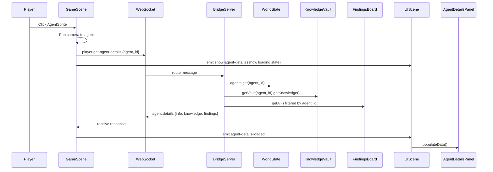
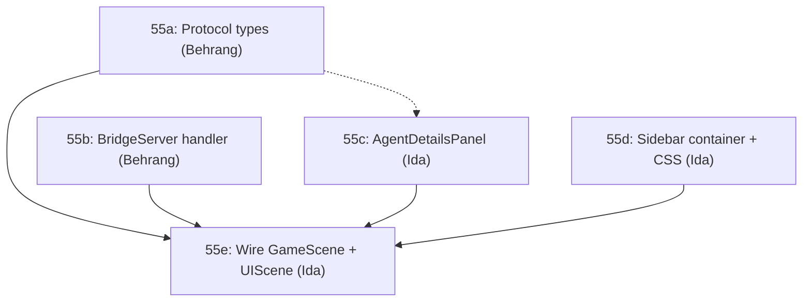

# Feature: Click Agent to See History (Task 55)

## Overview

Clicking an agent sprite in the game client opens a sidebar panel showing that agent's history: role/persona, status, expertise, task history, and findings posted. This gives the human observer visibility into what each agent has been doing and thinking during a brainstorming session.

## Data Flow



## Protocol Messages

Add to `shared/protocol.ts`:

```typescript
// Client -> Server: request agent details
export interface GetAgentDetailsMessage {
  type: 'player:get-agent-details';
  agent_id: string;
}

// Server -> Client: agent details response
export interface AgentDetailsMessage {
  type: 'agent:details';
  agent_id: string;
  info: AgentInfo;
  knowledge: {
    expertise: Record<string, number>;
    insights: string[];
    task_history: Array<{ task: string; outcome: string; timestamp: string }>;
  };
  findings: Array<{
    id: string;
    finding: string;
    severity: 'low' | 'medium' | 'high';
    timestamp: string;
  }>;
}
```

Add `GetAgentDetailsMessage` to the `ClientMessage` union and `AgentDetailsMessage` to the `ServerMessage` union.

## Implementation by Owner

### Behrang: Server + Protocol (Tasks 55a, 55b)

**55a. Protocol types**
1. Add `GetAgentDetailsMessage` and `AgentDetailsMessage` to `shared/protocol.ts`
2. Add to `ClientMessage` and `ServerMessage` unions
3. Mirror to `server/src/types.ts` and `client/src/types.ts`

**55b. BridgeServer handler**
1. Add `case 'player:get-agent-details'` in `handleMessage()` switch (~line 173)
2. New method:

```typescript
private async handleGetAgentDetails(ws: WebSocket, msg: GetAgentDetailsMessage): Promise<void> {
  const agentId = msg.agent_id;
  const agentInfo = this.worldState.agents.get(agentId);
  if (!agentInfo) {
    return; // agent not found, silently ignore
  }

  const vault = this.sessionManager.getVault(agentId);
  const knowledge = vault ? vault.getKnowledge() : null;

  const allFindings = await this.findingsBoard.getAll();
  const agentFindings = allFindings.filter(f => f.agent_id === agentId);

  this.send(ws, {
    type: 'agent:details',
    agent_id: agentId,
    info: agentInfo,
    knowledge: knowledge ? {
      expertise: knowledge.expertise,
      insights: knowledge.insights,
      task_history: knowledge.task_history,
    } : { expertise: {}, insights: [], task_history: [] },
    findings: agentFindings.map(f => ({
      id: f.id,
      finding: f.finding,
      severity: f.severity,
      timestamp: f.timestamp,
    })),
  });
}
```

3. Add server test: verify response shape, verify missing agent returns nothing.

### Ida: Client Panel + Wiring (Tasks 55c, 55d, 55e)

**55c. Create `AgentDetailsPanel.ts`**

New file: `client/src/panels/AgentDetailsPanel.ts`

Follow the DialogueLog pattern (DOM overlay, mounted in sidebar):
- Constructor takes `parentId` string
- Creates a container div with sections:
  - **Header**: agent name, role, colored indicator, status badge
  - **Expertise**: horizontal bars or tag chips showing top expertise areas
  - **Task History**: scrollable list of tasks with outcomes and timestamps
  - **Findings**: list of findings this agent posted (the brainstorm ideas)
- Methods:
  - `show(agentId: string, name: string, color: number)` — show panel with loading state
  - `hide()` — hide panel
  - `populateData(details: AgentDetailsMessage)` — fill in all sections
  - `clear()` — reset panel contents
- Clicking a different agent replaces the panel content
- Clicking the same agent again (or a close button) hides the panel

Style to match the dungeon aesthetic from `docs/agent-dungeon-design-spec.md`.

**55d. Add sidebar container in `index.html`**

Add a `<div id="agent-details-panel" class="panel hidden"></div>` in the sidebar area (~line 961). Add CSS for the panel sections.

**55e. Wire GameScene + UIScene**

`GameScene.ts` (~line 328, existing click handler):
```typescript
sprite.on('pointerdown', () => {
  // Existing: pan camera
  if (this.cameraController) {
    this.cameraController.panTo(sprite.getX(), sprite.getY(), agent.agent_id);
  }
  // New: request details + show panel
  this.wsClient.send({
    type: 'player:get-agent-details',
    agent_id: agent.agent_id,
  });
  this.scene.get('UIScene').events.emit('show-agent-details', {
    agent_id: agent.agent_id,
    name: agent.name,
    color: agent.color,
  });
});
```

Add WebSocket listener in `GameScene.create()`:
```typescript
this.wsClient.on('agent:details', (msg) => {
  this.scene.get('UIScene').events.emit('agent-details-loaded', msg);
});
```

`UIScene.ts`:
- Import and instantiate `AgentDetailsPanel`
- Listen for `show-agent-details` and `agent-details-loaded` events
- Route to panel methods

## Key Files

| File | Owner | Change |
|------|-------|--------|
| `shared/protocol.ts` | Behrang | Add message types |
| `server/src/types.ts` | Behrang | Mirror types |
| `client/src/types.ts` | Behrang | Mirror types |
| `server/src/BridgeServer.ts` | Behrang | Add handler |
| `server/src/__tests__/` | Behrang | Add test |
| `client/src/panels/AgentDetailsPanel.ts` | Ida | New panel |
| `client/index.html` | Ida | Sidebar container + CSS |
| `client/src/scenes/GameScene.ts` | Ida | Click handler + WS listener |
| `client/src/scenes/UIScene.ts` | Ida | Panel instantiation + events |

## Dependencies

Behrang's work (55a, 55b) and Ida's panel work (55c, 55d) can run **in parallel**. Ida's wiring work (55e) needs 55a to be merged first (for the protocol types). Ida can stub the types locally if she wants to start early.


