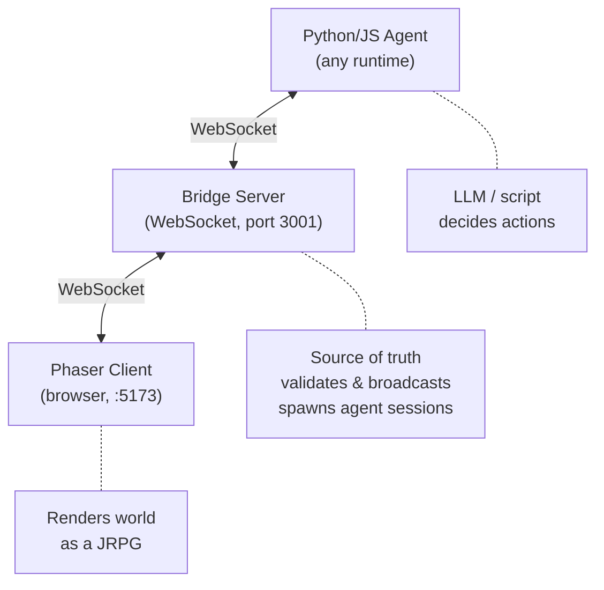
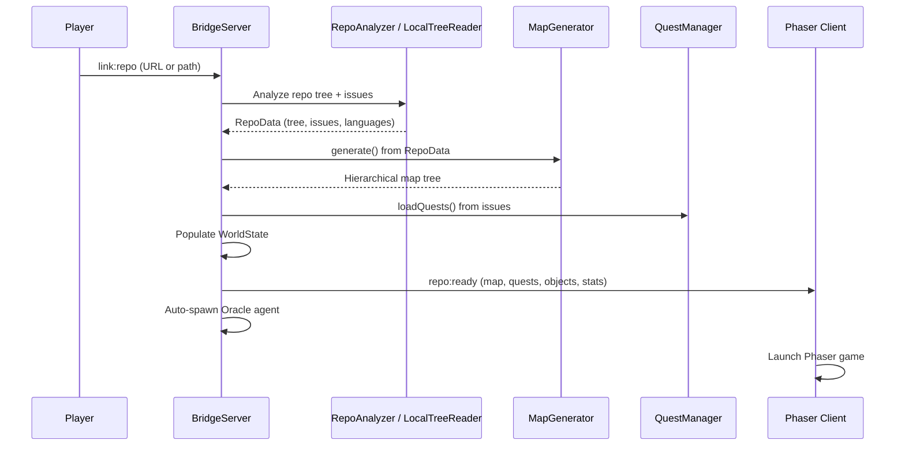
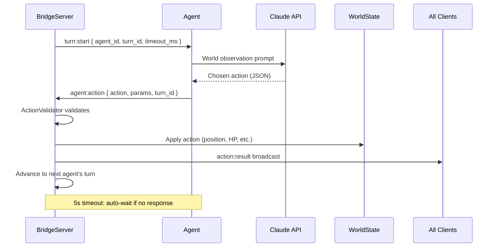
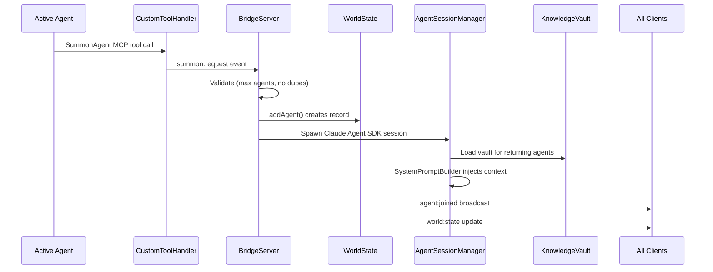
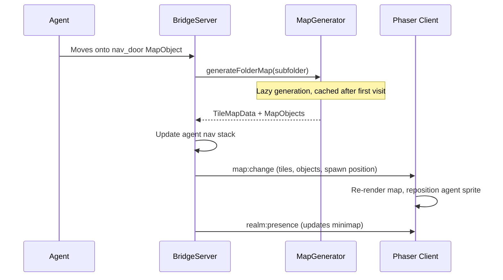
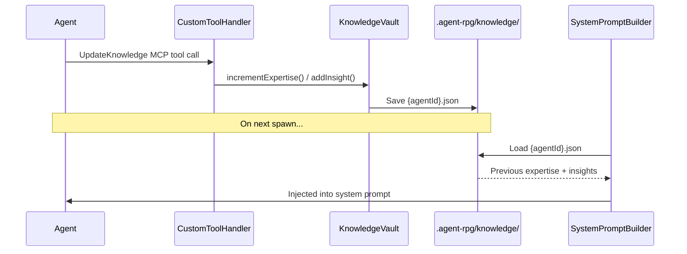
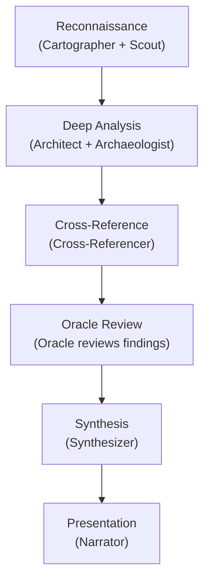
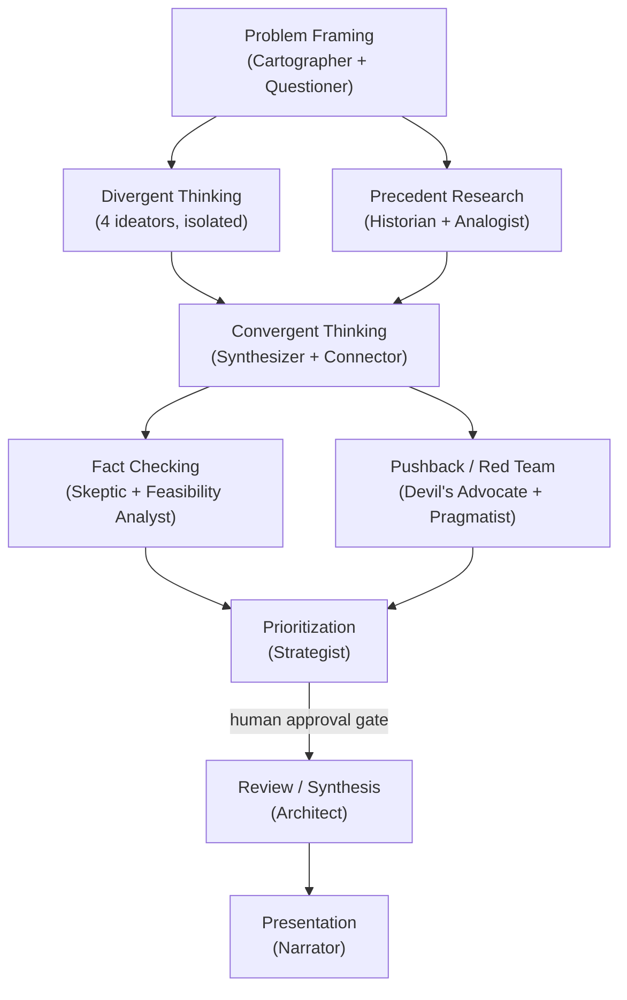
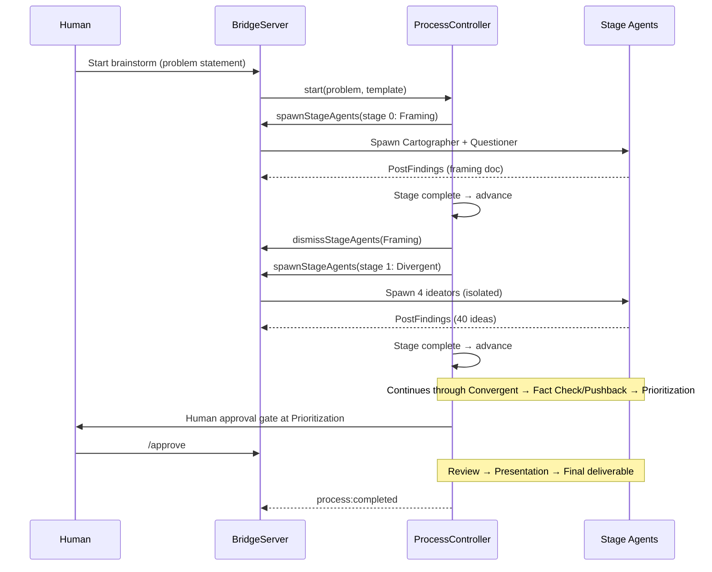

# Agent Dungeon: Architecture

## System Overview



Three processes communicate over WebSocket. The Bridge Server is the single source of truth. Agents propose actions; the server validates and broadcasts results; the client renders everything.

---

## Component Breakdown

### 1. Bridge Server (`ha-agent-rpg/server/src/`)

The orchestrator. Owns all state, enforces all rules, and manages agent lifecycles.

#### Core Modules

| File | Responsibility |
|------|---------------|
| `index.ts` | Entry point. Starts BridgeServer on port 3001, handles graceful shutdown. |
| `BridgeServer.ts` | WebSocket hub, message router, game phase manager, navigation handler. The central nervous system (~1000 lines). |
| `WorldState.ts` | In-memory game state: agents, map, objects, quests, hierarchical map tree. Provides snapshot serialization. |
| `types.ts` | Re-exports from shared protocol + server-specific message types (player navigation). |

#### Agent Session Management

| File | Responsibility |
|------|---------------|
| `AgentSessionManager.ts` | Spawns and manages Claude Agent SDK sessions. One long-running session per agent. Handles knowledge loading, system prompt injection, follow-up messages. |
| `RpgMcpServer.ts` | Custom MCP server exposing 6 RPG tools to agents (SummonAgent, RequestHelp, PostFindings, UpdateKnowledge, ClaimQuest, CompleteQuest). |
| `CustomToolHandler.ts` | Executes the 6 MCP tools. Emits events that BridgeServer listens to for side effects (spawning, broadcasting, quest state). |
| `SystemPromptBuilder.ts` | Builds dynamic system prompts per agent. Two modes: codebase exploration (original) and process-aware brainstorming (via `processContext`). Injects stage context, persona, prior artifacts, and co-participant info. |
| `EventTranslator.ts` | Converts Claude Agent SDK streaming messages into RPG events (move, speak, think, emote, activity, skill_effect). Maintains per-agent text buffers. |

#### Oracle Router

The Oracle Router is the unified entry point for all sessions. Instead of choosing a template upfront, the player sends a `player:submit` message with a problem statement, a repo path, or both. The Oracle agent (Claude Opus) analyzes the input and decides what to run.

| File | Responsibility |
|------|---------------|
| `OracleManager.ts` | Manages the Oracle agent lifecycle. Spawns the Oracle on `player:submit`, wires CustomToolHandler oracle events, feeds inter-stage context to the Oracle between process stages via `feedInterStageContext()`, and dismisses the Oracle at session end. Emits `oracle:decision`, `oracle:summon`, `oracle:dismiss`, `oracle:report`. |

**Input routing** (decided by the Oracle at runtime):

| Input | Template selected |
|-------|-------------------|
| Repo only | `code_review` |
| Problem only | `brainstorm` (standard_brainstorm or deep_brainstorm) |
| Both repo + problem | `code_brainstorm` |

**Model routing** for hero agents (decided per stage in BridgeServer):

| Template + Stage | Model |
|-----------------|-------|
| `code_review` stages 0-1 (Reconnaissance, Deep Analysis) | haiku |
| `code_review` stage 2 (Cross-Reference) | sonnet |
| `code_review` stages 3+ (Oracle Review, Synthesis, Presentation) | opus |
| All brainstorm templates, all stages | sonnet |
| Oracle agent itself | opus |

**Oracle MCP tools** (defined in `RpgMcpServer.ts` via `createOracleMcpServer()`):

| Tool | Purpose |
|------|---------|
| `SelectHeroes` | Choose activity type and initial hero roster; triggers `oracle:decision` |
| `SummonReinforcement` | Add a hero agent between stages |
| `DismissHero` | Remove a hero agent between stages |
| `PresentReport` | Compile and broadcast the final deliverable |

#### Process Management

| File | Responsibility |
|------|---------------|
| `ProcessController.ts` | Manages stage lifecycle for structured multi-agent processes. Tracks turn counts per stage, evaluates completion criteria (turn count or explicit signal), advances stages by dismissing/spawning agents via delegate callbacks to BridgeServer. Emits `stage:started`, `stage:completed`, and `process:completed` events. |
| `ProcessTemplates.ts` | Defines all available process templates. Includes `standard_brainstorm`, `deep_brainstorm`, and `code_review`. Each template has a list of stages, with per-stage agent roles, turn budgets, and persona addenda. |

#### Repository Analysis & Map Generation

| File | Responsibility |
|------|---------------|
| `RepoAnalyzer.ts` | Fetches GitHub repo tree + issues via Octokit. Detects languages, filters excluded paths. |
| `LocalTreeReader.ts` | Walks local filesystem, detects git remote, builds file tree with language detection. |
| `MapGenerator.ts` | Converts repo structure into game world. Folders become rooms, files become map objects. Procedural room layout with corridors. Lazy-generates tile maps per folder on first visit. |

#### Game Systems

| File | Responsibility |
|------|---------------|
| `QuestManager.ts` | Maps GitHub issues to quests. Manages lifecycle: open -> assigned -> in_progress -> done. Enforces valid state transitions. |
| `FindingsBoard.ts` | Shared discovery board. Agents post findings; persisted in Redis (list per session). Surfaced in system prompts. |
| `KnowledgeVault.ts` | Per-agent persistent memory. Tracks expertise levels, insights, files analyzed, task history. Loaded into system prompt on spawn. |

#### Persistence

| File | Responsibility |
|------|---------------|
| `RealmRegistry.ts` | Global registry of analyzed repos. SHA256 hash IDs. Enables "resume" for previously explored codebases. Stored at `~/.agent-rpg-global/`. |
| `WorldStatePersistence.ts` | Serializes/deserializes full game state for realm resumption. |
| `GitHelper.ts` | Git metadata helpers (remote URL, commit counts) for realm tracking. |
| `RedisClient.ts` | Singleton `ioredis` client. Configurable via `REDIS_HOST`/`REDIS_PORT`/`REDIS_PASSWORD` env vars. Used by `FindingsBoard` for live, shared persistence. |

#### Persistence Layout

Findings are stored in **Redis** (one list per session, keyed by `session:<path>:findings`). All other runtime data uses JSON files:

```
.agent-rpg/
├── knowledge/
│   ├── oracle.json              # Per-agent knowledge vault
│   ├── test_guardian.json
│   └── doc_scribe.json
└── logs/
    ├── oracle/
    │   └── 2026-02-19.jsonl     # Daily transcript logs
    └── test_guardian/
        └── 2026-02-19.jsonl
```

Redis keys (requires a running Redis instance, defaults to `localhost:6379`):

```
session:<sanitized-path>:findings   # FindingsBoard — rpush on write, lrange on read
```

---

### 2. Phaser Client (`ha-agent-rpg/client/src/`)

A Phaser 3 game running in the browser. Purely a renderer: it receives state from the bridge and draws it. The only messages it sends are player commands from the prompt bar.

#### Entry & Config

| File | Responsibility |
|------|---------------|
| `main.ts` | Client orchestrator. Connects WebSocket, manages onboarding screens (title, repo selection), launches Phaser game on `repo:ready`, wires up UI panels. |
| `config.ts` | Phaser config: 640x480, 32px tiles (20x15 grid), pixel art mode, dark background. |
| `types.ts` | Client-side protocol type re-exports. |

#### Scenes (Phaser)

| File | Responsibility |
|------|---------------|
| `BootScene.ts` | Generates all textures programmatically (no asset files). |
| `GameScene.ts` | Main gameplay. Renders map via MapRenderer, manages agent sprites, handles action results, processes map changes on navigation. |
| `UIScene.ts` | Overlay UI layer for dialogue, turn indicators. |

#### Rendering Systems

| File | Responsibility |
|------|---------------|
| `MapRenderer.ts` | Renders TileMapData as Phaser tiles (grass, wall, water, door, floor). |
| `AgentSprite.ts` | Agent visual: colored rectangle sprite with name label, walk animation, idle state. |
| `MapObjectSprite.ts` | File/config/doc objects on the map. Interactive, clickable. |
| `EffectSystem.ts` | Skill animations, status effects, visual feedback. |
| `DialogueSystem.ts` | JRPG dialogue box with typewriter text effect. |
| `ThoughtBubble.ts` | Floating thought text above agent sprites. |
| `CameraController.ts` | Camera snap/pan to active agents and door reveals. |

#### UI Panels (DOM overlays)

| File | Responsibility |
|------|---------------|
| `PromptBar.ts` | Command input with slash-command autocomplete. Mode selector (manual/supervised/autonomous). Agent focus badge. Sends `player:command` messages. |
| `QuestLog.ts` | Displays quests by status (open, assigned, in_progress, done). |
| `MiniMap.ts` | Hierarchical folder tree showing agent and player positions. |
| `DialogueLog.ts` | Scrolling log of all agent speech and player messages. |

#### Screens (Onboarding)

| File | Responsibility |
|------|---------------|
| `TitleScreen.ts` | "New Game" entry screen. |
| `RepoScreen.ts` | Repo URL input or realm selection for resuming previous sessions. |

#### Network

| File | Responsibility |
|------|---------------|
| `WebSocketClient.ts` | Pub-sub WebSocket wrapper with auto-reconnect (2s delay). |

---

### 3. Python Agents (`ha-agent-rpg/agent/`)

Sample agents demonstrating the protocol. Any WebSocket client in any language can be an agent.

| File | Responsibility |
|------|---------------|
| `agent.py` | Entry point for scripted agent. Connects, registers, loops on turn messages. |
| `protocol.py` | Dataclass message builders (RegisterMessage, ActionMessage) + JSON parser. |
| `behaviors.py` | ScriptedBehavior: cycles through all 6 action types for demo purposes. Handles move computation, target finding. |
| `llm_agent.py` | LLM-powered agent using Claude API. Supports full conversation history (LLMBehavior) or single-shot (SimpleReflexBehavior). Argparse CLI with mission, color, server URL. |
| `llm_behavior.py` | LLMBehavior: builds observation from world state, maintains conversation history, calls Claude API, parses JSON action responses. SimpleReflexBehavior: stateless single-shot variant using Haiku. |

---

### 4. Shared Protocol (`ha-agent-rpg/shared/protocol.ts`)

The canonical message contract. Defines every message type exchanged over WebSocket. Mirrored in both server and client `types.ts` files.

Key type groups:

- **Agent identity**: AgentInfo, AgentStats
- **Actions**: AgentActionMessage, ActionParams (move, speak, skill, interact, emote, wait, think)
- **World state**: WorldStateMessage, TileMapData, MapObject, MapNode
- **Game events**: ActionResultMessage, RepoReadyMessage, QuestUpdateMessage, FindingsPostedMessage
- **Navigation**: RealmListMessage, RealmPresenceMessage, RealmTreeMessage

---

## Key Flows

### Repo Onboarding



### Agent Turn Cycle



### Agent Spawning (SummonAgent)



### Hierarchical Navigation



### Quest Lifecycle

```mermaid
stateDiagram-v2
    [*] --> open: MapGenerator creates from GitHub issues
    open --> assigned: Agent calls ClaimQuest
    assigned --> in_progress: Agent begins work
    in_progress --> done: Agent calls CompleteQuest
    done --> [*]

    note right of open: quest:update broadcast at each transition
    note right of done: QuestLog panel updates in client
```

### Knowledge Persistence



---

## Skills / Process Templates (`ha-agent-rpg/skills/`)

Skills are structured multi-agent workflows that run on top of the core agent infrastructure. Each skill is a directory containing a human-readable design doc, a playbook, and a machine-readable process template.

### Code Review Template (`ProcessTemplates.ts` — `code_review`)

A 6-stage code analysis process run by specialist heroes with file-reading access.



**Key design features:**
- **File access**: Heroes in `code_review` stages 0-2 have access to file-reading MCP tools (Read, Glob, Grep). Later-stage heroes and brainstorm agents do not.
- **Model routing**: Stages 0-1 use `haiku` (cheap exploration), stage 2 uses `sonnet` (cross-reference reasoning), stages 3+ use `opus` (heavy synthesis).
- **Oracle-driven**: Launched by the Oracle Router after the Oracle calls `SelectHeroes`. The Oracle continues to run alongside heroes and reviews inter-stage findings.

### Brainstorm Skill (`skills/brainstorm/`)

A 9-stage divergent-then-convergent ideation process using 15 specialized agent personas. The `ProcessController` on the server drives execution; `brainstorm-process.json` is the template it reads.



**Key design features:**
- **Groupthink prevention**: Divergent agents are isolated; they cannot see each other's output until the stage completes.
- **Fast demo mode** (`fast_demo_mode: true`): Skips Precedent Research, Fact Checking, and Pushback; reduces to 2 ideators with 5 ideas each. Completes in ~2.5 min.
- **Human intervention**: Commands (`/approve`, `/inject`, `/skip`, `/kill`, `/deepen`, `/redirect`, `/restart`, `/export`) let the human direct the process at defined intervention points.
- **Conditional branching**: If all candidates are killed in Pushback, loops back to Divergent. If too many are eliminated in Fact Checking, loops back to Convergent.
- **Rooms as realms**: Each stage assigns agents to realm paths (e.g. `/brainstorm/framing`, `/brainstorm/divergent`) so they appear in distinct rooms in the Phaser client.

### Brainstorm Process Flow



### Skill File Structure

```
skills/
└── brainstorm/
    ├── SKILL.md                   # Playbook: invocation, phase flow, timing budget
    ├── DESIGN.md                  # Full methodology: 15 agent personas, transition rules, output schemas
    └── brainstorm-process.json    # Machine-readable process template (770 lines)
```

---

## Message Protocol (WebSocket)

All messages are JSON with a `type` field for routing.

### Agent -> Server

| Type | Purpose |
|------|---------|
| `agent:register` | Join the game with id, name, color |
| `agent:action` | Submit turn action (move, speak, skill, interact, emote, wait, think) |

### Server -> All

| Type | Purpose |
|------|---------|
| `world:state` | Full state snapshot (agents, map, objects, quests) |
| `action:result` | Result of an agent's action (success/error) |
| `turn:start` | Signal which agent should act next |
| `agent:joined` / `agent:left` | Agent lifecycle events |
| `map:change` | New map data after navigation |
| `quest:update` | Quest status change |
| `findings:posted` | New finding on the shared board |
| `knowledge:level-up` | Agent gained expertise |
| `spawn:request` | New agent being summoned |
| `oracle:decision` | Oracle selected activity type + hero roster |
| `repo:ready` | Repo analyzed, game can start |
| `realm:list` / `realm:removed` | Realm management |

### Player -> Server

| Type | Purpose |
|------|---------|
| `player:submit` | Unified entry point: submit a problem, repo path, or both; spawns the Oracle |
| `player:command` | Text command from the prompt bar |
| `player:navigate:enter` / `back` | Manual folder navigation |
| `link:repo` | Repo URL to analyze (legacy) |

---

## Configuration & Modes

The client prompt bar supports three autonomy modes:

- **Manual**: Agents wait for player commands before acting
- **Supervised**: Agents act autonomously but player can intervene
- **Autonomous**: Agents run fully independently

The bridge server tracks settings including max agents, token budget, permission level (read-only, write-with-approval, full), and autonomy mode.

---

## Build & Run

```
ha-agent-rpg/
├── package.json          # Workspace root (server + client workspaces)
├── server/
│   └── package.json      # ws, claude-agent-sdk, octokit, vitest
├── client/
│   └── package.json      # phaser, vite, vitest
├── agent/
│   └── requirements.txt  # websockets, anthropic
└── scripts/
    └── start-all.sh      # Kills stale processes, installs deps, starts all 3 components
```

**Ports**: Bridge 3001, Vite client 5173

### Multiplayer / Observation

To watch the game from another device on the same network, connect to the host's IP instead of `localhost`.

| Host | IP | URL |
|------|----|-----|
| Behrang | `10.4.33.165` | `http://10.4.33.165:5173` |

**Quick start**: `./scripts/start-all.sh` then open `http://localhost:5173` (or the remote URL above for spectating)

---

## Testing

- **Server**: Vitest tests in `server/src/__tests__/` covering FindingsBoard, EventTranslator, WorldStatePersistence, MapGenerator, CustomToolHandler, KnowledgeVault, QuestManager, RealmRegistry
- **Client**: Build verification (tests planned)
- **CI**: GitHub Actions with type checking, server tests, codecov upload, quality gate
