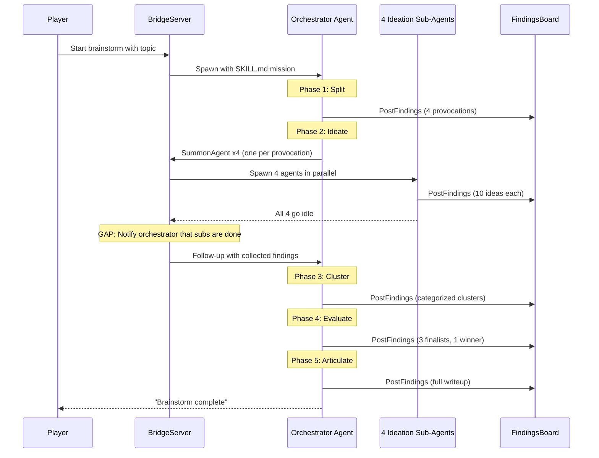
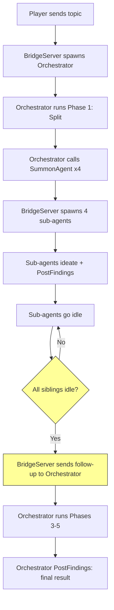

# Brainstorm End-to-End: Architecture & Gaps

This doc maps the SKILL.md brainstorm flow against Jeff's existing infrastructure, identifies what's missing, and proposes the minimal changes to get end-to-end working.

## Target Flow (from `skills/brainstorm/SKILL.md`)



## What Jeff Already Built

### Infrastructure that directly supports this flow

| Component | Status | How it helps |
|-----------|--------|-------------|
| `SummonAgent` tool + `spawnRequestedAgent()` | Working | Orchestrator can spawn sub-agents. Creates world state entry, generates map position, starts Claude session with RPG tool set. |
| `PostFindings` tool + `FindingsBoard` | Working | All agents can post to a shared board. Persisted to disk, broadcast to UI clients. |
| `sendFollowUp()` + prompt queuing | Working | Can wake an idle agent with new context. If agent is busy, prompt is queued and drained automatically when it goes idle. |
| `agent:idle` event chain | Working | Fires when any agent's `query()` completes. BridgeServer receives it, updates world state status. |
| `SystemPromptBuilder` (codebase mode) | Working | Orchestrator gets `SummonAgent`, `PostFindings`, `RequestHelp`, `UpdateKnowledge`, `ClaimQuest`, `CompleteQuest` in its prompt. Findings board contents included. |
| `EventTranslator` | Working | Agent SDK messages (text, tool calls) are translated to RPG events (speak, think, emote, activity) and broadcast to the Phaser client. |
| `handlePlayerCommand()` | Working | Player can send commands to specific agents via `sendFollowUp()`. Routes by agent name prefix or falls back to oracle. |
| ProcessController delegate pattern | Working | Clean separation: ProcessController doesn't own spawning; it delegates to BridgeServer. Shows the pattern for event-driven stage management. |
| `drainPendingPrompts()` | Working | Ensures follow-ups are handled even if agent is temporarily busy. Self-perpetuating: idle -> drain -> resume -> idle -> drain. |

### Infrastructure that exists but isn't wired for this flow

| Component | Status | What's missing |
|-----------|--------|---------------|
| `requestingAgent` in spawn flow | Partially built | The field flows through `summon:request` event and into `spawnRequestedAgent()`, but is only used for UI broadcasts. **Not stored.** |
| `handleStartProcess()` | Built for ProcessController | Currently wires up ProcessController with the `STANDARD_BRAINSTORM` template (3 stages, server-driven). Needs a SKILL.md path that skips ProcessController. |
| `help:request` event | Emitted but not handled | `RequestHelp` tool emits the event, but `wireToolHandlerEvents()` has no listener. Agent-to-agent help requests go nowhere. |

## The Three Gaps

### Gap 1: No parent-child spawn tracking

**Problem:** When the orchestrator calls `SummonAgent` x4, there's no record of which agent spawned which. The `requestingAgent` field exists in the event payload but is never persisted.

**Why it matters:** When sub-agents go idle, we need to know "these 4 agents were spawned by the orchestrator" so we can wake the orchestrator when they're all done.

**What exists:** `spawnRequestedAgent()` receives `request.requestingAgent` (line 562 of BridgeServer.ts). The data is right there; it just isn't stored.

**Fix:** Add a `Map<string, string>` (childId -> parentId) and a `Map<string, Set<string>>` (parentId -> childIds) in BridgeServer. Populate in `spawnRequestedAgent()`.

### Gap 2: No "all children idle" notification

**Problem:** When all sub-agents finish and go idle, nobody wakes the orchestrator. The `agent:idle` handler in `wireSessionManagerEvents()` only forwards to ProcessController (which we're not using in the SKILL.md approach).

**Why it matters:** The orchestrator needs to receive the collected findings and continue to Phase 3 (Cluster).

**What exists:** `sendFollowUp()` can wake any idle agent. `agent:idle` fires for every agent. The findings board has all posted findings. All the pieces are here.

**Fix:** In the `agent:idle` handler, after updating world state, check: does this agent have a parent? If so, are all siblings also idle? If yes, collect the current findings board entries and call `sendFollowUp()` on the parent with: "All sub-agents have completed. Here are the findings: [board contents]"

### Gap 3: No entry point for SKILL.md brainstorm

**Problem:** The player needs a way to start a brainstorm that spawns the orchestrator with the SKILL.md mission (not the ProcessController flow). Currently `player:start-process` is hardwired to the ProcessController path.

**What exists:** `handlePlayerCommand()` can route commands to agents, but there's no orchestrator to route to until one is spawned. `handleStartProcess()` exists but creates a ProcessController.

**Fix options (pick one):**
- **Option A:** Add a new message type `player:start-brainstorm` that spawns the orchestrator directly with the SKILL.md mission template, filling in the topic. No ProcessController.
- **Option B:** Reuse `player:start-process` but check the template type. If it's a "prompt-driven" template, skip ProcessController and just spawn an orchestrator agent with the RPG tool set.
- **Option C:** Player first links a fake/empty "brainstorm" realm, then sends a command like `/summon Brainstorm Conductor mission="..."`. Hacky but requires zero new server code.

## Proposed Architecture



The yellow nodes are the new behavior. Everything else already works.

## Implementation Sequence

### 1. Spawn tracking (Gap 1)

Add to BridgeServer:

```typescript
// Track parent-child spawn relationships
private spawnParent = new Map<string, string>();    // childId -> parentId
private spawnChildren = new Map<string, Set<string>>(); // parentId -> childIds
```

Populate in `spawnRequestedAgent()`:

```typescript
this.spawnParent.set(agentId, request.requestingAgent);
const children = this.spawnChildren.get(request.requestingAgent) ?? new Set();
children.add(agentId);
this.spawnChildren.set(request.requestingAgent, children);
```

Clear on `cleanupCurrentRealm()`.

### 2. All-children-idle notification (Gap 2)

In `wireSessionManagerEvents()`, in the `agent:idle` handler:

```typescript
// Check if this agent's parent should be notified
const parentId = this.spawnParent.get(agentId);
if (parentId) {
  const siblings = this.spawnChildren.get(parentId);
  if (siblings) {
    const allIdle = [...siblings].every(
      id => this.worldState.getAgent(id)?.status === 'idle'
    );
    if (allIdle) {
      const findings = this.findingsBoard.getRecent(50);
      const findingsText = findings
        .map(f => `[${f.agent_name}] ${f.finding}`)
        .join('\n');
      this.sessionManager.sendFollowUp(
        parentId,
        `All sub-agents have completed their work. Here are the collected findings:\n\n${findingsText}\n\nContinue with the next phase of your mission.`
      );
    }
  }
}
```

### 3. Entry point (Gap 3)

Add a handler for starting a prompt-driven brainstorm. Spawns the orchestrator with the SKILL.md mission, topic injected, using `createRpgMcpServer` (the full 6-tool set so it can call SummonAgent).

## What We're NOT Building Yet

These are all in DESIGN.md / brainstorm-process.json but are deferred:

- Groupthink isolation (divergent agents can't see each other's findings)
- Parallel stages (ProcessController does sequential only)
- Human gate commands (`/approve`, `/skip`, `/kill`, etc.)
- 9-stage / 15-persona full template
- `RequestHelp` agent-to-agent routing
- Conditional branching (loop back on kill-all)
- Custom tools from the JSON (`ProposeIdea`, `Synthesize`, `Vote`, etc.)

These can all be layered in after the end-to-end flow works.

## Visual Behavior in Client

No client changes needed for end-to-end. The existing infrastructure handles it:

1. Orchestrator spawns in `/brainstorm` realm; appears as a sprite, speech bubbles show its output
2. Sub-agents spawn in `/brainstorm/room-1` through `/brainstorm/room-4`; each appears in its realm
3. All `PostFindings` calls broadcast to UI via `findings:posted` messages
4. `agent:activity` messages from EventTranslator show agent actions in the dialogue log
5. MiniMap shows agent positions across realms
