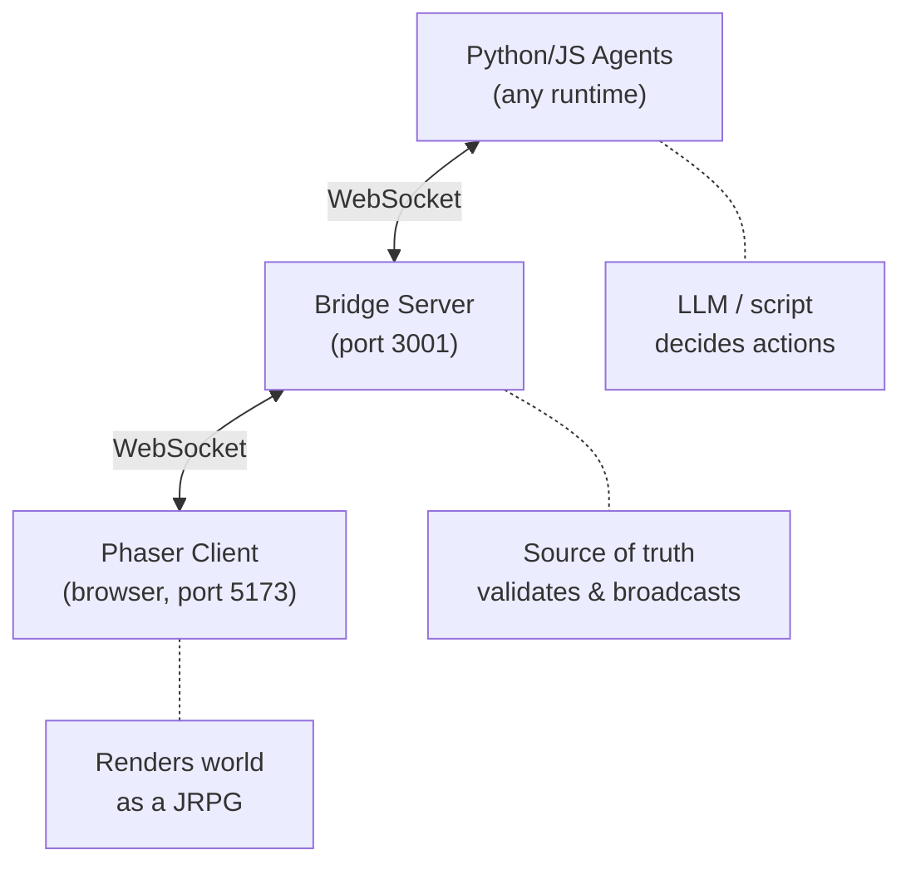
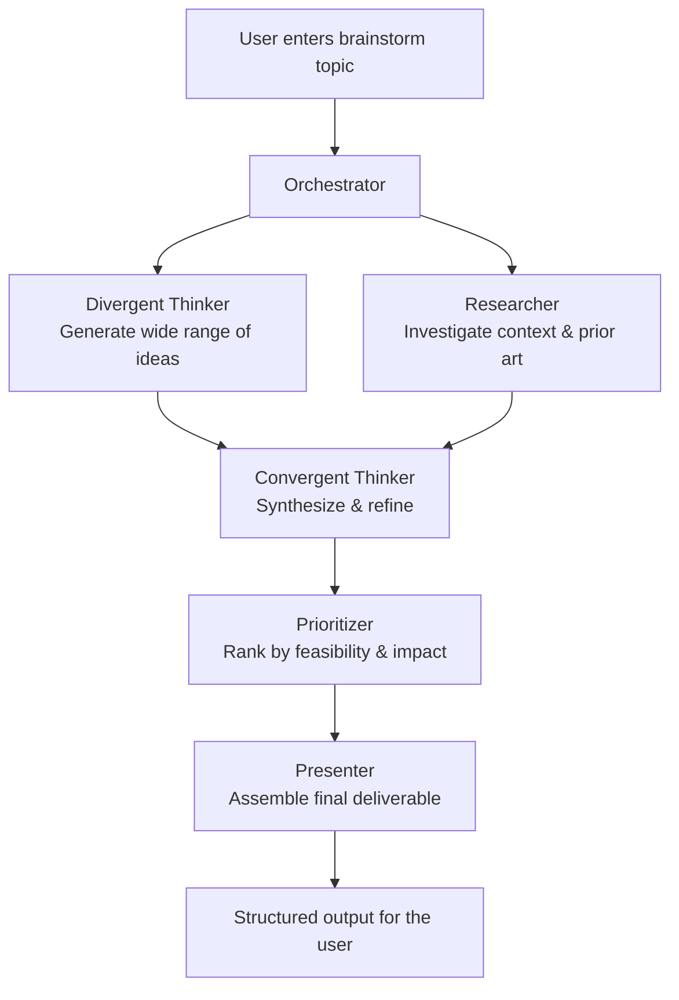

# Agent Dungeon: Project Brief

## What Is This?

Agent Dungeon is a visual interface that renders autonomous AI sub-agents as characters in a classic JRPG. When Claude Code spins up sub-agents to handle tasks, each one appears on screen as an RPG character: walking a tile map, speaking in dialogue boxes, emoting with bubbles, and interacting with objects that represent real files and folders in a codebase.

It turns the invisible work of AI agents into something you can actually watch.

## The Core Idea

AI agent orchestration is opaque. You kick off a process, sub-agents spawn, work happens, results come back. You have no visibility into what's happening in between.

Agent Dungeon fixes that by mapping agent behavior onto a metaphor everyone understands: a party of RPG characters exploring a dungeon. The "dungeon" is your codebase. Files are objects on the map. Folders are rooms connected by doors. Agents walk around, examine files, talk to each other, claim quests (GitHub issues), and report findings.

## How It Works (High Level)

Three components:

1. **Bridge Server** (TypeScript, port 3001) -- The source of truth. Manages world state, validates actions, runs turn logic, spawns agent sessions via Claude Agent SDK.
2. **Phaser Client** (browser, port 5173) -- The renderer. A Phaser 3 game that displays the tile map, agent sprites, dialogue, effects. Purely visual; it never sends actions, only receives state.
3. **Agents** (Python or any WebSocket client) -- The players. Connect to the bridge, receive turn prompts, decide actions (via LLM or script), send them back.

## What Exists Today

The `ha-agent-rpg/` directory contains a working prototype:

- **Bridge server** with WebSocket hub, world state, turn management, action validation, repo analysis (GitHub + local), hierarchical map generation, quest management, findings board, knowledge persistence, realm registry
- **Phaser client** with tile map rendering, agent sprites, dialogue system, thought bubbles, emote bubbles, skill effects, minimap, quest log, prompt bar, title/repo selection screens
- **Python agents** with both scripted behavior (demo) and LLM-powered behavior (Claude API), plus an LLM agent that uses the Claude Agent SDK with custom MCP tools
- **Custom MCP tools** for agents: SummonAgent, RequestHelp, PostFindings, UpdateKnowledge, ClaimQuest, CompleteQuest
- **Persistence layer**: per-agent knowledge vaults, findings board, transcript logs, realm registry for session resumption
- **CI pipeline**: GitHub Actions with server tests (vitest), type checking, codecov

## Visual Style

The map and world should evoke the look of classic 8-bit RPGs: chunky pixel tiles, limited color palettes, and the charm of NES/SNES-era adventures. We like this retro aesthetic; it keeps the interface playful and readable without requiring polished art assets. All textures are generated programmatically in BootScene to match this style.

## Target Experience

A developer runs `./scripts/start-all.sh`, opens the browser, and sees a JRPG world. They paste a repo URL (or pick a previously explored one). The system analyzes the repo, generates a dungeon map from its folder structure, and spawns an "Oracle" agent who begins exploring.

The Oracle can summon specialist agents (Test Guardian, Doc Scribe, etc.) who appear on the map, walk to relevant files, examine them, and report findings. Agents share knowledge, claim quests from GitHub issues, and level up their expertise over time.

The player can type commands in the prompt bar, switch between manual/supervised/autonomous modes, and watch the whole thing unfold like a game.

## Canonical Problem: Brainstorming

To ground the project and drive design decisions, we're building around a single canonical use case: **collaborative brainstorming**.

A user enters a topic or problem space to brainstorm on. The orchestrator takes that input and spawns a party of specialist agents, each with a distinct role in the brainstorming process:

- **Divergent Thinker** -- Generates a wide range of ideas, explores tangents, pushes into unexpected territory. Quantity over quality.
- **Convergent Thinker** -- Synthesizes, groups, and refines the divergent output. Finds themes, eliminates redundancy, sharpens the strongest ideas.
- **Researcher** -- Investigates context, pulls in relevant information, fact-checks claims, and surfaces prior art or related work.
- **Prioritizer** -- Evaluates ideas against criteria (feasibility, impact, effort, novelty). Ranks and scores. Identifies what to pursue first.
- **Presenter** -- Takes the prioritized output and assembles it into a clear, structured deliverable the user can act on.

The user watches all of this happen on the map in real time. Agents walk between idea clusters, talk to each other, post findings to the board, and the brainstorm takes shape visually. Every phase of the thinking process is observable.

This use case exercises the full system: multi-agent spawning, inter-agent communication, shared findings, phased workflows, and a clear deliverable at the end. If Agent Dungeon works well for brainstorming, the architecture generalizes to other multi-agent workflows.

## What We're Building Toward

This repo (`AI-Interfaces-Feb-2026`) is the umbrella for experiments in making AI agent work visible and interactive. Agent Dungeon is the first project. The vision:

- **Observable AI work**: See what agents are doing, not just the end result
- **Collaborative agents**: Multiple specialists working together with shared context
- **Persistent learning**: Agents remember what they've learned across sessions
- **Playful interface**: Make monitoring AI work something you actually want to look at

## Tech Stack

| Component | Technology |
|-----------|-----------|
| Game Client | Phaser 3, TypeScript, Vite |
| Bridge Server | Node.js, TypeScript, ws, Claude Agent SDK |
| Repo Analysis | Octokit (GitHub), local filesystem reader |
| Agent Runtime | Python 3, websockets, Anthropic SDK |
| Custom Tools | MCP server (6 RPG-themed tools) |
| Testing | Vitest, GitHub Actions |
| Persistence | JSON files (.agent-rpg/ directory) + Redis (findings board) |

## Team

- Ida
- Jeff
- Pratham
- Behrang
- Ken

## Key Terms

- **Bridge Server**: WebSocket hub that owns all game state and routes messages
- **Realm**: An analyzed repository that becomes a navigable dungeon
- **Map Node**: A folder in the repo, rendered as a room with doors to subfolders
- **Map Object**: A file in the repo, rendered as an interactable sprite on the tile map
- **Quest**: A GitHub issue mapped to an in-game quest with claim/complete lifecycle
- **Knowledge Vault**: Per-agent persistent memory (expertise levels, insights, file history)
- **Findings Board**: Shared team board where agents post discoveries
- **Oracle**: The first agent spawned; acts as team lead and can summon specialists
