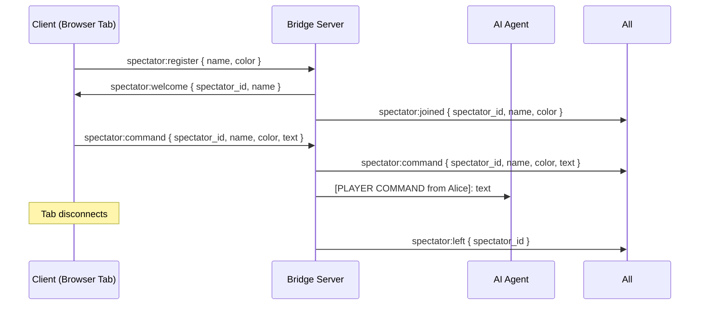
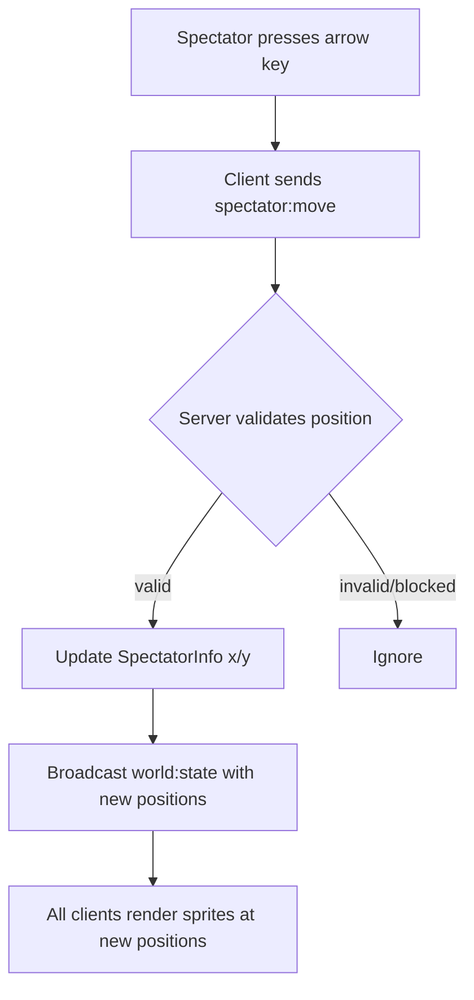
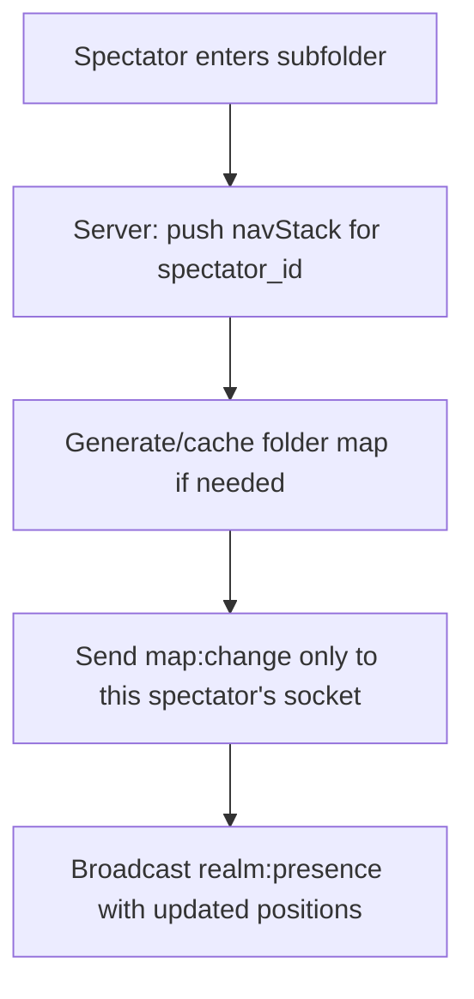
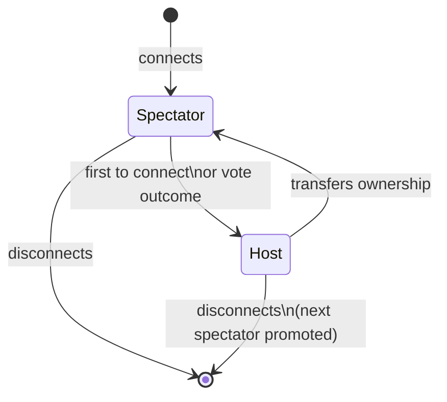

# Multiplayer Spectator Plan

> Status: Phase 1 implemented. Phases 2–5 are future work.

---

## Overview

Agent Dungeon currently supports one human player. This document specifies a multi-phase plan to add **named spectators** — humans who can connect, be identified by name and color, and issue commands to AI agents. Commands are attributed to their sender in the dialogue log.

---

## Phase 1 — Named Spectators with Agent Commands *(implemented)*

Spectators are named observers with shared agent-control access. No movement, no avatars. Multiple browser tabs can connect simultaneously and each sees every other spectator's commands in the dialogue log.

### Protocol Changes

#### New Types

```typescript
// Shared spectator identity
interface SpectatorInfo {
  spectator_id: string;
  name: string;
  color: number;       // 0xRRGGBB
}
```

#### New Messages

| Direction | Type | Payload |
|-----------|------|---------|
| Client → Server | `spectator:register` | `{ name, color }` |
| Server → Client | `spectator:welcome` | `{ spectator_id, name }` |
| Server → All | `spectator:joined` | `{ spectator_id, name, color }` |
| Server → All | `spectator:left` | `{ spectator_id }` |
| Client → Server | `spectator:command` | `{ spectator_id, name, color, text }` |
| Server → All | `spectator:command` | `{ spectator_id, name, color, text }` (echo) |

#### `WorldStateMessage` extension

```typescript
interface WorldStateMessage {
  // ... existing fields ...
  spectators?: SpectatorInfo[];   // connected spectators
}
```

### Message Flow



### Server Changes (`BridgeServer.ts`)

- Added `spectatorSockets: Map<string, WebSocket>` — spectatorId → socket
- Added `spectatorInfo: Map<string, SpectatorInfo>` — spectatorId → identity
- `handleSpectatorRegister()` — assigns UUID, stores socket, broadcasts `spectator:joined`
- `handleSpectatorCommand()` — broadcasts echo to all, routes to agent with attribution
- On disconnect — removes from maps, broadcasts `spectator:left`
- `getWorldStateWithSpectators()` — includes spectator list in `world:state` broadcasts

The player command routing prefix `[PLAYER COMMAND from {name}]:` tells agents who is speaking so they can attribute responses.

### Client Changes

| File | Change |
|------|--------|
| `screens/JoinScreen.ts` | New overlay: name input + color picker, shown on game start |
| `network/WebSocketClient.ts` | Stores spectator info; sends `spectator:register` after join |
| `panels/PromptBar.ts` | Sends `spectator:command` (with spectator_id/name/color) instead of `player:command` |
| `panels/DialogueLog.ts` | `addSpectatorCommand(name, color, text, isOwn)` — attributed bubbles |
| `main.ts` | Wires JoinScreen, spectator events, spectator list panel |
| `index.html` | CSS for join overlay + spectator list |

### Verification

1. Open two browser tabs to `http://localhost:5173`
2. Each tab shows the join screen; enter different names
3. Both appear in the Spectators panel in the sidebar
4. Tab A types a command → Tab B sees it in DialogueLog with Tab A's name and color
5. Agent receives command attributed to the spectator's name
6. Close Tab A → Tab B sees the spectator leave

---

## Phase 2 — Spectator Avatars (Read-Only Map Presence) *(future)*

Each spectator gets a `HumanSprite` on the root map — cosmetic only, no game-state effect.

### Changes

- `SpectatorInfo` extended with `x: number; y: number`
- Spectators can move via arrow keys; server broadcasts cosmetic position to all
- `WorldStateMessage.spectators` includes positions
- Client renders spectator sprites at their reported positions
- No `navStack` or folder navigation — avatars stay at root map



---

## Phase 3 — Independent Navigation *(future)*

Spectators can navigate into subfolders independently of each other.

### Changes

- Server tracks `navStack` and `currentPath` per spectator (parallel to agents)
- `spectator:navigate-enter` / `spectator:navigate-back` client messages
- Server sends targeted `map:change` to each spectator socket
- `realm:presence` extended to include spectators alongside agents
- `world:state` personalized: shared agent/quest data broadcast to all; map data sent individually



---

## Phase 4 — Authority & Roles *(future)*

One spectator is the **Host** with exclusive admin access.

### Changes

- `SpectatorInfo` extended with `role: 'host' | 'spectator'`
- First spectator to connect (or elected) becomes Host
- Host has exclusive access to `/summon`, `/dismiss`, `/mode`, `/settings`
- Other spectators can only send `spectator:command`
- `spectator:welcome` includes assigned role
- Role displayed in spectator list: `[Host] Alice`, `[Spectator] Bob`
- Host transfer: `spectator:transfer-host { target_spectator_id }`



---

## Phase 5 — Player Avatars & Quests *(future)*

Spectators become full **Players** with persistent identity and quest participation.

### Changes

- Persistent player profiles: `player_id`, display name, avatar color, session history
- Players can accept quests from agents (`quest:accept { player_id, quest_id }`)
- Players appear in agent dialogue: `"Quest accepted by Alice"`
- Knowledge vaults per human player (parallel to agent `KnowledgeVault`)
- `PlayerInfo` stored in realm persistence alongside agent state
- Session rejoin: reconnecting with same `player_id` restores position and quest assignments

---

## Critical Files Reference

| File | Phase 1 | Future |
|------|---------|--------|
| `shared/protocol.ts` | SpectatorInfo, 6 new message types, WorldStateMessage.spectators | Phase 2–5 types |
| `server/src/BridgeServer.ts` | spectatorSockets map, register/command/disconnect handlers | navStack per spectator (Phase 3), roles (Phase 4) |
| `server/src/WorldState.ts` | — (spectators tracked in BridgeServer) | PlayerInfo persistence (Phase 5) |
| `client/src/screens/JoinScreen.ts` | NEW — name + color picker overlay | role display (Phase 4) |
| `client/src/panels/PromptBar.ts` | spectator:command with attribution | host-only slash commands (Phase 4) |
| `client/src/panels/DialogueLog.ts` | addSpectatorCommand() attributed bubbles | — |
| `client/src/main.ts` | join screen wiring, spectator event handlers | — |
