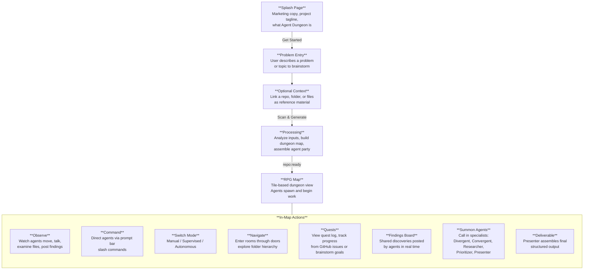

# Agent Dungeon: User Workflow

## Entry Flow

## What Changes from Today's Flow

| Current | Proposed |
|---------|----------|
| TitleScreen: "Agent RPG / Begin Quest" | Splash page with marketing copy explaining the product |
| RepoScreen: repo URL or path required | Problem entry first, repo/files optional as context |
| Agents are generic (Oracle spawns first) | Agents are brainstorm specialists with defined roles |
| No final output step | Presenter agent assembles a deliverable |

The big conceptual shift is that the **problem drives the session**, not the repo. The repo is supporting material, not the entry point.
