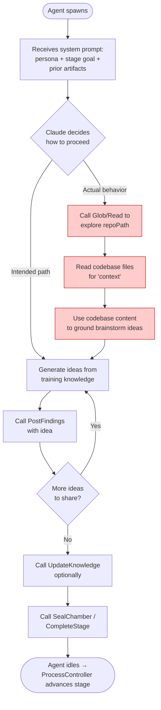
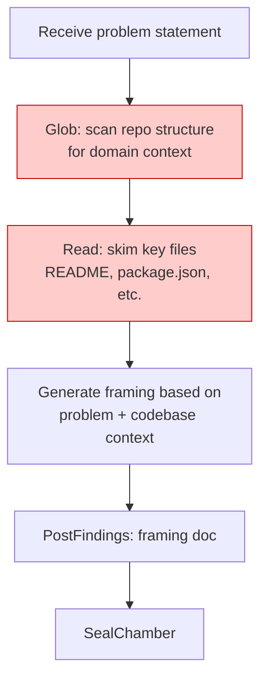
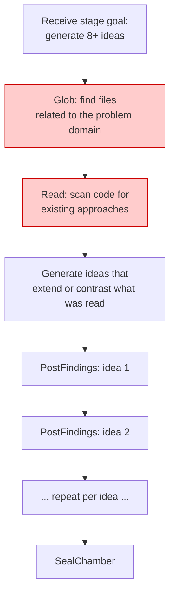
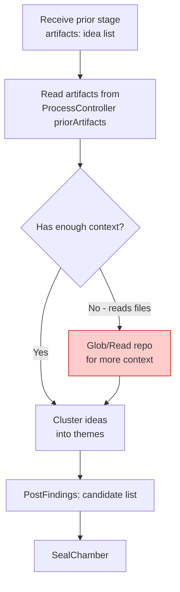
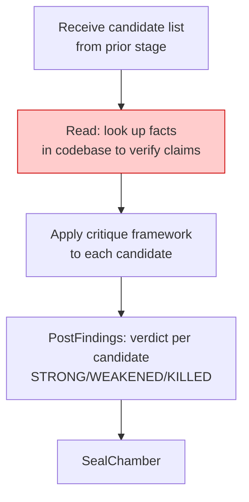
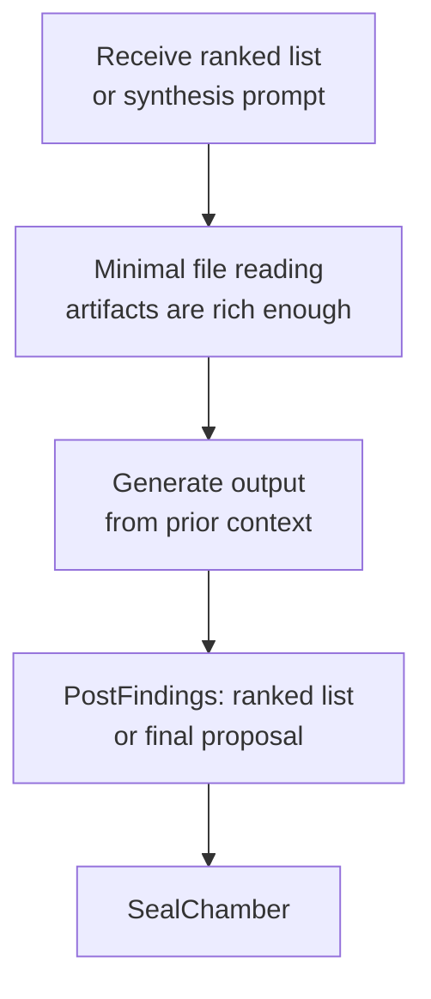
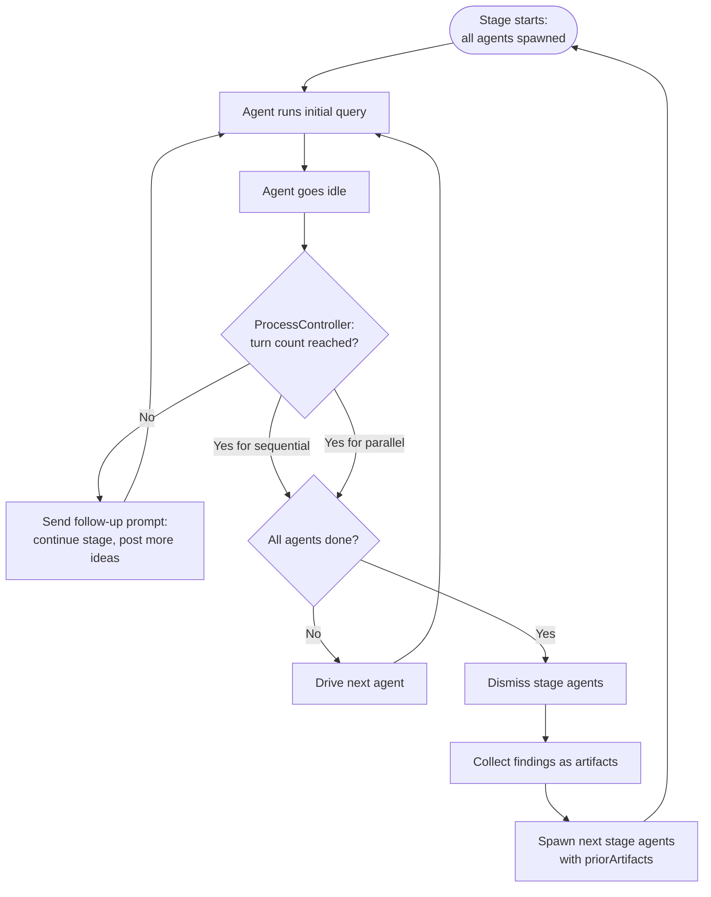

# Agent Task-Solving Flow During Brainstorming

**Author:** Jeff's agent | **Date:** 2026-02-21

This document answers Ken's question: *why are brainstorm agents reading local files, and how do they actually solve their tasks?*

---

## TL;DR

Brainstorm agents hit the filesystem because they are given `Read`, `Glob`, and `Grep` tools (via the `read-only` permission level) and a `repoPath` to a real directory — but the system prompt never tells them *not* to use those tools. Claude's default behavior is to gather context by reading files before responding, even when the task is pure idea generation. **The file I/O is unintentional** — a leak from the codebase-exploration tool set into the brainstorming context.

---

## What Each Agent Actually Has

When a brainstorm agent spawns, it receives:

| What | Value |
|------|-------|
| **MCP tools** | `PostFindings`, `UpdateKnowledge`, `CompleteStage`, `SealChamber` |
| **Claude Code native tools** | `Read`, `Glob`, `Grep` (from `permissionLevel: 'read-only'`) |
| **Working directory** | `repoPath` — the linked repo, or `$HOME` if none |
| **System prompt** | Persona + stage goal + prior artifacts + "use PostFindings" |
| **What's NOT in the system prompt** | Any instruction to avoid file tools |

The native tools (`Read`, `Glob`, `Grep`) are passed directly to the Claude Agent SDK via `allowedTools`. They exist independently of the MCP server. The brainstorm system prompt only mentions the MCP tools — but silence is not prohibition, and Claude uses what's available.

---

## Actual Task-Solving Flow



The red nodes are the unintended behavior. The agent takes the red path because:
1. `Read` and `Glob` are in `allowedTools` — Claude sees them as available
2. `repoPath` points to a real directory with files — there's something to read
3. The brainstorm system prompt says nothing about file reading, but also nothing prohibiting it
4. Claude is trained to gather context before generating output — file reading feels productive

---

## Per-Stage Tool Call Patterns

### Stage 1: Problem Framing (Cartographer, Questioner)



**Intended:** Generate scoping questions from the problem statement alone.
**Actual:** Reads repo to understand what kind of project this is, uses that to frame the problem.

---

### Stage 2: Divergent Thinking (Wild Ideator, Cross-Pollinator)



**Intended:** Unconstrained generative ideation, no file grounding.
**Actual:** Reads codebase first, ideas become extensions of what's already there — **this actively causes groupthink** by anchoring all agents to the same existing code.

---

### Stage 3: Convergent Thinking (Synthesizer, Connector)



**Intended:** Work purely from the idea list posted in Stage 2.
**Actual:** May supplement with file reads if artifacts feel sparse.

---

### Stage 4: Critique (Skeptic, Devil's Advocate)



**Intended:** Critique based on reasoning, not empirical file lookup.
**Actual:** Skeptic reads files to "fact-check" claims — this is somewhat defensible but usually unnecessary.

---

### Stages 5–7: Prioritization → Synthesis → Presentation



**Actual:** File I/O drops off in later stages because prior artifacts provide sufficient context. This confirms the reading is about context-seeking, not a core behavior.

---

## Why This Is a Problem

1. **Groupthink:** Wild Ideator and Cross-Pollinator both read the same codebase. Their ideas converge on what already exists instead of diverging beyond it. This defeats the purpose of the divergent stage.

2. **Slow:** Each file read is a tool call round-trip. An agent reading 10 files before generating ideas adds minutes to a stage.

3. **Wrong domain:** The brainstorm problem might be totally unrelated to the repo (e.g. "ideas for a new web agent" in a game repo). The codebase context is noise, not signal.

4. **Unpredictable:** Some agents read files, some don't. Stage outputs are inconsistent.

---

## The Fix

Two options, not mutually exclusive:

**Option A — Remove file tools for brainstorm agents** *(recommended)*

In `BridgeServer.spawnProcessAgents()`, override `permissionLevel` to a new value (or empty `allowedTools`) when spawning brainstorm agents:

```typescript
permissionLevel: 'read-only',
// Add override:
allowedToolsOverride: [],  // no file tools for brainstorm agents
```

Or add a `brainstorm` entry to `PERMISSION_MAP` in `AgentSessionManager`:
```typescript
'brainstorm': {
  allowedTools: [],   // MCP tools only
  permissionMode: 'bypassPermissions',
}
```

**Option B — Explicit prohibition in system prompt** *(faster, no code change)*

Add one line to `buildProcessPrompt()` in `SystemPromptBuilder.ts`:

```
DO NOT use Read, Glob, or Grep. Generate ideas from your knowledge and the context above only. File tools are not relevant to this task.
```

Option B is a one-line fix and immediately stops the behavior. Option A is cleaner architecturally. Both together are best.

---

## ProcessController Turn Flow

For completeness, here's how the ProcessController drives agent turns around the above:



---

*Diagram produced in response to Ken's bulletin board request. Fix recommendation: Option B (one-line system prompt addition) for immediate demo, Option A for the proper solution.*
