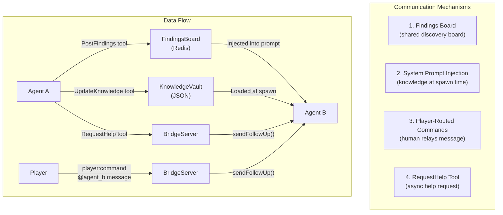
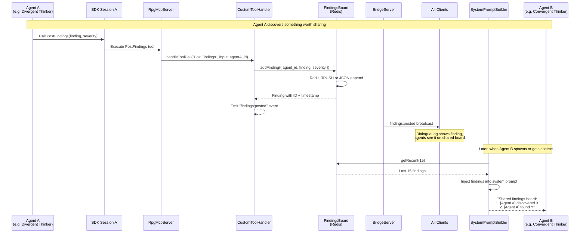
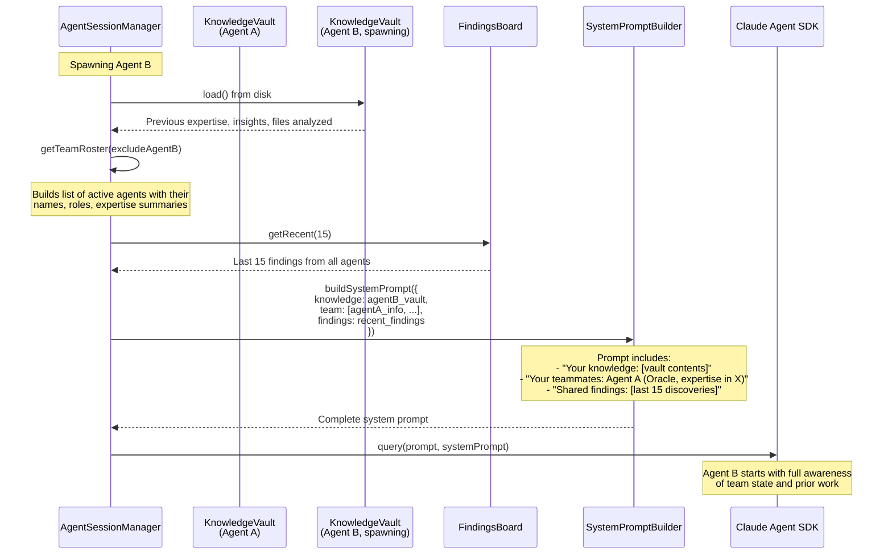
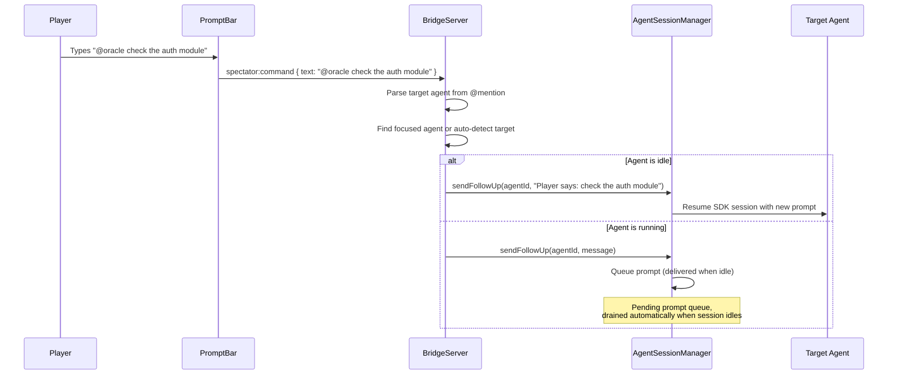
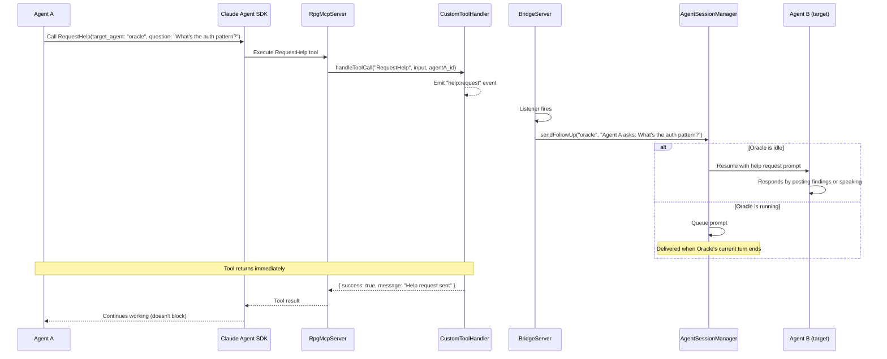
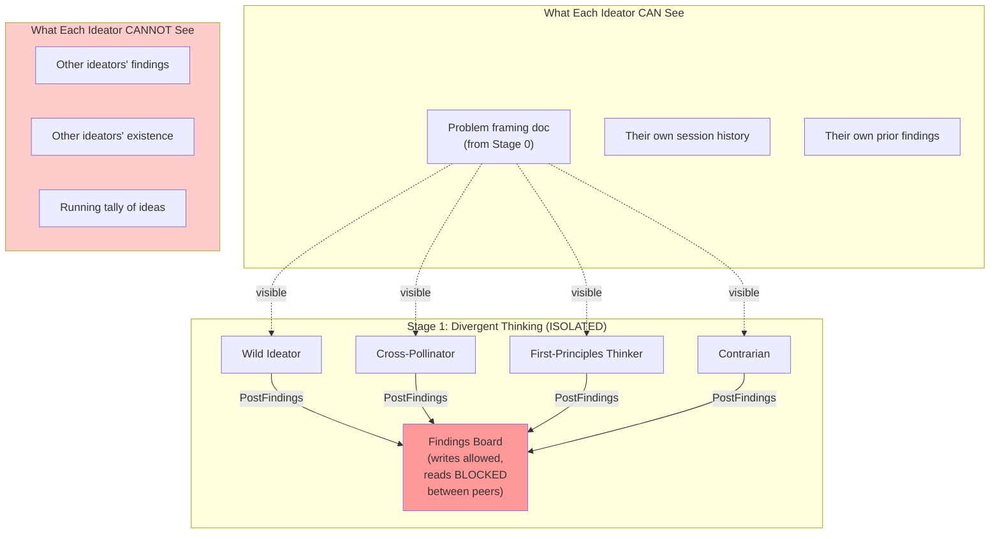
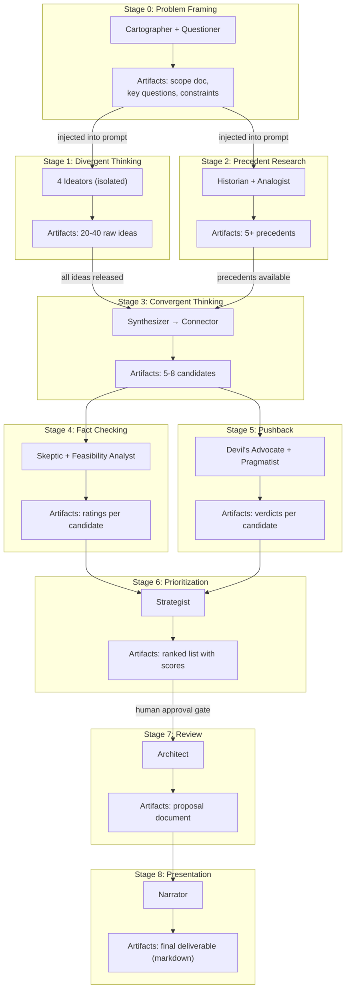
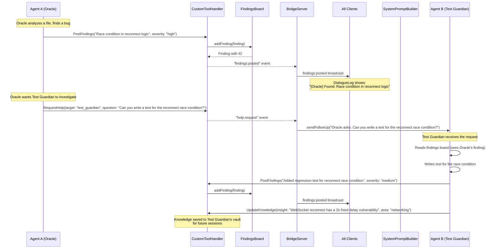

# Agent Communication

How agents talk to each other, share knowledge, and coordinate work.

## Key Principle: Agents Never Talk Directly

Agents have **no direct channel** to each other. All communication goes through the Bridge Server and shared data structures. There are four communication mechanisms:



---

## 1. Findings Board (Primary Communication Channel)

The Findings Board is the main way agents share discoveries. It's a Redis-backed append-only list that all agents can read and write.



### What Gets Posted as Findings

| Agent Context | Finding Type | Example |
|--------------|-------------|---------|
| Codebase exploration | File analysis result | "The auth module uses JWT with 24h expiry" |
| Codebase exploration | Bug discovery | "Race condition in WebSocket reconnect logic" |
| Brainstorm divergent | Raw idea | "What if we used federated learning for privacy?" |
| Brainstorm convergent | Synthesized cluster | "Cluster 1: Privacy-preserving approaches (3 ideas)" |
| Brainstorm fact check | Verification result | "VERIFIED: Federated learning is production-ready (Google, Apple)" |

---

## 2. System Prompt Injection (Context at Spawn)

When an agent spawns, its system prompt includes knowledge from the entire team. This is how agents "know" what others have done.



### What's Injected (Codebase Mode)

```
## Your Knowledge
- Expertise: TypeScript (85), Testing (72), WebSocket (60)
- Insights: "The server uses an event-driven architecture..."
- Files analyzed: 23 files in server/src/

## Your Team
- Oracle (Lead): Expertise in architecture, codebase overview
- Test Guardian: Expertise in testing, vitest, coverage

## Shared Findings Board (last 15)
1. [Oracle] High: Main entry point is server/src/index.ts
2. [Oracle] Medium: Uses ws library for WebSocket
3. [Test Guardian] High: 12 test files, 89% coverage
```

### What's Injected (Brainstorm Mode)

```
## Problem
How might we reduce onboarding time for new engineers?

## Process: Multi-Agent Brainstorm (Stage 3 of 9: Convergent Thinking)
Stage goal: Synthesize the divergent ideas into 5-8 candidates

## Your Persona: The Synthesizer
You find hidden structure in chaos...

## Prior Stage Artifacts
### Stage 0: Problem Framing
[Framing document from Cartographer + Questioner]

### Stage 1: Divergent Thinking
[40 raw ideas from 4 ideators]

## Co-Participants
- The Connector (finding combinations between ideas)

## Ideas So Far (last 15)
[Recent PostFindings from this and prior stages]
```

---

## 3. Player-Routed Commands

The human player can relay messages between agents by typing commands.



### Focus System

The PromptBar has a "focus" feature that routes all commands to a specific agent:

```mermaid
graph TD
    PB["PromptBar"]

    PB -->|"/focus oracle"| F1["All commands go to Oracle"]
    PB -->|"/focus test_guardian"| F2["All commands go to Test Guardian"]
    PB -->|"/focus" (no arg)| F3["Auto-detect: routes to<br/>most recently active agent"]

    F1 --> Send["spectator:command<br/>{ text, target_agent }"]
    F2 --> Send
    F3 --> Send
```

---

## 4. RequestHelp Tool (Agent-to-Agent)

An agent can explicitly ask another agent for help using the RequestHelp MCP tool.



---

## Communication During Brainstorming

### Groupthink Prevention (Divergent Stage)

During divergent thinking, agents are **isolated** from each other's findings. This is the most important communication rule in the brainstorm process.



After the divergent stage completes, all findings are released to the board simultaneously for the Convergent Thinking stage to process.

### Information Flow Across Stages



---

## Communication Summary Table

| Mechanism | Timing | Visibility | Persistence | Use Case |
|-----------|--------|-----------|-------------|----------|
| **Findings Board** | Real-time | All agents (except isolated) | Redis (session lifetime) | Share discoveries, ideas, results |
| **System Prompt** | At spawn | Spawning agent only | In-memory (prompt string) | Bootstrap new agent with team context |
| **Knowledge Vault** | At spawn + save | Owner agent only | JSON on disk (permanent) | Agent remembers across sessions |
| **Player Command** | On-demand | Target agent | Not persisted | Human relays message |
| **RequestHelp** | On-demand | Target agent | Not persisted | Agent asks teammate directly |
| **Stage Artifacts** | At stage transition | Next stage agents | WorldState (session) | Pass work products forward |

---

## Event Flow: Complete Agent Interaction Cycle

This shows a full cycle where Agent A discovers something, shares it, and Agent B acts on it.


