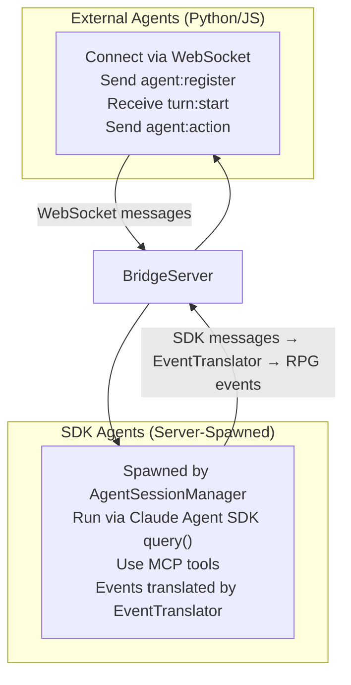
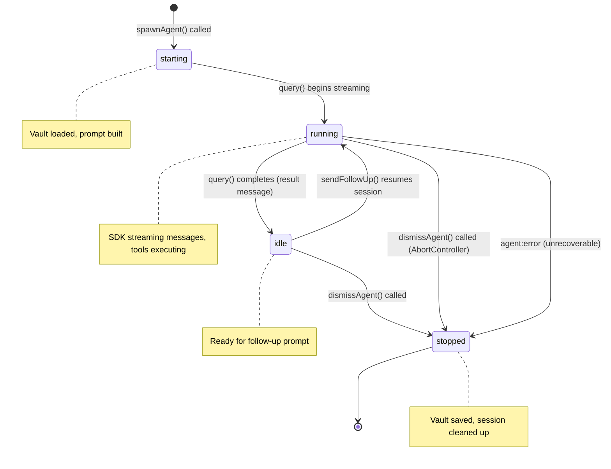
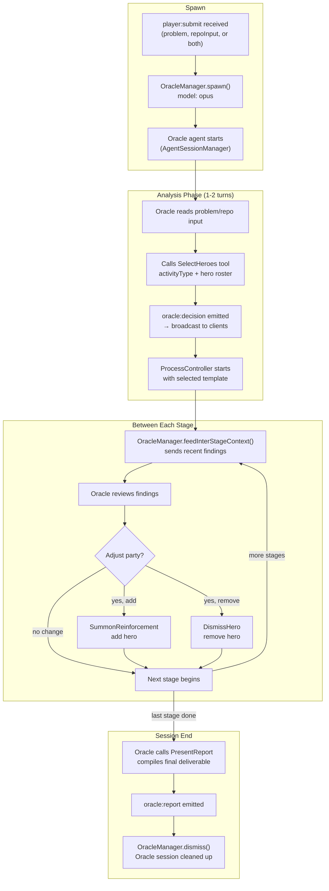
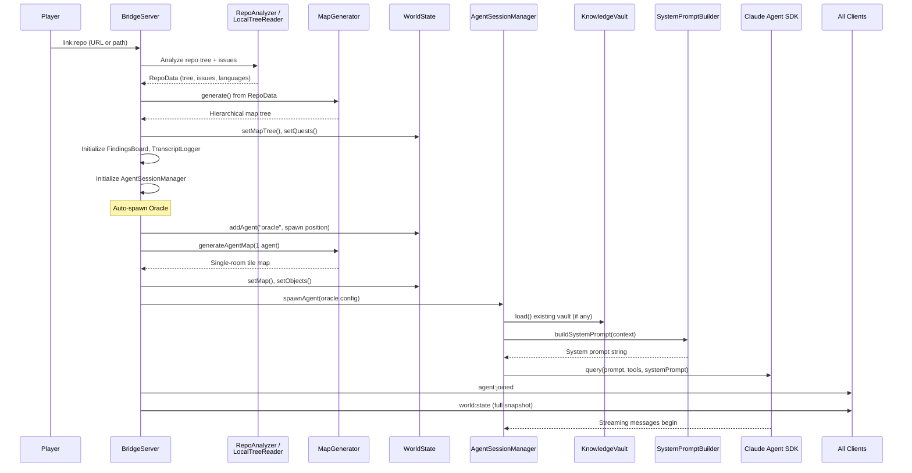
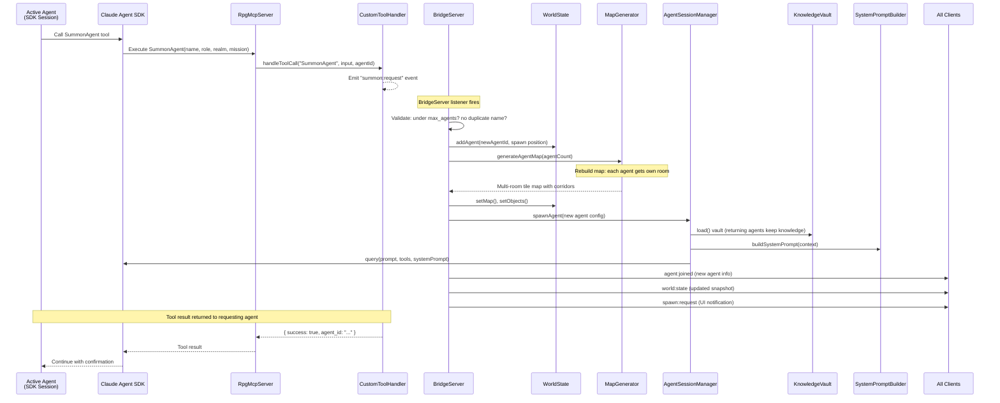
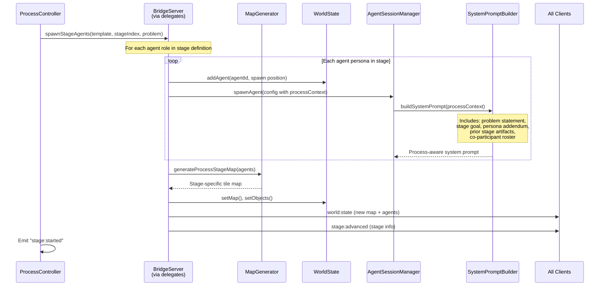
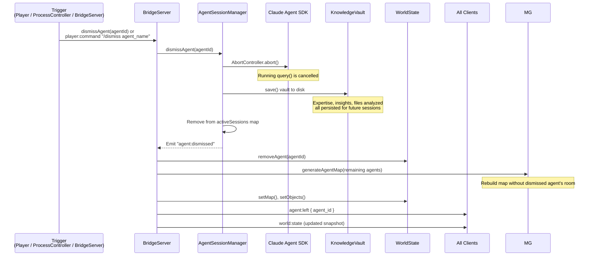
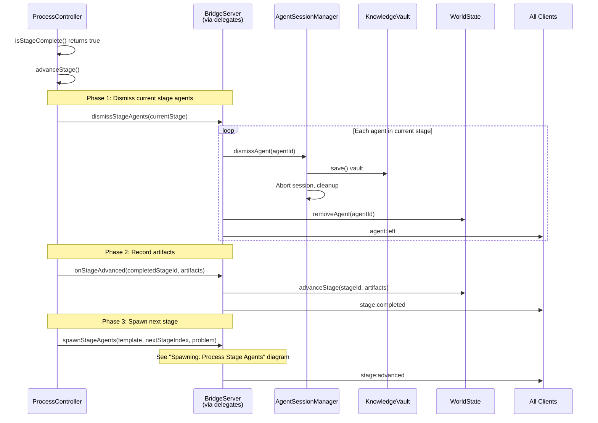
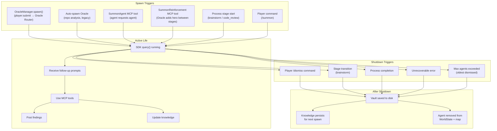

# Agent Lifecycle

How agents are spawned, run, communicate, and shut down.

## Agent Types

There are two kinds of agents in the system:



**External agents** (Python scripts, custom clients) connect over raw WebSocket and follow the turn-based protocol manually. **SDK agents** are spawned server-side by AgentSessionManager using the Claude Agent SDK; they use MCP tools and their streaming output is translated into RPG events by EventTranslator.

---

## Agent Session States



---

## Oracle Agent Lifecycle (Oracle Router)

The Oracle is a special session-leader agent spawned when the player sends `player:submit`. It runs for the full session, analyzing input, selecting heroes, reviewing findings between stages, and compiling the final report.



---

## Spawning: The Oracle (First Agent, legacy)

When a repo is analyzed or a brainstorm process starts via `player:start-process`, the server auto-spawns the first agent.



---

## Spawning: SummonAgent (Agent Requests New Agent)

An active agent can request a specialist by calling the SummonAgent MCP tool.



---

## Spawning: Process Stage Agents (Brainstorm)

When a brainstorm stage starts, all agents for that stage are spawned at once.



---

## Agent Shutdown: Dismissal

Agents can be dismissed by the player, by stage transitions, or programmatically.



---

## Agent Shutdown: Stage Transition (Brainstorm)

When a brainstorm stage completes, all its agents are dismissed before the next stage spawns.



---

## Agent Shutdown: Error / Timeout

```mermaid
stateDiagram-v2
    running --> error_recovery: SDK throws error
    running --> timeout: No response within turn timeout

    error_recovery --> stopped: Unrecoverable error
    error_recovery --> idle: Recoverable (logged, continue)

    timeout --> auto_wait: BridgeServer applies wait action
    auto_wait --> next_turn: Turn advances to next agent

    note right of error_recovery: Error logged to TranscriptLogger<br/>agent:error event emitted
    note right of auto_wait: 5s timeout per turn<br/>(configurable)
```

---

## Full Agent Lifecycle Summary


