# Brainstorm Process

The brainstorm skill is a 9-stage divergent-then-convergent ideation process using 17 specialized agent personas. Managed by `ProcessController` on the server, driven by `brainstorm-process.json`.

**Additional process templates** are available beyond the standard brainstorm: **SIX_THINKING_HATS** (Edward de Bono's parallel thinking: 6-hat round + blue hat synthesis), **SCAMPER** (structured ideation: 7 SCAMPER lenses in parallel + synthesis), and **RAPID_FIRE** (fast 3-stage: spark + pick + go). Select via `processId` on `player:start-process`.

## Stage Flow Overview

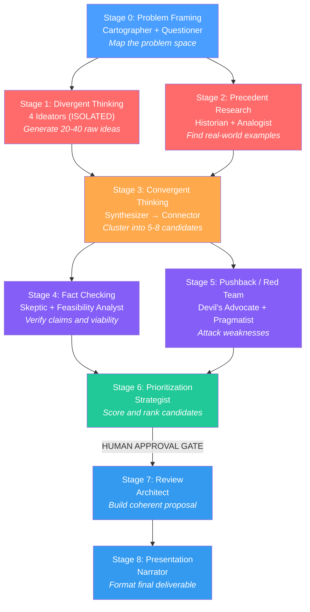

**Color key:** Blue = framing/synthesis, Red = divergent, Orange = convergent, Purple = challenge, Green = evaluation

---

## Parallel and Sequential Stages

```mermaid
gantt
    title Brainstorm Timeline (Full Mode)
    dateFormat X
    axisFormat %s

    section Framing
    Problem Framing          :s0, 0, 60

    section Divergent
    Divergent Thinking       :s1, 60, 300
    Precedent Research       :s2, 60, 240

    section Convergent
    Convergent Thinking      :s3, 300, 120

    section Challenge
    Fact Checking            :s4, 420, 120
    Pushback / Red Team      :s5, 420, 120

    section Evaluate
    Prioritization           :s6, 540, 60
    Human Approval Gate      :milestone, m1, 600, 0

    section Deliver
    Review / Synthesis       :s7, 600, 60
    Presentation             :s8, 660, 60
```

Stages 1+2 run in parallel (divergent + research). Stages 4+5 run in parallel (fact check + pushback). All other stages are sequential.

---

## Stage Details

### Stage 0: Problem Framing

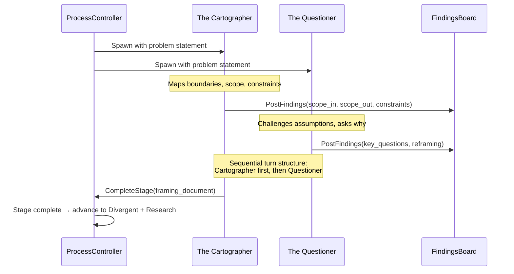

**Output schema:**
- Scope in/out boundaries
- Constraints and assumptions
- Success criteria
- Key questions to explore
- Optional problem reframing

### Stage 1: Divergent Thinking

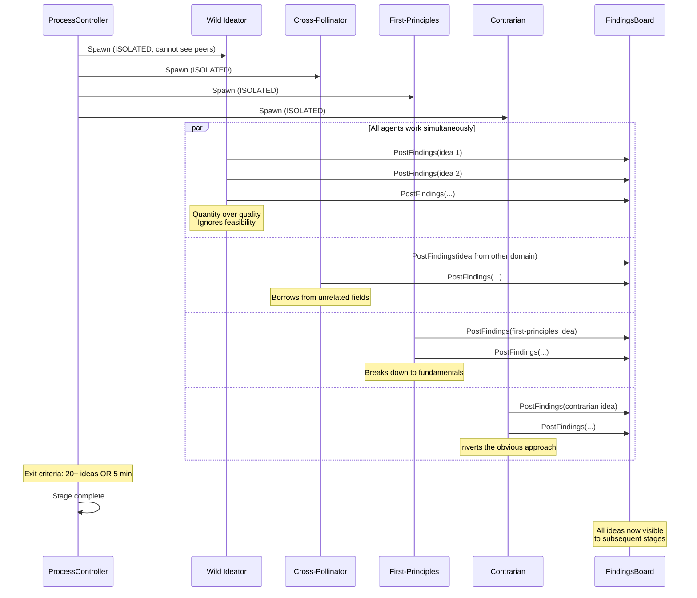

**Groupthink prevention:** Each ideator's system prompt contains ONLY the framing document and their own history. They cannot see each other's PostFindings outputs. Ideas are released to the board simultaneously when the stage ends.

### Stage 3: Convergent Thinking

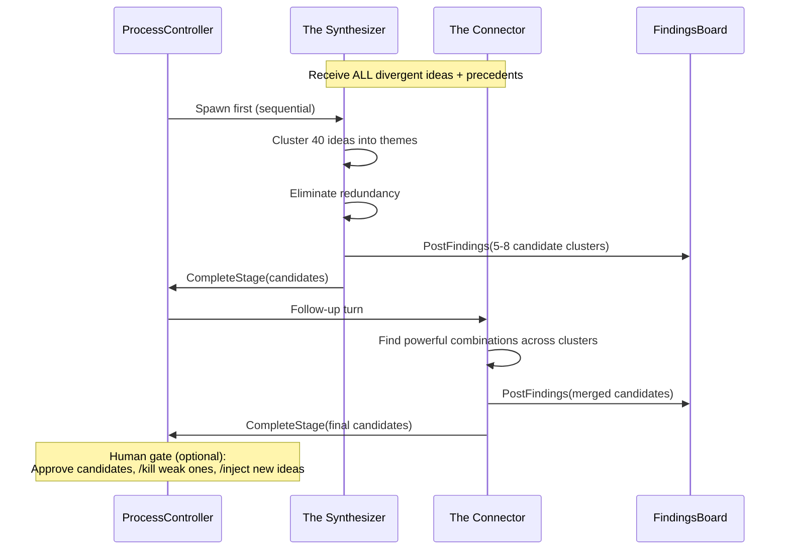

### Stages 4+5: Fact Checking + Pushback (Parallel)

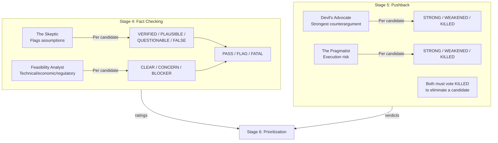

### Conditional Branches

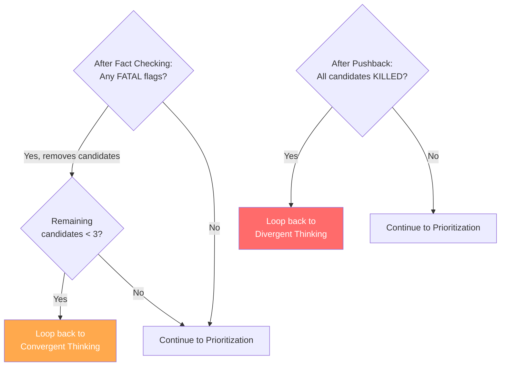

### Stage 6: Prioritization

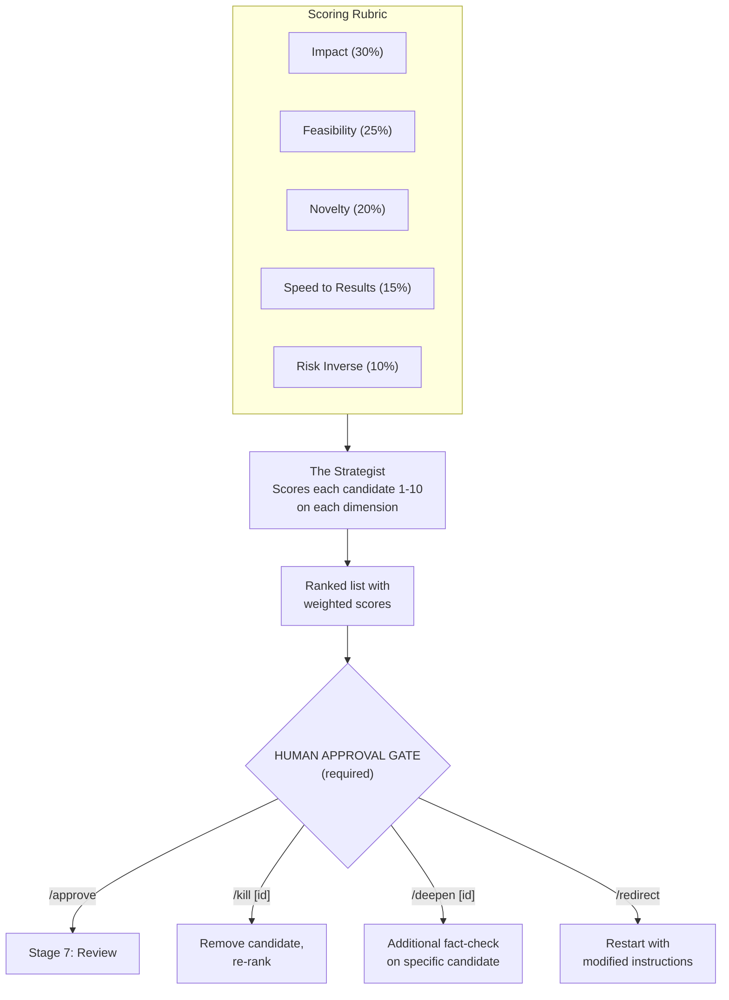

---

## ProcessController Turn Management

The ProcessController tracks turns per-agent and per-stage, driving sequential and parallel agents differently.

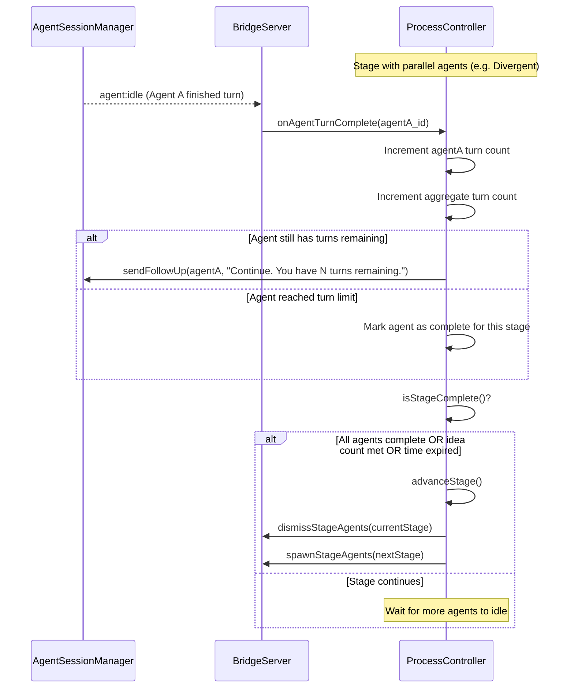

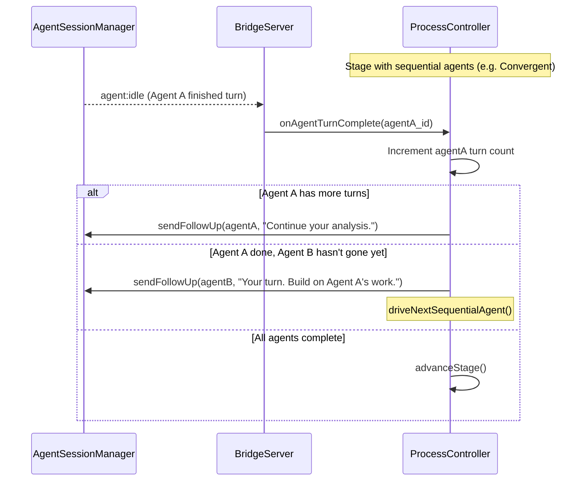

---

## Human Intervention Commands

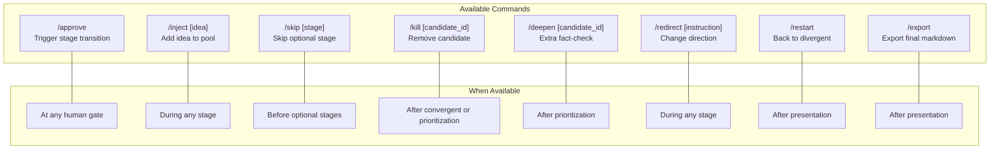

---

## Fast Demo Mode

Skips 3 stages, reduces agents, and tightens time limits for a ~2.5 minute run.

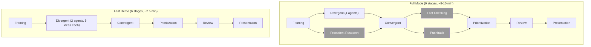

Gray = skipped in fast demo mode.

---

## 17 Agent Personas

| # | Stage | Persona | Thinking Style | Optimizes For |
|---|-------|---------|---------------|---------------|
| 1 | Framing | The Cartographer | Boundary-mapping | Clarity of scope |
| 2 | Framing | The Questioner | Socratic questioning | Assumption-busting |
| 3 | Divergent | Wild Ideator | Associative leaps | Quantity of ideas |
| 4 | Divergent | Cross-Pollinator | Cross-domain transfer | Unexpected connections |
| 5 | Divergent | First-Principles Thinker | Deductive reasoning | Fundamental truths |
| 6 | Divergent | Contrarian | Inversion | Overlooked possibilities |
| 7 | Research | The Historian | Evidence-based | Real-world precedent |
| 8 | Research | The Analogist | Structural analogy | Pattern recognition |
| 9 | Convergent | The Synthesizer | Clustering, pattern-matching | Thematic coherence |
| 10 | Convergent | The Connector | Combinatorial thinking | Powerful mergers |
| 11 | Fact Check | The Skeptic | Adversarial questioning | Assumption exposure |
| 12 | Fact Check | Feasibility Analyst | Multi-dimensional analysis | Viability assessment |
| 13 | Pushback | Devil's Advocate | Strongest counterargument | Weakness discovery |
| 14 | Pushback | The Pragmatist | Execution-focused | Implementation risk |
| 15 | Prioritization | The Strategist | Multi-criteria scoring | Optimal ranking |
| 16 | Review | The Architect | Systems thinking | Coherent integration |
| 17 | Presentation | The Narrator | Audience-aware framing | Clarity and persuasion |
