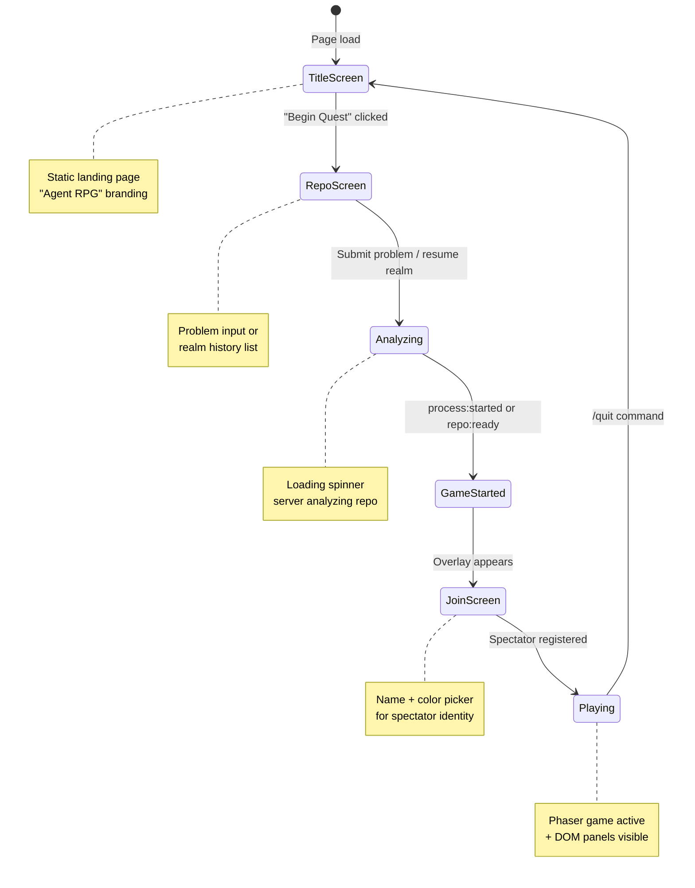
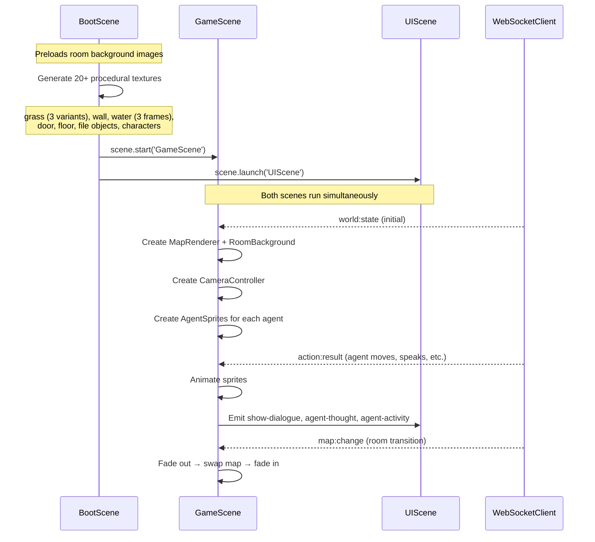
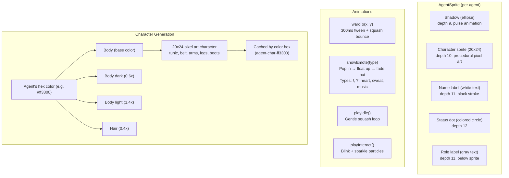
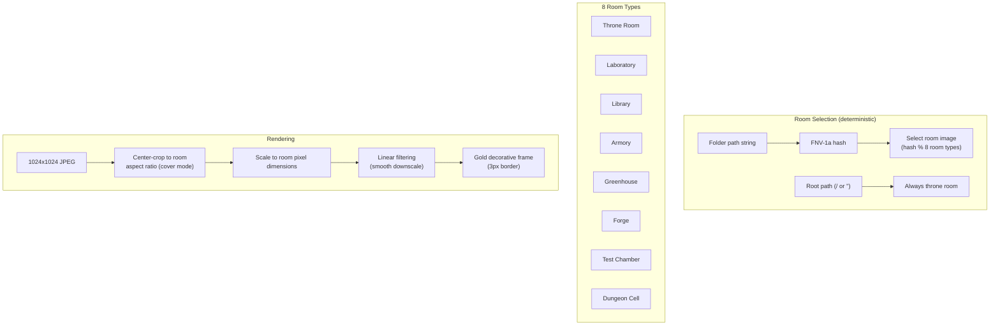
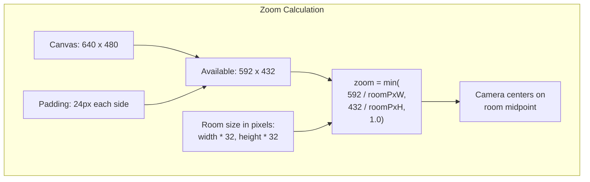
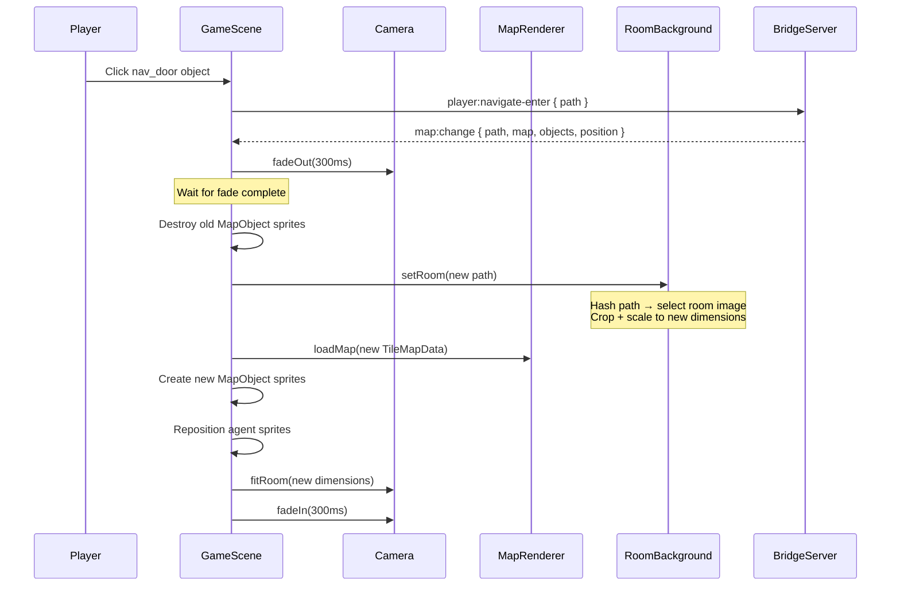
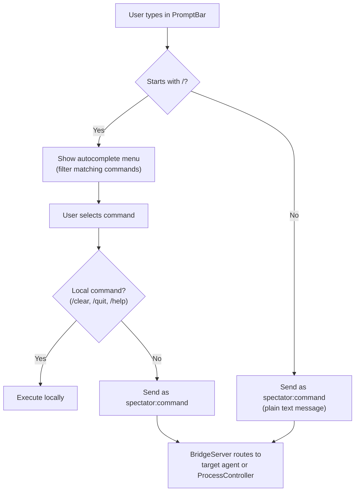

# Client Rendering

How the Phaser client receives data and turns it into pixels. The client is a **pure renderer**; the server is the single source of truth.

## Screen Flow



---

## Phaser Scene Lifecycle

Three scenes run in sequence. BootScene runs once; GameScene and UIScene run for the session.



---

## Data Flow: WebSocket to Pixels

```mermaid
graph TD
    subgraph Network ["WebSocket Messages"]
        WS1["world:state"]
        WS2["action:result"]
        WS3["agent:joined"]
        WS4["agent:left"]
        WS5["map:change"]
        WS6["agent:thought"]
        WS7["agent:activity"]
        WS8["findings:posted"]
        WS9["stage:advanced"]
    end

    subgraph GameScene ["GameScene Handlers"]
        GS1["Sync agent sprites<br/>(create/update/remove)"]
        GS2["Animate: walkTo, emote,<br/>skill effect, interact"]
        GS3["Create new AgentSprite"]
        GS4["Destroy AgentSprite"]
        GS5["Fade out → new map → fade in"]
    end

    subgraph UIScene ["UIScene + Panels"]
        UI1["DialogueLog entry (speak)"]
        UI2["DialogueLog entry (thought)"]
        UI3["DialogueLog entry (activity)"]
        UI4["DialogueLog entry (finding)"]
        UI5["DialogueLog entry (stage announcement)"]
    end

    subgraph Panels ["DOM Panels"]
        P1["MiniMap: realm tree + presence"]
        P2["QuestLog: quest status"]
        P3["StageProgressBar: stage indicator"]
    end

    WS1 --> GS1
    WS1 --> P1
    WS1 --> P2
    WS2 --> GS2
    WS2 --> UI1
    WS3 --> GS3
    WS4 --> GS4
    WS5 --> GS5
    WS6 --> UI2
    WS7 --> UI3
    WS8 --> UI4
    WS9 --> UI5
    WS9 --> P3
```



---

## Agent Sprite Rendering

Each agent is rendered as a group of Phaser objects:



---

## Room Rendering

Rooms use full-illustration backgrounds instead of tile-by-tile rendering.



---

## Camera System (Diorama Framing)

The camera always shows the entire room. No scrolling; the room is the stage.



---

## Map Transitions

When navigating between folders, the camera fades between rooms.



---

## DOM Panel Layout

UI panels are HTML elements positioned around the Phaser canvas.

```
+--------------------------------------------------+
|  [Mode: Autonomous]              [Stage 3 of 9]  |  <- StageProgressBar
+--------------------------------------------------+
|                                  |                |
|                                  | MiniMap        |
|     Phaser Canvas (640x480)      | (folder tree)  |
|     - Room background            |                |
|     - Agent sprites              +----------------+
|     - Map objects                |                |
|                                  | QuestLog       |
|                                  | (quest list)   |
+----------------------------------+----------------+
|                                                   |
|  DialogueLog (scrolling message history)          |
|  [Oracle] Found race condition in reconnect...    |
|  [Test Guardian] Writing regression test...       |
|                                                   |
+--------------------------------------------------+
|  > Type a message or /command...          [Send]  |  <- PromptBar
+--------------------------------------------------+
```

---

## PromptBar Command Processing



### Slash Commands

| Command | Action | Scope |
|---------|--------|-------|
| `/summon [name]` | Request agent spawn | Server |
| `/dismiss [name]` | Remove agent | Server |
| `/focus [name]` | Direct all commands to agent | Local |
| `/clear` | Clear dialogue log | Local |
| `/quit` | Return to title screen | Local |
| `/approve` | Approve brainstorm gate | Server (ProcessController) |
| `/inject [idea]` | Add idea to brainstorm | Server (ProcessController) |
| `/skip` | Skip optional stage | Server (ProcessController) |
| `/kill [id]` | Remove candidate | Server (ProcessController) |
| `/export` | Export brainstorm results | Server (ProcessController) |
