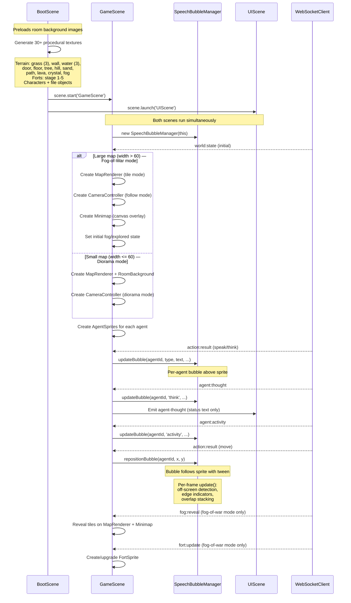
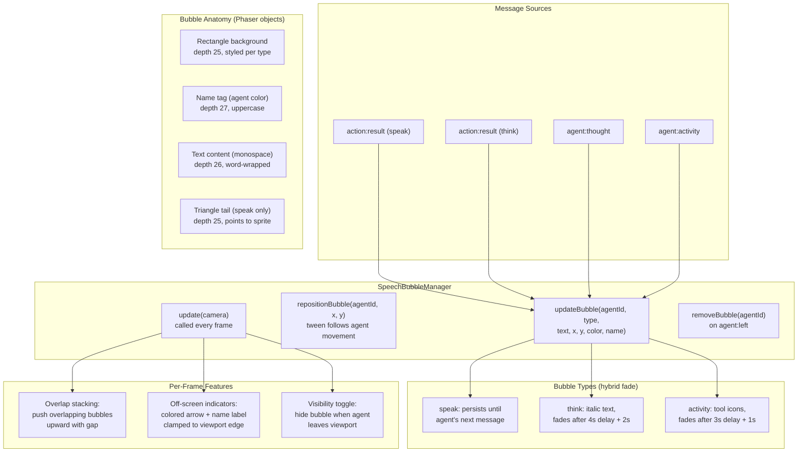
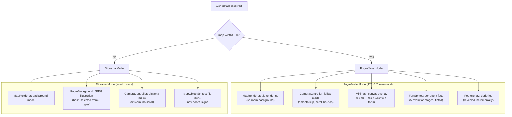
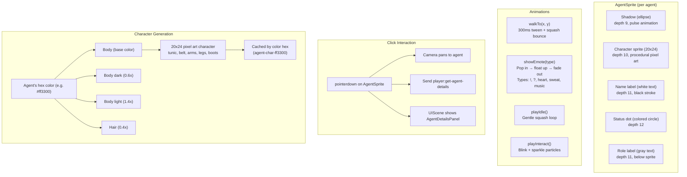
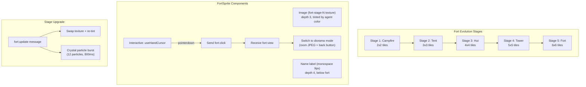
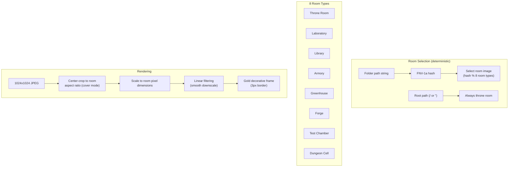
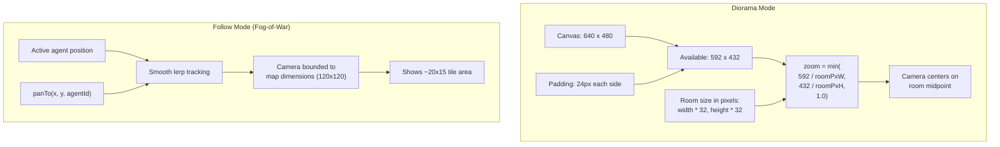
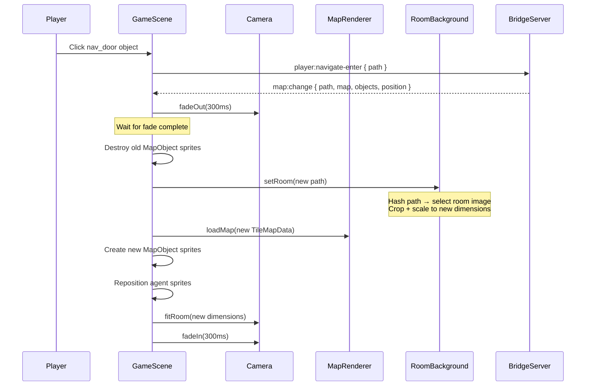
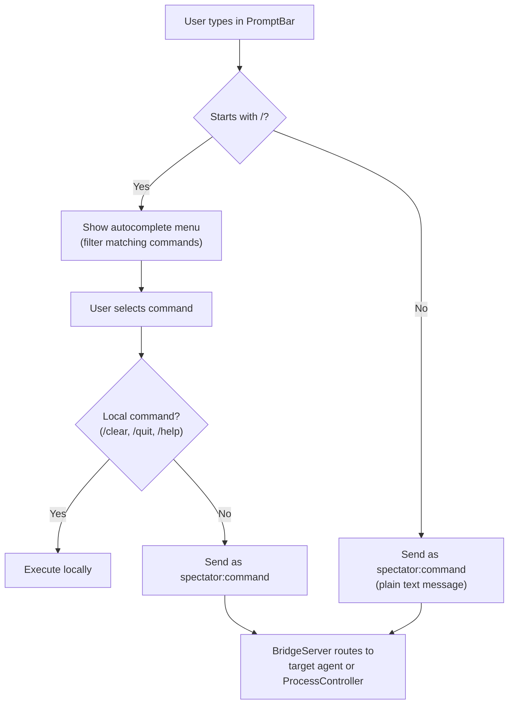

# Client Rendering

How the Phaser client receives data and turns it into pixels. The client is a **pure renderer**; the server is the single source of truth.

## Screen Flow

```mermaid
stateDiagram-v2
    [*] --> SplashScreen: Page load
    SplashScreen --> SetupScreen: "Enter the Dungeon" clicked
    SetupScreen --> Loading: Submit (name + color + problem)
    Loading --> Playing: process:started received

    Playing --> SessionComplete: process:completed
    SessionComplete --> Playing: "Keep Reading"
    SessionComplete --> SetupScreen: "New Session"

    Playing --> SetupScreen: /quit command

    note right of SplashScreen: Dungeon branding<br/>"Agent Dungeon" logo
    note right of SetupScreen: Name + color picker +<br/>problem textarea<br/>(all in one form)
    note right of Loading: SetupScreen.showLoading()<br/>+ process-loading-overlay<br/>"Spawning agents..."
    note right of Playing: Phaser game active<br/>+ DOM panels visible
    note right of SessionComplete: Overlay with options:<br/>Keep reading, Export, New session
```

---

## Phaser Scene Lifecycle

Three scenes run in sequence. BootScene runs once; GameScene and UIScene run for the session. Agent speech/thought/activity is rendered by SpeechBubbleManager as in-world bubbles above sprites (replacing the old DialogueLog sidebar panel and ThoughtBubble float-up).



---

## Data Flow: WebSocket to Pixels

```mermaid
graph TD
    subgraph Network ["WebSocket Messages"]
        WS1["world:state"]
        WS2["action:result"]
        WS3["agent:joined"]
        WS4["agent:left"]
        WS5["map:change"]
        WS6["agent:thought"]
        WS7["agent:activity"]
        WS8["findings:posted"]
        WS9["stage:advanced"]
        WS10["agent:details"]
        WS11["fog:reveal"]
        WS12["fort:update"]
        WS13["fort:view"]
        WS14["spectator:welcome/joined/left"]
        WS15["process:completed"]
    end

    subgraph GameScene ["GameScene Handlers"]
        GS1["Sync agent sprites<br/>(create/update/remove)"]
        GS2["Animate: walkTo, emote,<br/>skill effect, interact"]
        GS3["Create new AgentSprite"]
        GS4["Destroy AgentSprite +<br/>removeBubble"]
        GS5["Fade out -> new map -> fade in"]
        GS6["Reveal fog tiles +<br/>update Minimap"]
        GS7["Create/upgrade FortSprite"]
        GS8["Enter fort interior<br/>(switch to diorama)"]
    end

    subgraph Bubbles ["SpeechBubbleManager (in-world)"]
        SB1["Speech bubble (speak)<br/>persists until replaced"]
        SB2["Thought bubble (think)<br/>fades after 4s + 2s"]
        SB3["Activity bubble (activity)<br/>fades after 3s + 1s"]
        SB4["repositionBubble<br/>(follows agent on move)"]
    end

    subgraph UIScene ["UIScene (minimal)"]
        UI1["statusText<br/>(active agent indicator)"]
        UI2["AgentDetailsPanel<br/>(show on agent click)"]
    end

    subgraph Panels ["DOM Sidebar Panels (collapsible)"]
        P1["MiniMap: realm tree + presence"]
        P2["QuestLog: quest status"]
        P3["StageProgressBar: stage indicator"]
        P4["SpectatorPanel: connected viewers"]
        P5["ServerInfoPanel: LAN address"]
    end

    WS1 --> GS1
    WS1 --> P1
    WS1 --> P2
    WS2 -->|"speak/think"| SB1
    WS2 -->|"speak/think"| SB2
    WS2 -->|"move"| GS2
    WS2 -->|"move"| SB4
    WS3 --> GS3
    WS4 --> GS4
    WS5 --> GS5
    WS6 --> SB2
    WS6 -->|"status text"| UI1
    WS7 --> SB3
    WS9 --> P3
    WS10 --> UI2
    WS11 --> GS6
    WS12 --> GS7
    WS13 --> GS8
    WS14 --> P4
    WS15 --> P5
```



---

## SpeechBubbleManager

Replaces the old ThoughtBubble (ephemeral float-up) and DialogueLog (sidebar scrollback) with persistent, per-agent speech bubbles rendered directly in the Phaser game world above each agent's sprite.



---

## Dual Rendering Modes

The client operates in one of two rendering modes based on the initial `world:state` map dimensions.



---

## Agent Sprite Rendering

Each agent is rendered as a group of Phaser objects:



---

## Fort Sprite Rendering (Fog-of-War Mode)

Agent forts evolve through 5 stages as agents progress through their work.



---

## Room Rendering (Diorama Mode)

Rooms use full-illustration backgrounds instead of tile-by-tile rendering.



---

## Camera System

The camera has two modes depending on the rendering mode.



---

## Map Transitions (Diorama Mode)

When navigating between folders, the camera fades between rooms.



---

## DOM Panel Layout

UI panels are HTML elements positioned around the Phaser canvas. The sidebar is collapsible via a toggle button (`<<` / `>>`). Agent dialogue is no longer in the sidebar; it is rendered as in-world speech bubbles by SpeechBubbleManager directly above agent sprites in the Phaser canvas.

```
+--------------------------------------------------+
|                                  | [<<] toggle    |
|                                  +----------------+
|     Phaser Canvas (640x480)      |                |
|                                  | StageProgress  |
|  In-world speech bubbles:        | [3 of 9]       |
|     AGENT NAME (colored)         +----------------+
|     "Speech persists until       |                |
|      next message"               | AgentDetails   |
|     (think/activity auto-fade)   | (on click)     |
|                                  +----------------+
|  Diorama mode:                   |                |
|     - Room background            | Settings       |
|     - Agent sprites              | (max agents,   |
|     - Map objects                |  budget, etc.) |
|                                  +----------------+
|  Fog-of-war mode:                |                |
|     - Tile terrain + fog layer   | QuestLog       |
|     - Fort sprites               | (quest list)   |
|     - Agent sprites              |                |
|     - Minimap overlay (top-right)+----------------+
|                                  |                |
|                                  | PromptBar      |
|                                  | > /command...  |
+----------------------------------+----------------+

Sidebar collapsed (toggle shows >>):
+--------------------------------------------------+
|                                               [>>]|
|                                                   |
|     Phaser Canvas (full width)                    |
|                                                   |
|  Speech bubbles still render above agents         |
|  in the game world (independent of sidebar)       |
|                                                   |
+--------------------------------------------------+
```

---

## PromptBar Command Processing



### Slash Commands

| Command | Action | Scope |
|---------|--------|-------|
| `/summon [name]` | Request agent spawn | Server |
| `/dismiss [name]` | Remove agent | Server |
| `/focus [name]` | Direct all commands to agent | Local |
| `/quit` | Return to setup screen | Local |
| `/approve` | Approve brainstorm gate | Server (ProcessController) |
| `/inject [idea]` | Add idea to brainstorm | Server (ProcessController) |
| `/skip` | Skip optional stage | Server (ProcessController) |
| `/kill [id]` | Remove candidate | Server (ProcessController) |
| `/export` | Export brainstorm results | Server (ProcessController) |
