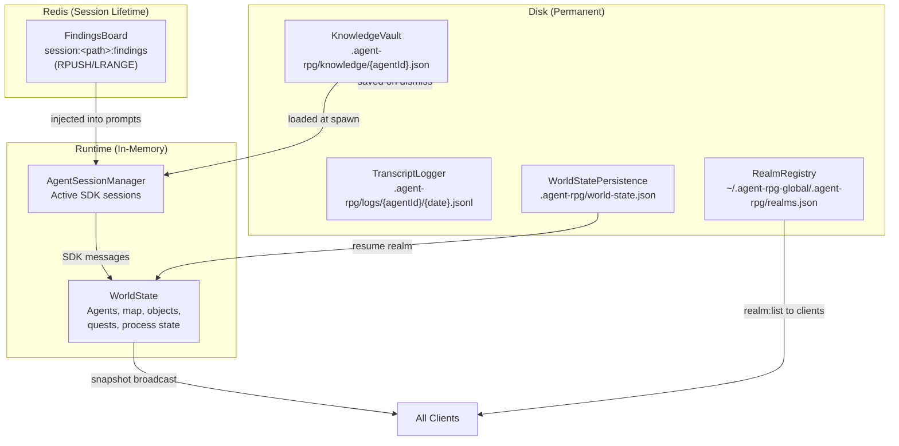
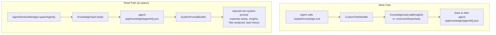
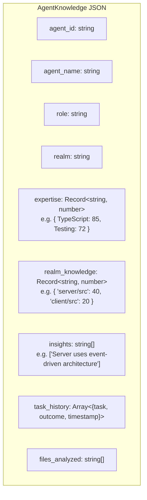
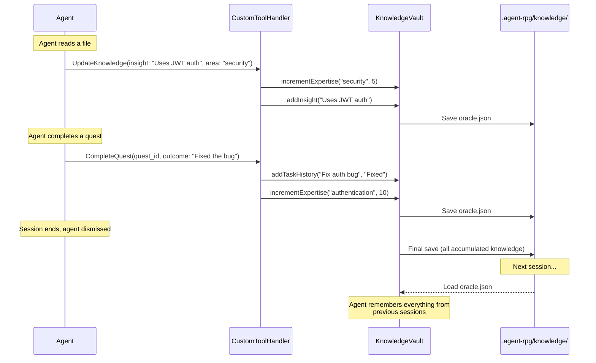
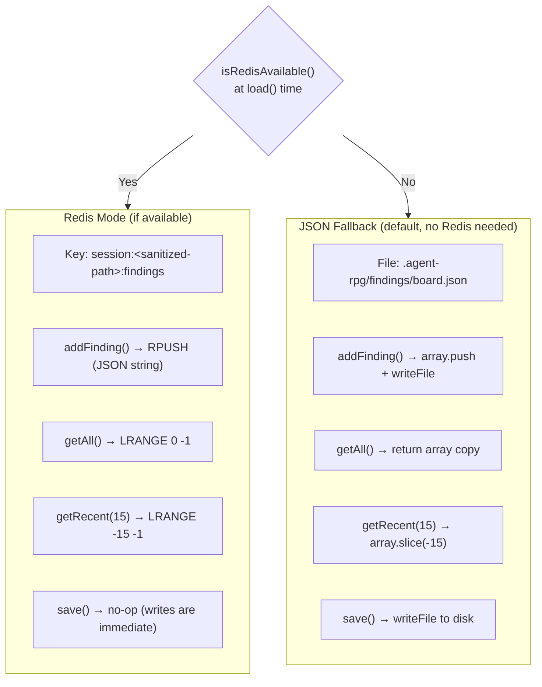
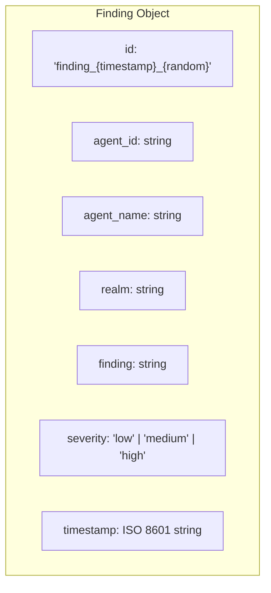
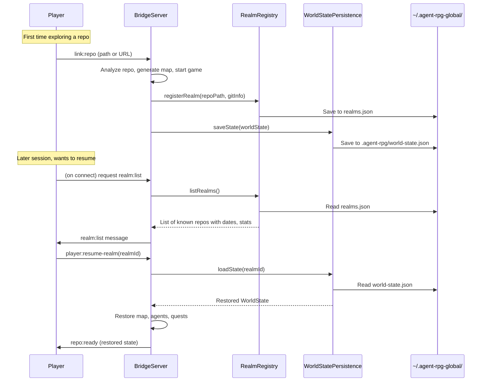
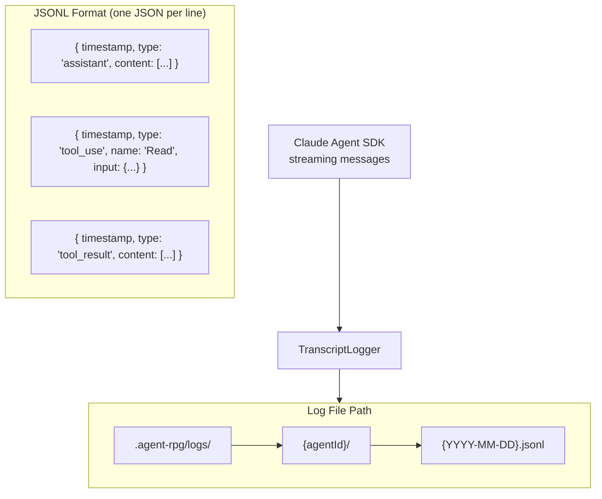
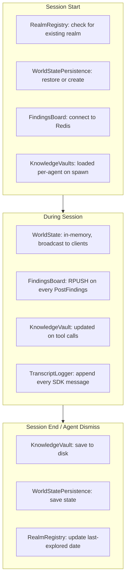

# Data & Persistence

How the system stores and retrieves data across sessions.

## Storage Overview



---

## Knowledge Vault (Per-Agent Memory)

Each agent has a persistent knowledge file that survives across sessions.



### Knowledge Data Model



### Knowledge Accumulation Flow



---

## Findings Board (Redis + JSON Fallback)

The shared board where agents post discoveries. Checks Redis availability at load time via `isRedisAvailable()`. Falls back to JSON file automatically, so the server works without Redis (including in CI).



### Finding Data Model



---

## Realm Registry (Global Session Tracking)

Tracks all repos that have been explored, enabling session resumption.



---

## Transcript Logging

Every SDK message is logged per-agent per-day for debugging and replay.



---

## Known Gap: ProcessController State

**ProcessController has no state serialization.** Its runtime state (`context`, `stageTurnCounts`, `agentTurnCounts`) lives in memory only. If the server crashes mid-brainstorm, the process state is lost and cannot be resumed. Only `WorldState` tracks high-level process completion (via `advanceStage()` and `completeProcess()`). A state persistence feature is designed in `docs/features/20260221.02_state_persistence/` but not yet implemented.

---

## Persistence Lifecycle



---

## File System Layout

```
Project Root/
├── .agent-rpg/                          # Per-repo persistence
│   ├── knowledge/
│   │   ├── oracle.json                  # Oracle's accumulated knowledge
│   │   ├── test_guardian.json           # Test Guardian's knowledge
│   │   └── doc_scribe.json             # Doc Scribe's knowledge
│   ├── logs/
│   │   ├── oracle/
│   │   │   ├── 2026-02-19.jsonl        # Daily transcript
│   │   │   └── 2026-02-20.jsonl
│   │   └── test_guardian/
│   │       └── 2026-02-20.jsonl
│   └── world-state.json                 # Full serialized game state
│
└── ~/.agent-rpg-global/                 # Global (cross-repo)
    └── .agent-rpg/
        └── realms.json                  # Registry of all explored repos

Redis (localhost:6379):
    session:<sanitized-path>:findings    # FindingsBoard data
```

---

## Environment Variables

| Variable | Default | Purpose |
|----------|---------|---------|
| `REDIS_HOST` | `localhost` | Redis connection host |
| `REDIS_PORT` | `6379` | Redis connection port |
| `REDIS_PASSWORD` | (none) | Redis auth password |
| `ANTHROPIC_API_KEY` | (required) | Claude API key for SDK agents |
