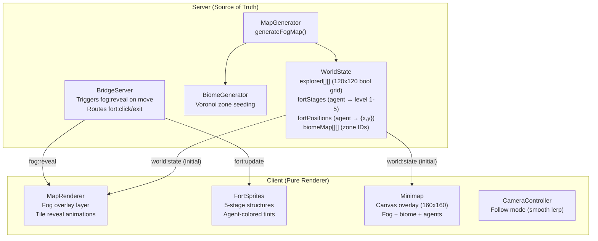
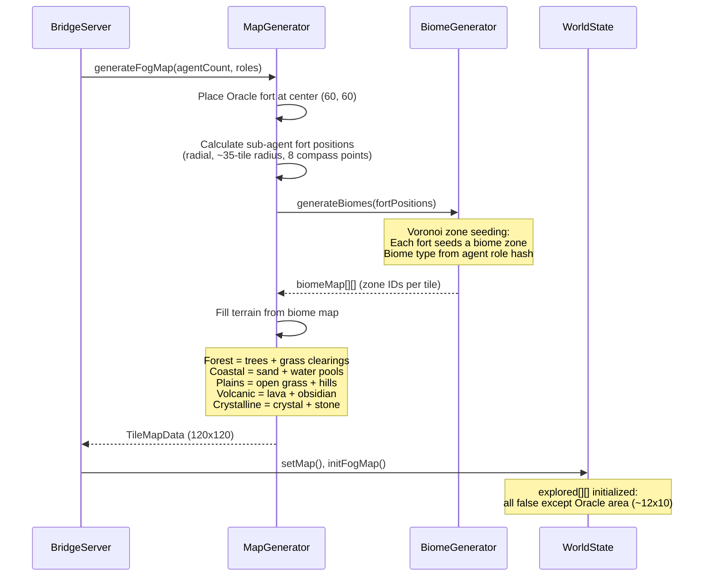
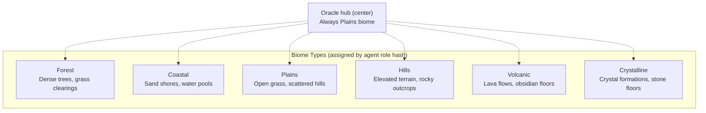
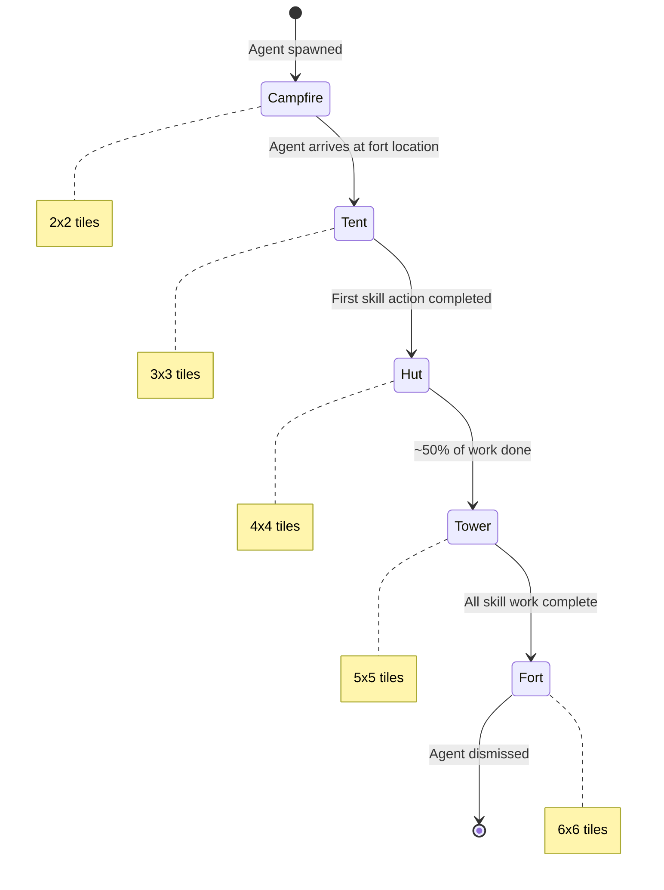
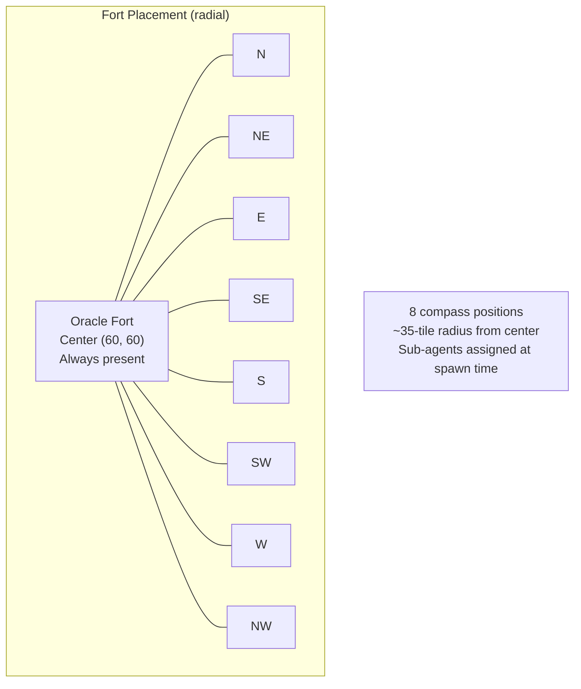
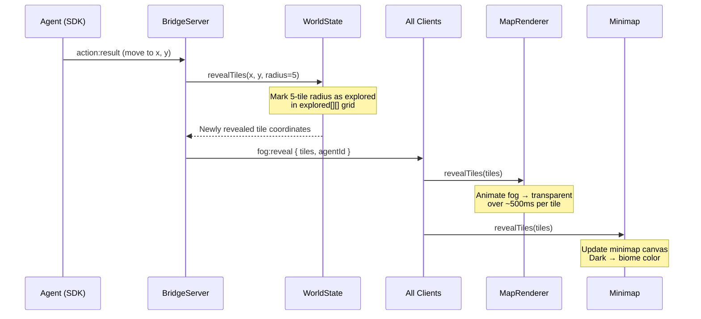
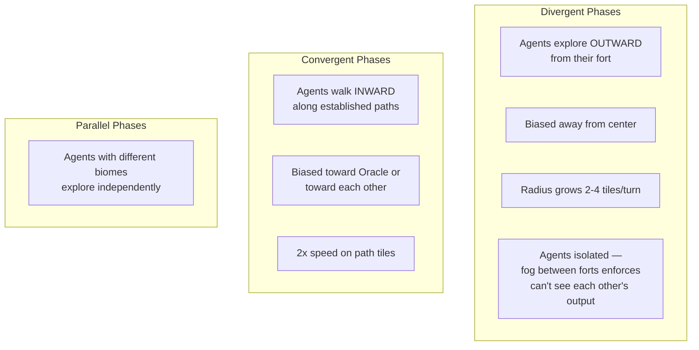
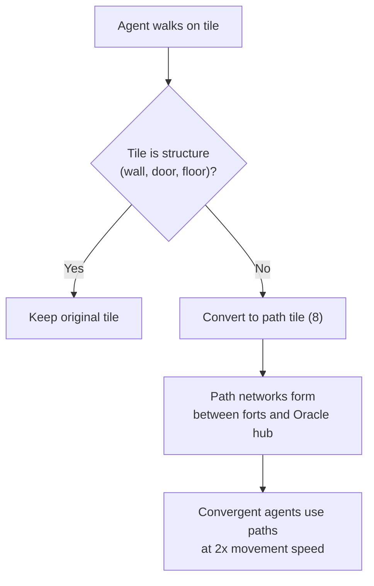
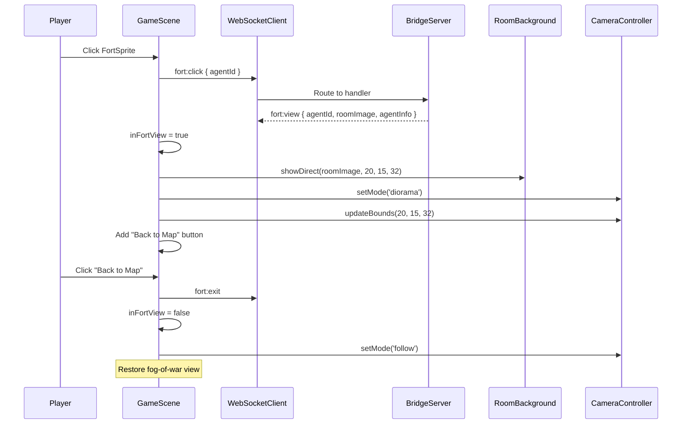
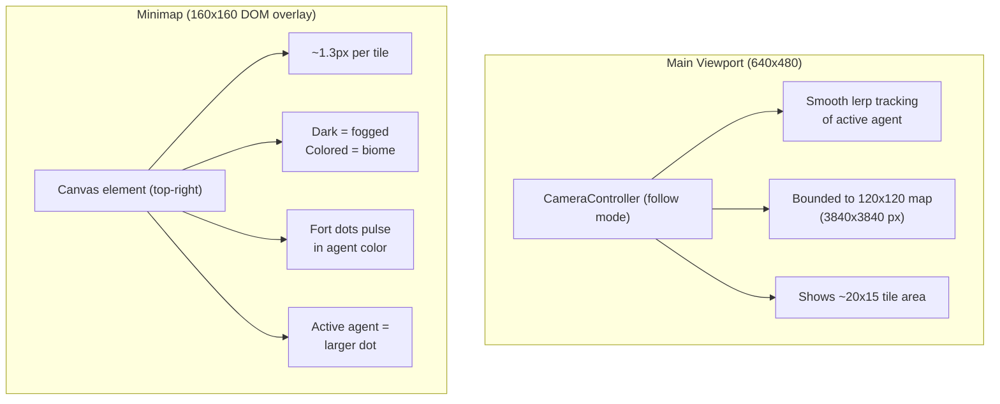

# Fog-of-War Map System

The fog-of-war overworld replaces static room-based maps with a 120x120 tile world featuring procedural biomes, evolving agent forts, and incremental fog reveal. Agents explore outward from a central Oracle hub, build forts that grow as they work, and leave paths connecting the settlement network.

## Architecture: Hybrid Server-Client Fog

---

## World Generation

When a brainstorm process starts, the server generates a 120x120 overworld.

### Tile Types

| ID | Tile | Walkable | Biome |
|----|------|----------|-------|
| 0 | Grass | Yes | Plains |
| 1 | Wall | No | Fort boundaries |
| 2 | Water | No | Coastal |
| 3 | Door | Yes | Fort entrances |
| 4 | Floor | Yes | Fort interiors |
| 5 | Tree | No | Forest |
| 6 | Hill | Yes (slow) | Plains/Hills |
| 7 | Sand | Yes | Coastal |
| 8 | Path | Yes (fast) | Agent trails |
| 9 | Lava | No | Volcanic |
| 10 | Crystal | No | Crystalline |

### Biomes

---

## Fort Evolution

Agent forts evolve through 5 stages as agents progress through their work.

### Fort Placement

---

## Fog Reveal Mechanics

The server maintains the canonical fog state. Fog is revealed incrementally as agents move.

### Skill-Driven Movement

Movement direction varies by brainstorm phase:

---

## Path System

Every tile an agent walks on becomes a path tile (type 8) if it's not already a structure tile. Over time, organic road networks form between forts and the hub.

---

## Fort Interior View

Clicking a fort transitions to a room view using dungeon JPEG illustrations.

### Room Assignment

| Room Image | Assignment |
|------------|------------|
| room-throne.jpg | Oracle (always) |
| room-forge.jpg | By agent role hash |
| room-library.jpg | By agent role hash |
| room-armory.jpg | By agent role hash |
| room-dungeon-cell.jpg | By agent role hash |
| room-greenhouse.jpg | By agent role hash |
| room-alchemy-lab.jpg | By agent role hash |
| room-summoning-chamber.jpg | By agent role hash |

---

## Camera and Minimap

---

## Protocol Messages

### Client → Server

| Message | Fields | Purpose |
|---------|--------|---------|
| `fort:click` | `agentId` | Player clicks an agent's fort |
| `fort:exit` | (none) | Player exits fort interior view |

### Server → Client

| Message | Fields | Purpose |
|---------|--------|---------|
| `fog:reveal` | `tiles[], agentId` | Incrementally reveal fog tiles |
| `fort:update` | `agentId, stage, position` | Fort evolution stage change |
| `fort:view` | `agentId, roomImage, agentInfo` | Fort interior room data |

### WorldState Additions

| Field | Type | Purpose |
|-------|------|---------|
| `explored` | `boolean[][]` | 120x120 canonical fog grid |
| `fortStages` | `Map<string, number>` | Per-agent fort level (1-5) |
| `fortPositions` | `Map<string, {x,y}>` | Pre-assigned fort locations |
| `biomeMap` | `number[][]` | Biome zone IDs for terrain |
