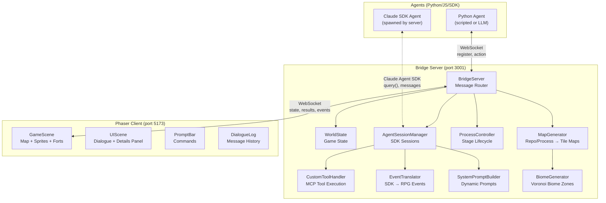
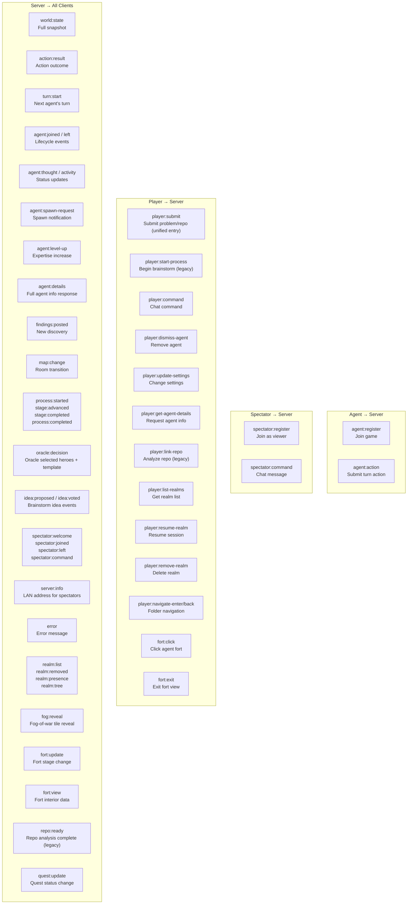
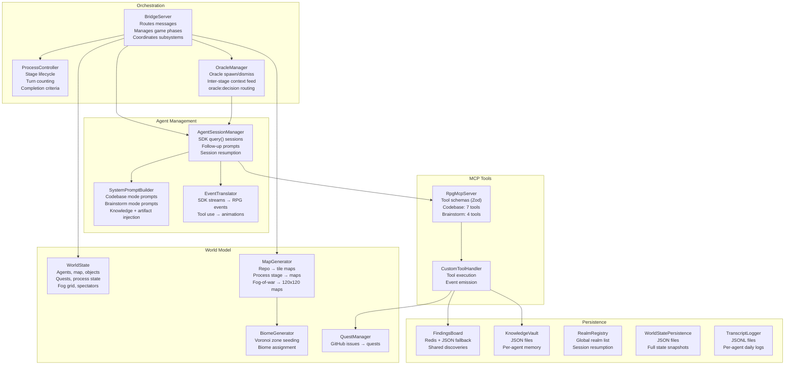
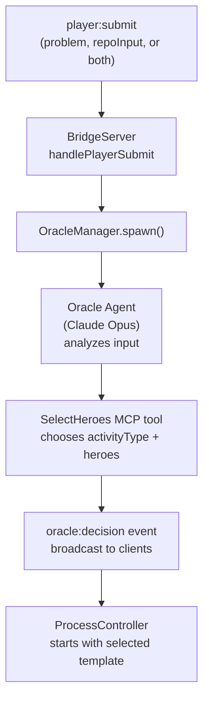
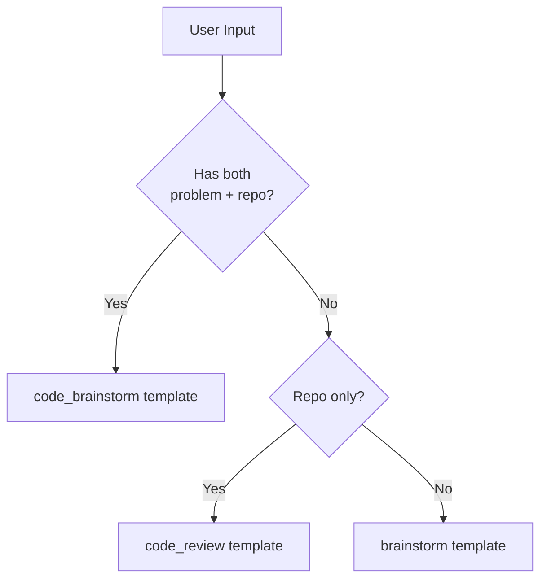
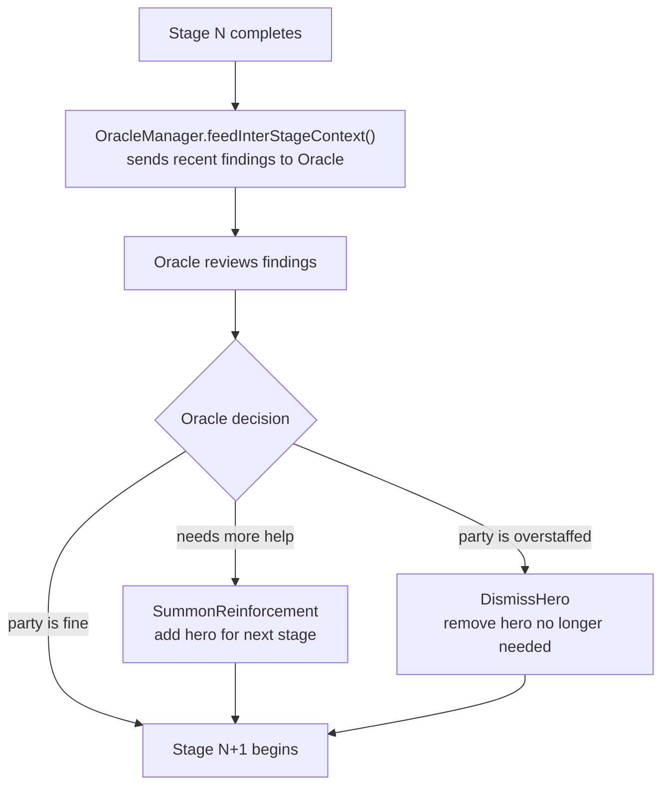
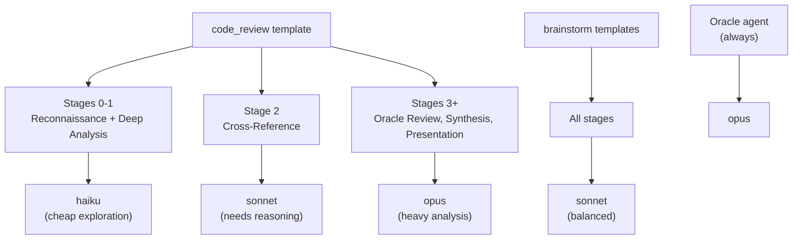

# System Overview

## Three-Process Architecture

The system has three processes that communicate over WebSocket. The Bridge Server is the single source of truth; agents and the client never talk directly to each other.

## Message Protocol Summary

All messages are JSON with a `type` field for routing.

## Module Responsibility Map

### MCP Tool Details

| Server | Tool | Description |
|--------|------|-------------|
| Codebase | SummonAgent | Spawn a new specialist agent |
| Codebase | RequestHelp | Ask another agent for help |
| Codebase | PostFindings | Share a discovery on the board |
| Codebase | UpdateKnowledge | Update own knowledge vault |
| Codebase | ClaimQuest | Claim a quest from the board |
| Codebase | CompleteQuest | Mark a quest as complete |
| Codebase | SealChamber | Mark a chamber/area as done |
| Brainstorm | PostFindings | Share an idea or result |
| Brainstorm | UpdateKnowledge | Update own knowledge |
| Brainstorm | CompleteStage | Signal stage completion |
| Brainstorm | SealChamber | Mark a chamber as done |
| Oracle | SelectHeroes | Choose activity type + initial hero roster |
| Oracle | SummonReinforcement | Add a hero between stages |
| Oracle | DismissHero | Remove a hero between stages |
| Oracle | PresentReport | Compile and broadcast final report |

## Oracle Routing

The Oracle Router is the unified entry point for all sessions. When the player submits a problem and/or repo, the Oracle agent analyzes the input and decides which process to run.

### Input Routing Rules

### Oracle Inter-Stage Intervention

Between process stages the Oracle receives a context update and can adjust the hero party.

### Model Routing

Hero agent model is selected per stage based on the active template.

## Port Map

| Service | Port | Protocol |
|---------|------|----------|
| Bridge Server | 3001 | WebSocket |
| Phaser Client (Vite) | 5173 | HTTP |
| Redis (optional) | 6379 | Redis protocol |
