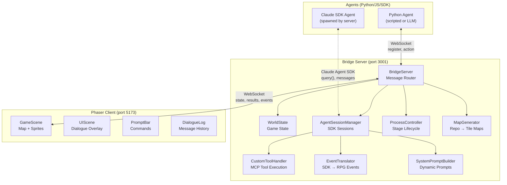
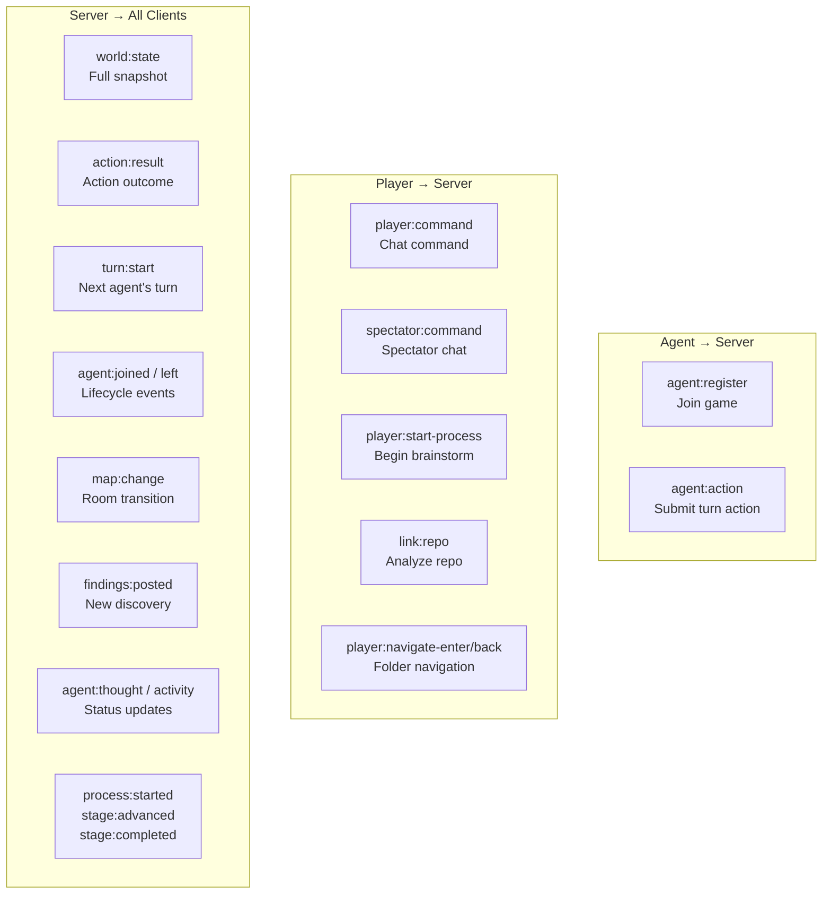
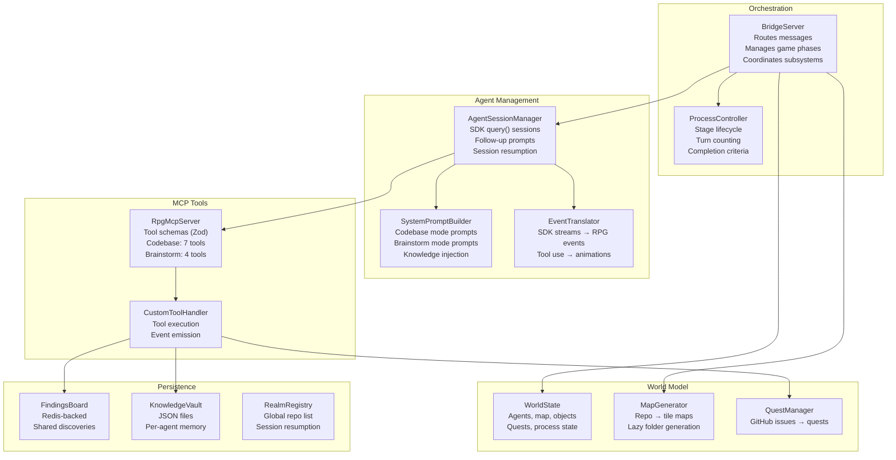

# System Overview

## Three-Process Architecture

The system has three processes that communicate over WebSocket. The Bridge Server is the single source of truth; agents and the client never talk directly to each other.

## Message Protocol Summary

All messages are JSON with a `type` field for routing.

## Module Responsibility Map

## Port Map

| Service | Port | Protocol |
|---------|------|----------|
| Bridge Server | 3001 | WebSocket |
| Phaser Client (Vite) | 5173 | HTTP |
| Redis (optional) | 6379 | Redis protocol |
