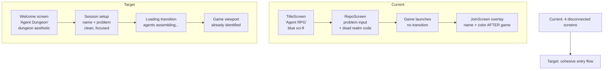

# Feature Brief: Entry Flow Redesign

## Context

Agent Dungeon pivoted from "explore a codebase" to "run a brainstorming process." The engine was rebuilt (Behrang's tasks 1-11), but the front door was never updated to match. The current entry flow is a patchwork:

- **TitleScreen** still says "Agent RPG" with the tagline "Orchestrate AI agents. Ship your project." and uses the old blue sci-fi palette.
- **RepoScreen** was repurposed from a GitHub-repo-linking screen to a brainstorm-problem-input screen. It still has dead code for "Previously Explored Realms," the callback param is named `repoUrl`, and the class is named `RepoScreen`.
- **JoinScreen** (spectator name + color picker) appears *after* the game launches, meaning agents are already running before the user has identified themselves. This is disorienting.
- There's no meaningful loading/transition state between clicking "Begin Session" and the game appearing.
- None of Ida's design spec has been applied. Everything is default blue `#6a8aff` on dark `#0a0a1a`.

Ida (visual design owner) stepped out. Ken is picking up the entry flow work to unblock the demo.

**Related tasks:** Ida's 27 (design tokens), 28 (reskin chrome), 29 (reskin onboarding screens), 32 (landing page finalization).

**Related files:**
- `client/src/screens/TitleScreen.ts`
- `client/src/screens/RepoScreen.ts`
- `client/src/screens/JoinScreen.ts`
- `client/src/main.ts` (screen orchestration, `startGame()`)
- `client/index.html` (CSS, screen containers)
- `docs/agent-dungeon-design-spec.md` (Ida's design spec)

## Goal / Problem

Redesign the entry flow so a new user can go from "opened the app" to "watching agents brainstorm" in a coherent, good-looking sequence that matches the dungeon aesthetic and makes sense for brainstorming (not codebase exploration).

## Non-Goals

- Not redesigning the in-game UI (sidebar, dialogue log, prompt bar). That's a separate pass.
- Not building the landing page into the app. `landing.html` stays separate; this is about the in-app onboarding.
- Not changing the server protocol. `player:start-process`, `process:started`, `spectator:register` all stay the same.
- Not adding new features (session history, templates). Just making the existing flow coherent and styled.
- Not creating the shared design tokens file (task 27). We'll hardcode the design spec values directly for now; tokens can be extracted later.

## User Stories

- **As a first-time user**, I want to understand what this app does within 5 seconds of opening it, so I don't bounce.
- **As a brainstorm facilitator**, I want to enter my name and problem in one place, so I'm not context-switching between identity and topic.
- **As a spectator**, I want to see a loading state while agents spin up, so I know something is happening (not a frozen screen).
- **As a demo audience member**, I want the entry flow to look polished and thematic, so the demo makes a good impression.

## Requirements

### Core Workflow

1. **Combine identity and problem input into one screen.** The user should enter their name/color AND their brainstorm problem on the same screen, then hit one button to start. No reason to split these across two separate moments.
2. **Remove dead repo-exploration code.** Kill the "Previously Explored Realms" section, rename `RepoScreen` to something accurate (e.g. `SessionScreen` or `SetupScreen`), rename the `repoUrl` param.
3. **Add a loading/transition state.** After clicking "Begin Session," show a themed transition (e.g. "Agents assembling in the dungeon...") that persists until `process:started` arrives from the server. This replaces the current "Starting session..." text.
4. **Update the title/branding.** "Agent RPG" becomes "Agent Dungeon." Tagline updated for brainstorming (e.g. "AI agents brainstorm your hardest problems").
5. **Apply design spec styling.** Replace the blue sci-fi palette with the dungeon stone/flame/gold palette from `docs/agent-dungeon-design-spec.md`. Bring in Google Fonts (Cinzel, Cormorant Garamond, DM Mono). Art Nouveau framing on panels.

### Screen Flow

6. **Screen 1: Welcome + Setup (merged TitleScreen + JoinScreen + RepoScreen).** One screen with:
   - Branding header (Agent Dungeon logo, tagline)
   - Name input (required, with color picker)
   - Problem/question textarea (required)
   - "Begin Session" button
7. **Screen 2: Loading transition.** Themed overlay or screen that shows while the server processes and spawns agents. Disappears when `process:started` arrives.
8. **Screen 3: Game viewport.** Same as today, but the user is already registered as a spectator (name + color were collected on Screen 1). The `spectator:register` message is sent automatically as part of game startup, not via a separate JoinScreen overlay.

### Styling

9. All text uses the design spec's font hierarchy: Cinzel Decorative for the logo, Cinzel for headings/labels/buttons, Cormorant Garamond for body text, DM Mono only in terminal contexts.
10. Color palette follows the Dungeon Stone (backgrounds), Torch & Fire (primary accent/buttons), Gold Ornament (framing/borders), and Text (bone/parchment) scales.
11. Panels use the Art Nouveau double-border pattern with gold-dark outer and reduced-opacity inner.
12. Buttons follow the design spec: flame gradient primary, gold-bordered secondary.

## Success Metrics

- **Screen count reduced from 4 to 2** (setup + game, with a loading transition between them).
- **Zero dead code** from the repo-exploration flow remaining in the entry screens.
- **All entry-flow CSS uses design spec colors/fonts** (no more `#6a8aff` or `#0a0a1a` in onboarding screens).
- **Loading state visible** for the full duration between "Begin Session" click and game appearing.
- **Demo-ready:** a teammate watching the entry flow for the first time understands it's a brainstorming tool within 5 seconds.

## UX Notes

- The combined setup screen should feel like a "quest briefing" in RPG terms: you're declaring who you are and what quest you're embarking on.
- The color picker from JoinScreen is a nice touch for multi-spectator sessions; keep it but make it feel integrated (not a separate step).
- The loading transition is a chance for flavor text ("Assembling your council of advisors..." / "Lighting the torches..." / "Agents entering the dungeon...") that reinforces the theme.
- Mobile isn't a priority but the setup screen should at least not break on phone-width viewports.

## Open Questions

1. **Do we keep TitleScreen as a separate splash, or go straight to the combined setup screen?** Option A: one-screen entry (setup screen IS the first screen). Option B: keep a minimal splash with the logo + "Enter the Dungeon" button, then show setup. Splash adds a click but gives the branding a moment to breathe.
2. **How much of `index.html` CSS do we restyle now vs. later?** The setup screen and loading transition need the design spec applied. But `index.html` also has CSS for the sidebar, dialogue log, prompt bar, etc. We could restyle just the entry screens now and leave the in-game chrome for a later pass, or do a full sweep. Recommendation: entry screens only; in-game chrome is a separate task.
3. **Should the loading transition be a separate screen or an overlay on the setup screen?** Overlay is simpler (just swap the form for a loading animation in place). Separate screen is more theatrical.

## Decisions (Resolved)

1. **Keep a splash screen.** The entry flow is: Splash (branding + "Enter the Dungeon") → Setup (name + color + problem) → Loading transition → Game. The splash gives the brand a moment to land.
2. **Restyle entry screens with the full design spec.** Use the existing `index.html` CSS structure plus the design spec (dungeon stone palette, Cinzel/Cormorant/DM Mono fonts, Art Nouveau framing) to create the new entry point. In-game chrome (sidebar, dialogue log, prompt bar) is a separate pass.
3. **Loading transition is an overlay on the setup screen.** Simpler, keeps one screen container. Swap the form content for a loading animation in place when the user clicks "Begin Session."
