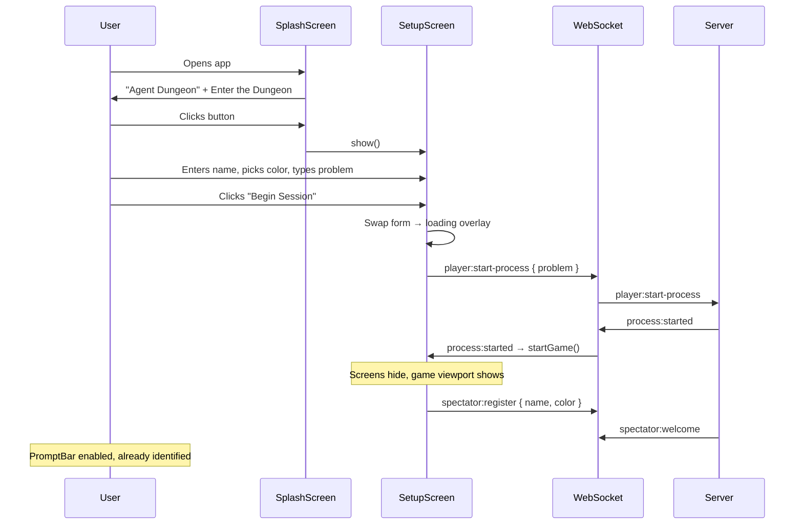
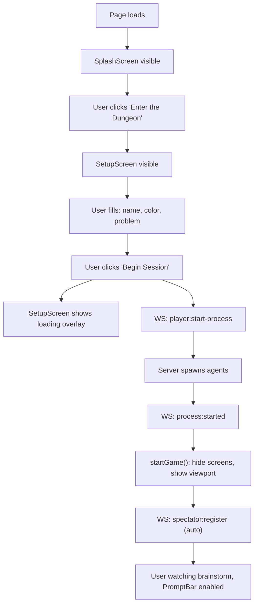

# Architecture: Entry Flow Redesign

## Summary

Replace the current 4-screen entry flow (TitleScreen → RepoScreen → game launch → JoinScreen overlay) with a 2-screen flow plus loading transition: **SplashScreen** (branding + "Enter the Dungeon") → **SetupScreen** (name, color, problem input, "Begin Session") → **loading overlay** (in-place on SetupScreen) → **game viewport** (user already registered as spectator). Restyle all entry screens from the blue sci-fi palette to the dungeon stone/flame/gold design spec.

## Analysis of Existing Structure

### Current screen containers (`index.html`)

```html
<div id="title-screen" class="screen">        <!-- TitleScreen mounts here -->
<div id="repo-screen" class="screen screen-hidden">  <!-- RepoScreen mounts here -->
<div id="game-viewport" class="screen-hidden">  <!-- Phaser + sidebar -->
```

JoinScreen creates its own overlay div appended to `<body>`.

### Current screen classes

| File | Class | What it does | Fate |
|------|-------|-------------|------|
| `screens/TitleScreen.ts` | `TitleScreen` | Logo + "Begin Quest" button | **Replace** with `SplashScreen` |
| `screens/RepoScreen.ts` | `RepoScreen` | Problem input + dead realm history | **Replace** with `SetupScreen` |
| `screens/JoinScreen.ts` | `JoinScreen` | Name + color picker overlay (post-game) | **Delete**; functionality absorbed into `SetupScreen` |

### Current wiring (`main.ts`)

```
TitleScreen.onStart → hide title, show repo, send player:list-realms
RepoScreen.onAnalyze → showLoading, send player:start-process
ws 'process:started' → startGame()
  startGame() → hide screens, show viewport, launch Phaser, create JoinScreen overlay
  JoinScreen.onJoin → send spectator:register
ws 'spectator:welcome' → promptBar.setSpectator()
```

### What stays the same

- `#game-viewport` structure (Phaser canvas + sidebar)
- WebSocket protocol: `player:start-process`, `process:started`, `spectator:register`, `spectator:welcome`
- `startGame()` internals (Phaser launch, PromptBar, MiniMap, QuestLog, StageProgressBar, SpectatorPanel)
- All in-game CSS (sidebar, chat bubbles, prompt bar, etc.) — untouched in this feature

## Components / Modules Touched

| File | Change |
|------|--------|
| `client/index.html` | Replace `#title-screen` with `#splash-screen`, `#repo-screen` with `#setup-screen`. Add Google Fonts. Restyle entry-flow CSS to dungeon palette. Keep all in-game CSS unchanged. |
| `client/src/screens/TitleScreen.ts` | **Delete.** Replace with new `SplashScreen.ts`. |
| `client/src/screens/RepoScreen.ts` | **Delete.** Replace with new `SetupScreen.ts`. |
| `client/src/screens/JoinScreen.ts` | **Delete.** No longer needed. |
| `client/src/screens/SplashScreen.ts` | **New.** Minimal branding screen: "Agent Dungeon" logo, tagline, "Enter the Dungeon" button. |
| `client/src/screens/SetupScreen.ts` | **New.** Combined: name input, color picker, problem textarea, "Begin Session" button, loading overlay state. |
| `client/src/main.ts` | Rewire: SplashScreen → SetupScreen → startGame(). Remove JoinScreen. Send `spectator:register` automatically in `startGame()` using identity collected by SetupScreen. Remove `player:list-realms` / realm list handling. |

## Data / State Changes

No new protocol messages. No server changes. The only state change is that `spectator:register` is sent earlier (inside `startGame()` instead of after JoinScreen submit), using identity data collected during setup.



## Key Flows

### Primary: New user opens app and starts brainstorming



### Secondary: User quits game and returns

The existing `stopGame()` → show setup screen flow. Currently goes back to RepoScreen; will go back to SetupScreen instead.

### Error: Server rejects or fails

SetupScreen shows error text below the form (same as current RepoScreen behavior). Loading overlay hides, form re-enables.

## Alternatives Considered

### Alternative: Single screen (no splash)

Skip the splash and make SetupScreen the first and only pre-game screen. Fewer clicks.

**Rejected because:** The splash gives the branding a moment to land. In a demo setting, the "Agent Dungeon" title with the dungeon aesthetic makes an immediate visual impression before the user is asked to fill out a form. Ken explicitly chose to keep the splash.

### Alternative: Keep JoinScreen as a separate step

Leave spectator registration as a post-game overlay.

**Rejected because:** It's disorienting to watch agents running before you've identified yourself. Collecting identity upfront also simplifies `startGame()` (no overlay management) and means the PromptBar is immediately functional.

### Alternative: Create shared design tokens file first (Ida's task 27)

Extract all design spec values into `shared/design-tokens.ts` and import from there.

**Rejected for now:** Adds a dependency and an extra file. We'll hardcode the hex values directly in CSS. Tokens can be extracted later as a refactor. The design spec is the source of truth either way.

## Failure Modes / Edge Cases

| Scenario | Handling |
|----------|----------|
| User submits empty name | SetupScreen validates: name is required, focus the input. |
| User submits empty problem | SetupScreen validates: problem is required, focus the textarea. |
| Server returns error during process start | SetupScreen exits loading state, shows error text, re-enables form. |
| WebSocket disconnects during loading | WebSocketClient auto-reconnects. Loading state persists until `process:started` or error. User can refresh. |
| User resizes window on splash/setup | Screens are flexbox-centered, max-width constrained. Should handle gracefully. |

## Test Strategy

This is primarily UI/visual work (TDD exception per feature-forge rules). Testing approach:

1. **Manual visual verification**: Each screen renders correctly with the design spec palette and fonts.
2. **Functional flow test**: Splash → Setup → loading → game transition works end-to-end.
3. **Validation tests** (unit): SetupScreen rejects empty name, empty problem, shows/hides loading state correctly.
4. **Regression**: Existing server tests (`npm run test -w server`) still pass — no server changes.
5. **Build check**: `npm run build -w client` passes — no type errors.

## Open Questions

None. All decisions resolved in the brief.
