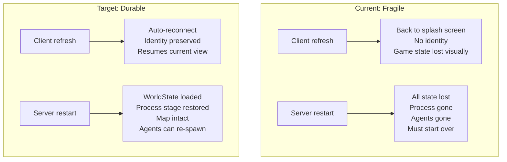

# Feature Brief: State Persistence Across Refresh and Restart

## Context

Agent Dungeon currently loses most of its state when the user refreshes the browser or when the server restarts. This creates a fragile experience: a brainstorm session that took minutes to build can vanish from a browser tab reload or a server process crash. The underlying persistence infrastructure exists (WorldStatePersistence, RealmRegistry, KnowledgeVault, FindingsBoard) but it's only partially wired up, and several critical components (ProcessController, client identity, navigation state) have zero persistence.

**What survives today:**
- RealmRegistry (global session list): file-based, survives everything
- MapGenerator cache (generated maps): persisted in WorldState.mapTree
- WorldState snapshot (agent positions, map, quests): saved to disk, but only on realm link; not on shutdown or periodically
- KnowledgeVault (per-agent memory): saved on agent dismissal only
- FindingsBoard: Redis or JSON fallback, survives restart

**What is lost today:**
- ProcessController state (stage tracking, turn counts, completion criteria): in-memory only
- Active agent sessions (Claude SDK sessions, conversation history): ephemeral
- Client identity and game phase: no localStorage; refresh goes back to splash screen
- Navigation state (agentNavStacks, agentCurrentPath): in-memory only
- BridgeServer settings (max_agents, token_budget): in-memory defaults only
- Agent hierarchy (spawnParent/spawnChildren): in-memory only

**Related files:**
- `server/src/WorldStatePersistence.ts`, `server/src/WorldState.ts`
- `server/src/BridgeServer.ts` (handleResumeRealm, handleStartProcess, cleanupCurrentRealm)
- `server/src/ProcessController.ts`
- `server/src/AgentSessionManager.ts`
- `client/src/main.ts`, `client/src/network/WebSocketClient.ts`

## Goal / Problem

Make the brainstorming experience durable. Two scenarios must work:

1. **Client refresh:** User refreshes browser tab; client reconnects and resumes exactly where it was (correct screen, correct map, agents still running).
2. **Server restart:** Server process stops and restarts; server reloads the last session state, re-enters the correct game phase, and the client reconnects to a functional session (map visible, agents can be re-spawned into the correct process stage).

## Non-Goals

- **Full agent session continuity.** The Claude Agent SDK does not support serializing in-flight sessions. We accept that agent conversation history is lost on server restart; agents re-spawn fresh but into the correct process stage with prior artifacts.
- **Real-time replication / HA.** This is a single-server hackathon project. We're persisting to local disk, not replicating across nodes.
- **Redis migration.** Pratham's Redis work (tasks 37-47) is a separate, parallel effort. This feature uses the existing JSON-file persistence layer. If Redis lands first, these changes still apply; they're backend-agnostic.
- **Undo/rollback.** We save current state, not a history of states.

## User Stories

- **As a facilitator**, I want to refresh my browser without losing the brainstorm session, so I can fix a visual glitch or switch tabs without starting over.
- **As a facilitator**, I want the server to recover from a restart and let me resume the session, so a crash doesn't destroy 10 minutes of brainstorming.
- **As a spectator**, I want to join mid-session and see the current state immediately, so I don't have to ask "what stage are we on?"

## Requirements

### Tier 1: Server-Side Persistence (Critical)

1. **Periodic WorldState saves.** Save WorldState to disk after every significant event: stage advance, agent spawn/dismiss, findings posted, quest update. Not just on realm link.
2. **ProcessController persistence.** Serialize ProcessController's internal state (context, stageTurnCounts, agentTurnCounts, current stage index) into WorldState's processState field. Load it back on resume.
3. **Process resume logic in BridgeServer.** When resuming a realm that has an active processState (status === 'running'), re-instantiate ProcessController from the saved state and spawn agents for the current stage (not just oracle).
4. **Navigation state persistence.** Save agentNavStacks and agentCurrentPath in WorldState. Restore on resume.
5. **Graceful shutdown saves.** On SIGINT/SIGTERM, save WorldState before exiting.

### Tier 2: Client-Side Persistence (Important)

6. **Client identity in localStorage.** Save spectator name, color, and the current realm ID to localStorage. On reconnect, auto-register with saved identity.
7. **Game phase awareness on reconnect.** When the client reconnects, the server should tell it what phase the game is in (onboarding, playing, process running). The client should skip screens it's already past.
8. **Automatic re-entry on refresh.** If localStorage has a realm ID and the server confirms it's still active, skip the splash/setup screens and go straight to the game viewport.

### Tier 3: Robustness (Nice-to-Have)

9. **Periodic KnowledgeVault saves.** Auto-save agent knowledge vaults every 60 seconds (not just on dismissal), so a crash loses at most 1 minute of knowledge.
10. **Settings persistence.** Save user-modified settings (max_agents, token_budget, autonomy mode) to a settings file; reload on server start.
11. **Agent hierarchy persistence.** Save spawnParent/spawnChildren maps in WorldState so re-spawned agents know their lineage.

## Success Metrics

- **Client refresh during brainstorm:** User refreshes, client reconnects within 2 seconds, same map and agents visible, no splash screen.
- **Server restart with saved state:** Server restarts, loads last WorldState, client reconnects and sees the map. Process can resume (agents re-spawn into correct stage).
- **Zero data loss on graceful shutdown:** SIGINT triggers a save; next startup loads exact state.

## Domain Ownership

This feature crosses two domains:

| Component | Domain Owner | What Changes |
|-----------|-------------|--------------|
| WorldStatePersistence, save triggers | **Pratham** (Persistence) | More frequent saves, expanded serialization |
| ProcessController serialization | **Behrang** (Core Engine) | Add toJSON/fromJSON, wire into WorldState |
| BridgeServer resume logic | **Behrang** (Core Engine) | Process-aware resume in handleResumeRealm |
| Client localStorage, reconnect flow | **Ken** or unassigned | New client-side code |
| Graceful shutdown handler | **Behrang** (Core Engine) | index.ts signal handlers |

Cross-domain work should be coordinated via the Bulletin Board per CLAUDE.md rules.

## Open Questions

1. **Should process resume re-spawn agents at the current stage, or replay from the beginning?** Recommendation: re-spawn at current stage with prior artifacts injected into system prompts. Replaying would be expensive and confusing.
2. **How do we handle a server restart mid-stage-advance?** The `advancing` flag in ProcessController guards against double-advances. If the server crashes during an advance, we should resume at the stage that was being advanced TO (not the previous one). The save should happen after the advance completes.
