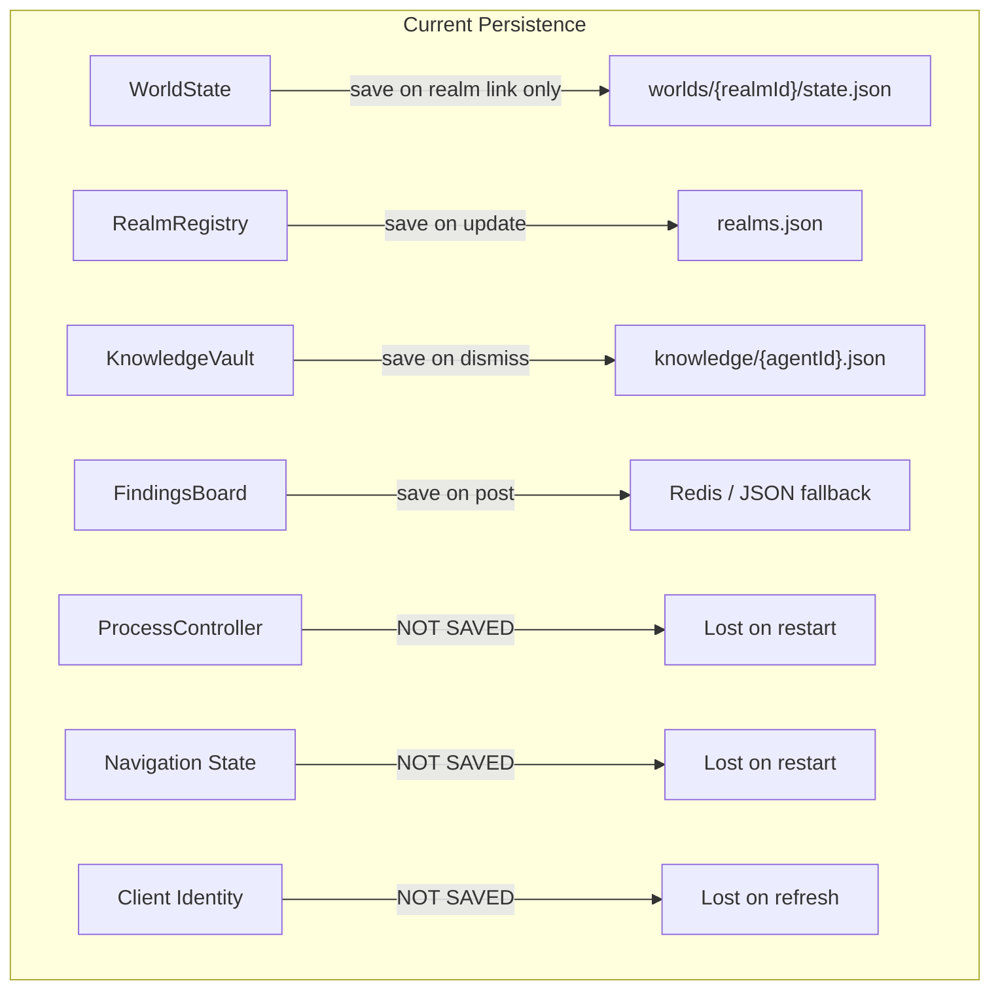
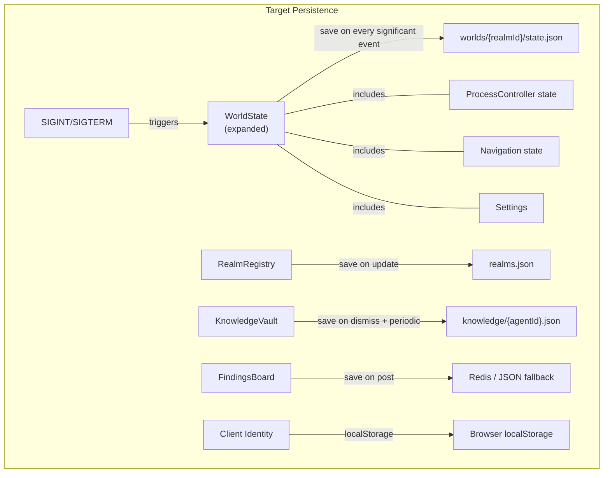
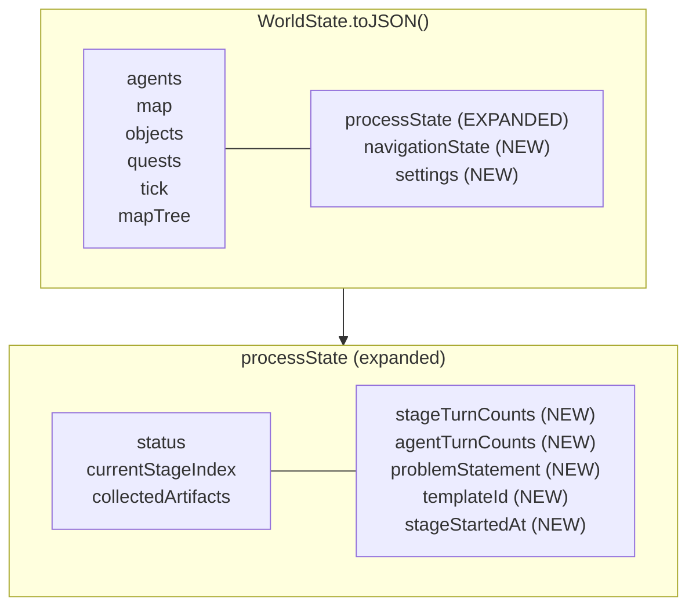
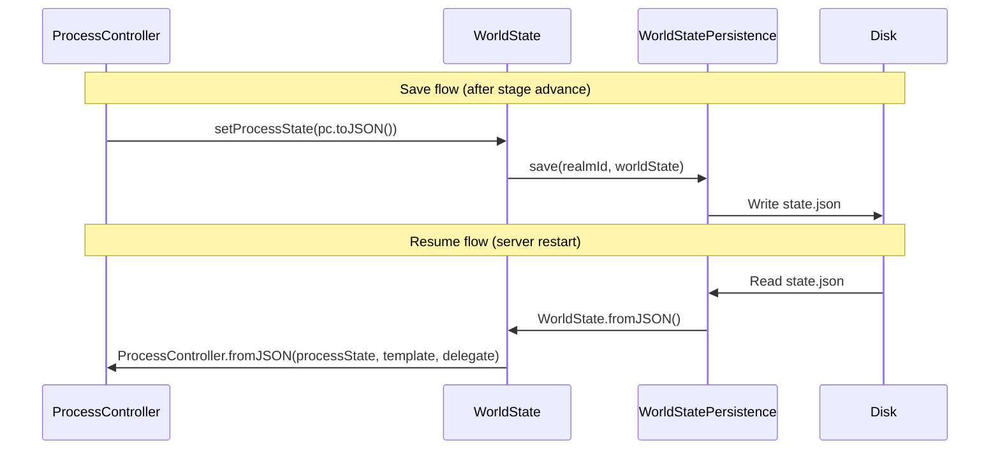
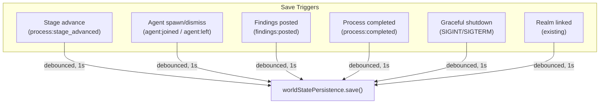
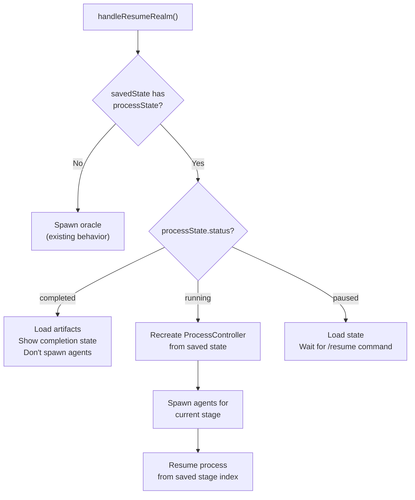
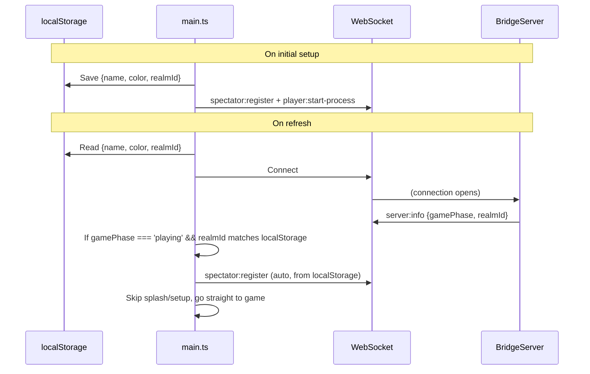
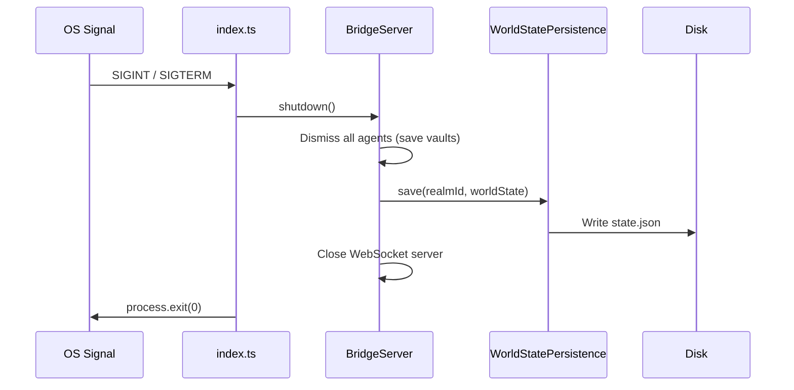
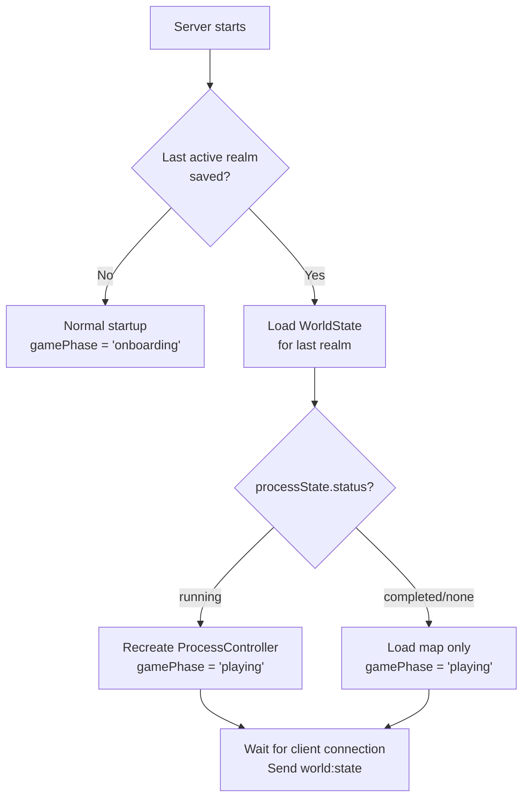

# Architecture: State Persistence Across Refresh and Restart

## Current State vs. Target State





## Component Changes

### 1. WorldState Expansion

WorldState.toJSON() currently serializes: agents, map, objects, quests, tick, mapTree, processState. We expand `processState` and add new fields.



**Expanded ProcessState type** (in `shared/protocol.ts` or `shared/process.ts`):

```typescript
interface ProcessState {
  // Existing fields
  status: 'idle' | 'running' | 'paused' | 'completed';
  currentStageIndex: number;
  collectedArtifacts: Record<string, unknown>;

  // New fields for persistence
  problemStatement: string;
  templateId: string;               // Which process template (e.g. 'STANDARD_BRAINSTORM')
  stageTurnCounts: Record<string, number>;       // stageId -> total turns taken
  agentTurnCounts: Record<string, number>;       // "stageId:agentId" -> turns taken
  stageStartedAt: string | null;    // ISO 8601 timestamp of current stage start
}
```

**New NavigationState type:**

```typescript
interface NavigationState {
  agentNavStacks: Record<string, string[]>;  // agentId -> stack of folder paths
  agentCurrentPath: Record<string, string>;  // agentId -> current folder path
}
```

### 2. ProcessController Serialization

ProcessController gains `toJSON()` and `static fromJSON()` methods:



`ProcessController.toJSON()` returns the expanded ProcessState object. `ProcessController.fromJSON()` reconstructs the controller from saved state + the original process template + delegate callbacks.

### 3. BridgeServer Save Triggers

Current: save only on `link:repo`.
Target: save on every significant event.



**Debouncing:** Multiple events can fire in quick succession (e.g. dismiss 4 agents + spawn 3 new ones during a stage advance). Use a simple debounce: schedule a save 1 second after the last trigger. If another trigger fires within that second, reset the timer.

### 4. BridgeServer Resume Logic

Current `handleResumeRealm` only spawns the oracle agent. Target: detect process state and resume accordingly.



### 5. Client-Side Persistence



**New server message:** `server:info` is already sent on connection (line 150 in BridgeServer). We expand it to include `gamePhase` and `realmId` so the client knows whether to show setup screens or jump to the game.

**localStorage keys:**
- `agentDungeon.identity` → `{ name: string, color: string }`
- `agentDungeon.realmId` → `string`
- `agentDungeon.gamePhase` → `'onboarding' | 'playing'`

### 6. Graceful Shutdown



### 7. Auto-Save on Startup

On server startup, if a realm was active (check a `lastActiveRealm` field in the realm registry or a separate file), auto-load it. This means after a crash, the server comes back in `playing` phase with the last realm loaded; the client reconnects and sees the game.



## File Change Summary

| File | Change Type | Description |
|------|------------|-------------|
| `shared/protocol.ts` | **Modify** | Expand ProcessState type, add NavigationState type, expand `server:info` payload |
| `server/src/types.ts` | **Modify** | Mirror protocol changes |
| `client/src/types.ts` | **Modify** | Mirror protocol changes |
| `server/src/WorldState.ts` | **Modify** | Add navigationState to toJSON/fromJSON, expand processState serialization |
| `server/src/WorldStatePersistence.ts` | **Modify** | No changes needed (already generic JSON serialization) |
| `server/src/ProcessController.ts` | **Modify** | Add toJSON()/fromJSON(), make internal maps serializable |
| `server/src/BridgeServer.ts` | **Modify** | Add debounced save triggers, expand handleResumeRealm for process resume, add navigationState save/load, expand server:info |
| `server/src/index.ts` | **Modify** | Add SIGINT/SIGTERM handlers for graceful shutdown |
| `server/src/RealmRegistry.ts` | **Modify** | Add lastActiveRealmId field |
| `client/src/main.ts` | **Modify** | Add localStorage read/write, auto-resume logic on reconnect |
| `client/src/network/WebSocketClient.ts` | **Modify** | Minimal; reconnect already works |
| `server/src/__tests__/` | **Add/Modify** | Tests for ProcessController serialization, resume logic, save triggers |

## Risks and Mitigations

| Risk | Impact | Mitigation |
|------|--------|------------|
| Save I/O slows down event processing | Medium | Debounce saves; write async (don't await in hot path) |
| Corrupted state file prevents startup | High | Validate JSON on load; fall back to clean state if corrupt |
| ProcessController fromJSON misses new fields added later | Low | Default values for missing fields in fromJSON |
| localStorage cleared by user | Low | Graceful fallback to splash screen; not a hard requirement |
| Agent SDK sessions can't be restored | Medium (accepted) | Re-spawn fresh agents with prior artifacts in system prompt |
