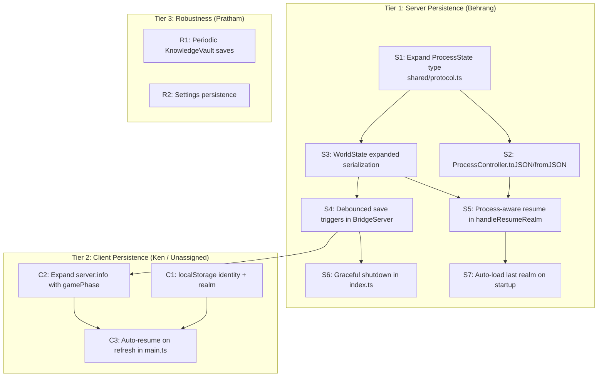

# Implementation Plan: State Persistence Across Refresh and Restart

## Overview

Three parallel workstreams, ordered by dependency. Tier 1 (server persistence) unblocks everything. Tier 2 (client persistence) is independent. Tier 3 (robustness) can happen last.



## Tier 1: Server-Side Persistence

**Owner: @Behrang** (Core Engine / Agent Orchestration)

These tasks modify BridgeServer, ProcessController, and WorldState; all squarely in Behrang's domain. Protocol type changes in `shared/` are also Behrang's responsibility.

### S1: Expand ProcessState Type

**File:** `shared/protocol.ts` (+ mirrors in `server/src/types.ts`, `client/src/types.ts`)

Add to the existing `ProcessState` interface:

```typescript
// New fields
problemStatement: string;
templateId: string;
stageTurnCounts: Record<string, number>;
agentTurnCounts: Record<string, number>;
stageStartedAt: string | null;
```

Add a new `NavigationState` interface:

```typescript
interface NavigationState {
  agentNavStacks: Record<string, string[]>;
  agentCurrentPath: Record<string, string>;
}
```

Expand `ServerInfoMessage` (or the payload of `server:info`) to include `gamePhase` and `activeRealmId`.

**Test:** Compile check. Existing tests should still pass (new fields are additive).

### S2: ProcessController.toJSON / fromJSON

**File:** `server/src/ProcessController.ts`

Add:

```typescript
toJSON(): ProcessState {
  return {
    status: this.context.status ?? 'running',
    currentStageIndex: this.context.stageIndex,
    collectedArtifacts: this.context.artifacts ?? {},
    problemStatement: this.context.problem,
    templateId: this.context.template.id ?? 'STANDARD_BRAINSTORM',
    stageTurnCounts: Object.fromEntries(this.stageTurnCounts),
    agentTurnCounts: Object.fromEntries(this.agentTurnCounts),
    stageStartedAt: this.stageStartedAt ?? null,
  };
}

static fromJSON(
  state: ProcessState,
  template: ProcessDefinition,
  delegate: ProcessControllerDelegate
): ProcessController {
  const pc = new ProcessController(/* ... */);
  pc.context.stageIndex = state.currentStageIndex;
  pc.context.problem = state.problemStatement;
  pc.stageTurnCounts = new Map(Object.entries(state.stageTurnCounts ?? {}));
  pc.agentTurnCounts = new Map(Object.entries(state.agentTurnCounts ?? {}));
  pc.stageStartedAt = state.stageStartedAt ?? null;
  // Do NOT auto-advance; let the delegate spawn agents for the current stage
  return pc;
}
```

**Test:** Unit test: create a ProcessController, advance a few stages, call toJSON(), then fromJSON() and verify state matches. Add to `server/src/__tests__/ProcessController.test.ts`.

### S3: WorldState Expanded Serialization

**File:** `server/src/WorldState.ts`

Expand `toJSON()` to include `navigationState`. Expand `fromJSON()` to restore it. The processState field is already serialized; it now contains the expanded fields from S1.

```typescript
toJSON(): string {
  return JSON.stringify({
    agents: Array.from(this.agents.entries()),
    map: this.map,
    objects: this.objects,
    quests: this.quests,
    tick: this.tick,
    mapTree: this.mapTree ?? null,
    processState: this.processState ?? null,
    navigationState: this.navigationState ?? null,  // NEW
  });
}
```

**Test:** Extend existing WorldStatePersistence tests to verify navigationState round-trips through save/load.

### S4: Debounced Save Triggers in BridgeServer

**File:** `server/src/BridgeServer.ts`

Add a `scheduleSave()` method with a 1-second debounce:

```typescript
private saveTimer: NodeJS.Timeout | null = null;

private scheduleSave(): void {
  if (!this.realmId) return;
  if (this.saveTimer) clearTimeout(this.saveTimer);
  this.saveTimer = setTimeout(async () => {
    // Sync ProcessController state into WorldState before saving
    if (this.processController) {
      this.worldState.setProcessState(this.processController.toJSON());
    }
    // Sync navigation state
    this.worldState.navigationState = {
      agentNavStacks: Object.fromEntries(this.agentNavStacks),
      agentCurrentPath: Object.fromEntries(this.agentCurrentPath),
    };
    await this.worldStatePersistence.save(this.realmId!, this.worldState);
  }, 1000);
}

// Force immediate save (for shutdown)
private async forceSave(): Promise<void> {
  if (this.saveTimer) clearTimeout(this.saveTimer);
  if (!this.realmId) return;
  if (this.processController) {
    this.worldState.setProcessState(this.processController.toJSON());
  }
  this.worldState.navigationState = {
    agentNavStacks: Object.fromEntries(this.agentNavStacks),
    agentCurrentPath: Object.fromEntries(this.agentCurrentPath),
  };
  await this.worldStatePersistence.save(this.realmId, this.worldState);
}
```

Call `scheduleSave()` after:
- Stage advance (`stage:completed` handler)
- Agent spawn/dismiss (`agent:joined` / `agent:left` handlers)
- Findings posted (`findings:posted` handler)
- Process completed (`process:completed` handler)
- Quest update (`quest:update` handler)

**Test:** Mock WorldStatePersistence, fire multiple events in quick succession, verify save is called once (after debounce).

### S5: Process-Aware Resume in handleResumeRealm

**File:** `server/src/BridgeServer.ts`

After loading WorldState in `handleResumeRealm`, check for active process:

```typescript
if (savedState.processState && savedState.processState.status === 'running') {
  // Look up the template
  const template = getProcessTemplate(savedState.processState.templateId);
  if (template) {
    this.processController = ProcessController.fromJSON(
      savedState.processState,
      template,
      this.createProcessDelegate()
    );
    // Spawn agents for the current stage
    await this.spawnProcessAgents(
      template.stages[savedState.processState.currentStageIndex],
      savedState.processState.problemStatement
    );
  }
} else {
  // Existing behavior: spawn oracle
  await this.spawnOracle(realm.path);
}
```

Also restore navigation state:

```typescript
if (savedState.navigationState) {
  this.agentNavStacks = new Map(Object.entries(savedState.navigationState.agentNavStacks));
  this.agentCurrentPath = new Map(Object.entries(savedState.navigationState.agentCurrentPath));
}
```

**Test:** Integration test: save a WorldState with processState.status === 'running', call handleResumeRealm, verify ProcessController is recreated and agents spawn for the correct stage.

### S6: Graceful Shutdown in index.ts

**File:** `server/src/index.ts`

Add signal handlers:

```typescript
const shutdown = async () => {
  console.log('Shutting down gracefully...');
  await bridge.forceSave();
  bridge.close();
  process.exit(0);
};

process.on('SIGINT', shutdown);
process.on('SIGTERM', shutdown);
```

Expose `forceSave()` and `close()` as public methods on BridgeServer.

**Test:** Manual verification; hard to unit test signal handlers. Can test `forceSave()` in isolation.

### S7: Auto-Load Last Realm on Startup

**File:** `server/src/BridgeServer.ts`, `server/src/RealmRegistry.ts`

Add a `lastActiveRealmId` field to RealmRegistry (or a separate `~/.agent-rpg-global/.agent-rpg/active-realm.txt`). Set it when a realm becomes active; clear it on clean shutdown.

On startup, if `lastActiveRealmId` exists, auto-load that realm's WorldState and set `gamePhase = 'playing'`. When a client connects, it receives the active game state immediately.

**Test:** Unit test: set lastActiveRealmId, restart server (simulate), verify realm is auto-loaded.

---

## Tier 2: Client-Side Persistence

**Owner: @Ken** (or unassigned; client-side, minimal)

### C1: localStorage Identity and Realm

**File:** `client/src/main.ts`

After spectator registration:

```typescript
localStorage.setItem('agentDungeon.identity', JSON.stringify({ name, color }));
localStorage.setItem('agentDungeon.realmId', realmId);
```

On startup, read these values. If they exist, pre-fill the setup screen or skip it entirely (depending on C3).

### C2: Expand server:info with gamePhase

**File:** `server/src/BridgeServer.ts` (server side), `client/src/main.ts` (client side)

When the server sends `server:info` on new connection, include:

```typescript
{
  type: 'server:info',
  gamePhase: this.gamePhase,
  activeRealmId: this.realmId ?? null,
  // existing fields...
}
```

The client uses this to decide which screen to show.

### C3: Auto-Resume on Refresh

**File:** `client/src/main.ts`

On WebSocket connect, after receiving `server:info`:

```typescript
const savedIdentity = JSON.parse(localStorage.getItem('agentDungeon.identity') ?? 'null');
const savedRealmId = localStorage.getItem('agentDungeon.realmId');

if (serverInfo.gamePhase === 'playing' && savedRealmId === serverInfo.activeRealmId && savedIdentity) {
  // Auto-register and skip to game
  ws.send({ type: 'spectator:register', ...savedIdentity });
  startGame();
} else {
  // Show setup screens normally
  showSplashScreen();
}
```

**Test:** Manual QA. Could add a client unit test mocking localStorage and WebSocket.

---

## Tier 3: Robustness

**Owner: @Pratham** (Persistence domain)

### R1: Periodic KnowledgeVault Saves

**File:** `server/src/AgentSessionManager.ts`

Add a 60-second interval per active agent that calls `vault.save()`. Clear interval on agent dismissal.

### R2: Settings Persistence

**File:** `server/src/BridgeServer.ts`

Save `this.settings` to `~/.agent-rpg-global/.agent-rpg/settings.json` when modified. Load on startup. Fallback to defaults if file doesn't exist.

---

## Implementation Order

```
1. S1 (types)           ← Do first, unblocks everything
2. S2 (PC serialize)    ← Depends on S1
3. S3 (WorldState)      ← Depends on S1
4. S4 (save triggers)   ← Depends on S3
5. S5 (resume logic)    ← Depends on S2 + S3
6. S6 (shutdown)        ← Depends on S4
7. S7 (auto-load)       ← Depends on S5
8. C1 + C2 (parallel)   ← Independent of server tier
9. C3 (client resume)   ← Depends on C1 + C2
10. R1 + R2 (parallel)  ← Independent, low priority
```

Total estimate: S1-S7 is the bulk; C1-C3 is small; R1-R2 is small.

## Testing Strategy

- **Unit tests** for ProcessController.toJSON/fromJSON round-trip
- **Unit tests** for WorldState expanded serialization round-trip
- **Integration test** for debounced save (mock persistence, fire events, verify save count)
- **Integration test** for process resume (save state → load state → verify ProcessController recreated)
- **Manual QA** for client refresh behavior and graceful shutdown
- All existing tests must continue to pass (additive changes only)
