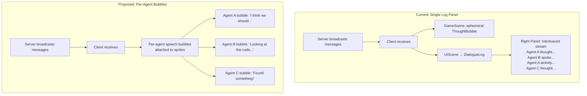

# Feature Brief: Agent Speech Bubbles

## Context

Currently, all agent output (speech, thoughts, tool activity) flows into a single **right-panel scrolling log** (`DialogueLog`), a 320px sidebar DOM overlay. Every agent's messages are interleaved chronologically. There's also a lightweight `ThoughtBubble` system that shows ephemeral Phaser text above agent sprites (floats up, fades after ~4 seconds), but it's a secondary visual flourish; the right panel is the primary way users read what agents are saying.

The problem: the right panel mixes all agents into one stream, making it hard to follow individual agents. It feels like reading a noisy chat room rather than watching characters interact in a JRPG world. The visual center of the experience (the game canvas with agent sprites) is under-utilized for communication.

## Goal / Problem

Replace the right-panel interleaved log with **individual speech/thought bubbles that appear directly above each agent's sprite**. Each agent should have its own visual bubble showing what it's currently thinking or saying. This makes the JRPG metaphor stronger: you watch characters "talk" in the game world rather than reading a separate chat transcript.

The key design question: **How persistent should bubbles be?** Options range from ephemeral (like current ThoughtBubble, fades after a few seconds) to semi-persistent (stays until replaced by the agent's next message) to scrollable (a mini-log per agent).

## Non-Goals

- Not building a full chat history per agent (that could be a follow-up)
- Not changing the server-side message format or protocol
- Not modifying how agents generate their messages
- Not removing the sidebar entirely; the sidebar still exists for PromptBar, AgentDetailsPanel, QuestLog, and StageProgressBar
- Not implementing click-to-expand full conversation history (follow-up feature)

## User Stories

- **As a viewer watching a brainstorm session**, I want to see each agent's current thought above their sprite so that I can follow individual contributions without scanning a shared log.
- **As a presenter demoing Agent Dungeon**, I want the visual experience to feel like a JRPG where characters talk via speech bubbles so that the metaphor is immediately clear to the audience.
- **As a user monitoring multiple agents**, I want each agent's bubble to update independently so that I can see at a glance which agent is active and what it's doing.

## Requirements

### Core

1. **Speech bubbles appear above agent sprites.** Each agent gets a bubble positioned above their sprite, visually anchored to them.
2. **Bubbles show the agent's latest message.** When a new `agent:thought`, `agent:activity`, or `action:result` (speak) arrives, the bubble updates to show that content.
3. **Bubbles are per-agent.** Each agent has exactly one bubble area. New messages replace the previous content (not interleaved with other agents).
4. **Bubbles are visually distinct by type.** Speech, thoughts, and activity indicators should look different (e.g., speech = white bubble with tail, thought = italic cloud-style, activity = compact with tool icon).
5. **Bubbles follow their agent.** If an agent moves, the bubble moves with them.

### Visual

6. **Text truncation for long messages.** Agent thoughts can be verbose. Bubble should show a truncated preview (2-3 lines max) rather than a wall of text.
7. **Bubble styling fits the JRPG aesthetic.** Pixel-art inspired borders, dark theme colors consistent with existing UI, agent's color used for the name/accent.
8. **Bubbles don't overlap excessively.** When agents are close together, bubbles should have some stacking or offset logic so they remain readable.

### Sidebar Changes

9. **Remove DialogueLog from the sidebar.** The right panel no longer shows the interleaved chat log.
10. **Sidebar retains other panels.** PromptBar, AgentDetailsPanel, StageProgressBar, QuestLog remain as-is.
11. **Sidebar may become narrower or collapsible** if it feels too empty without DialogueLog (open question).

## Success Metrics

- Each agent's current message is visible above their sprite within 200ms of receipt
- No visual overlap making text unreadable when 3+ agents are on screen
- Bubbles update correctly when agents move (no orphaned bubbles)
- The right-panel DialogueLog is fully removed; no interleaved log visible
- Demo viewers can identify what each specific agent is thinking/saying without cross-referencing a sidebar

## UX Notes

- Bubble width should be constrained (~180-220px) so they don't dominate the 640x480 canvas
- Consider a fade/transition when bubble content updates (not a hard swap)
- Activity indicators (tool usage) could be more compact than speech/thought; maybe just an icon + one-line summary
- Agents that haven't spoken recently could show a subtle "idle" state (dimmed or no bubble)

## Open Questions

_All resolved. See Decisions below._

## Decisions (Resolved)

1. **Bubble persistence: Hybrid.** Speech bubbles persist until replaced by the agent's next message. Thought bubbles fade after a few seconds. Activity indicators are ephemeral (replace quickly as tools change).
2. **Sidebar: Collapsible.** The sidebar becomes collapsible now that DialogueLog is gone. PromptBar and other panels remain inside it.
3. **Off-screen agents: Edge indicators.** Show a small indicator at the screen edge pointing toward off-screen agents. In practice agents rarely go off-screen, so this is a safety net.
4. **Implementation approach: Engineer's choice.** Pure Phaser (consistent with ThoughtBubble) is the likely path, but the implementer may choose DOM overlays or hybrid if it yields a better result.
