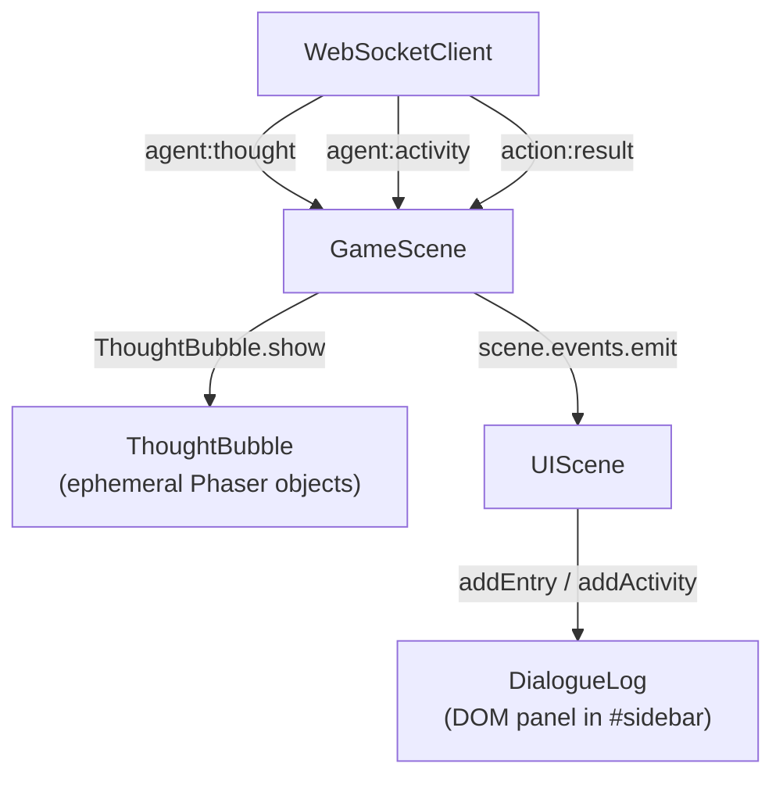
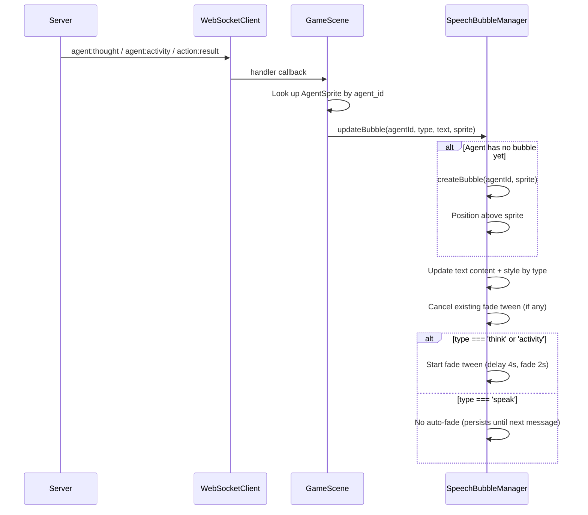
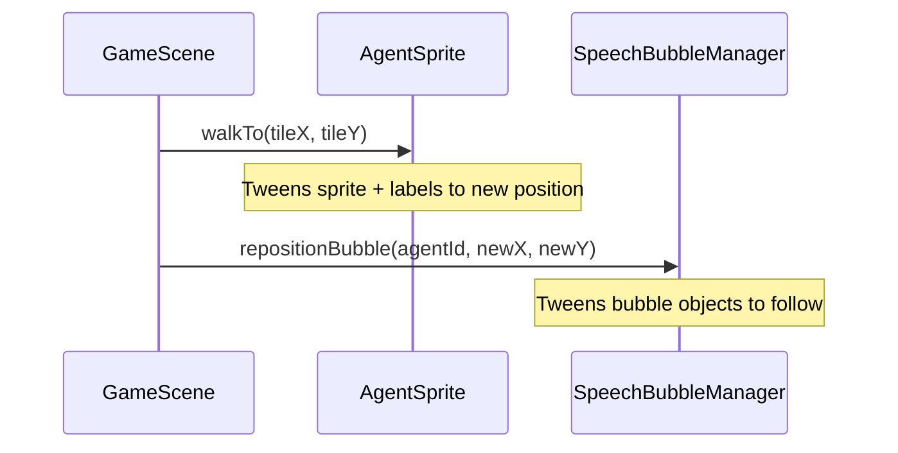
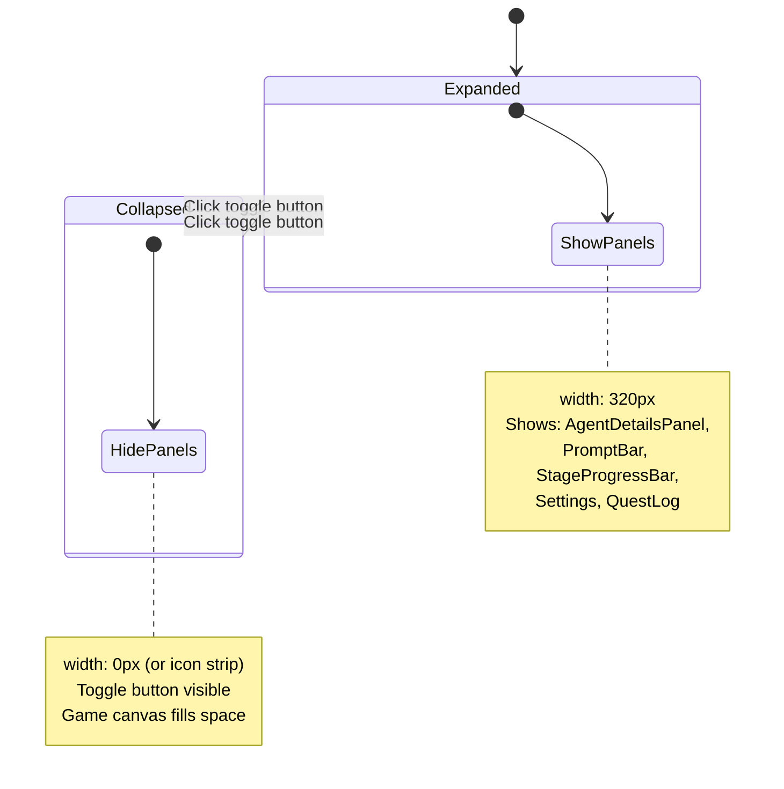
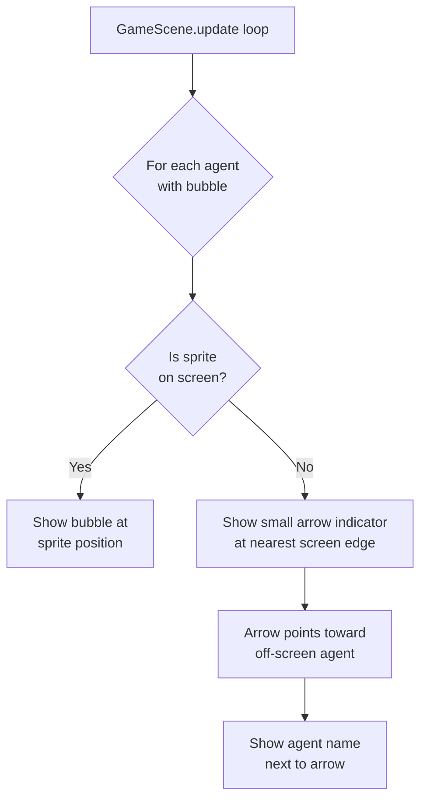

# Architecture: Agent Speech Bubbles

## Summary

Replace the interleaved DialogueLog right-panel with per-agent speech bubbles rendered as Phaser game objects above each agent's sprite. A new `SpeechBubbleManager` class in the client manages one persistent bubble per agent, updating content when new messages arrive. The sidebar becomes collapsible with a toggle button, retaining PromptBar, AgentDetailsPanel, StageProgressBar, and Settings. No server-side changes needed; only client message routing changes.

## Analysis of Existing Structure

### What exists today



**Key files and their roles:**

| File | Role | Changes needed |
|------|------|----------------|
| `client/src/systems/ThoughtBubble.ts` | Ephemeral float-up-and-fade bubbles | **Replace** with SpeechBubbleManager |
| `client/src/panels/DialogueLog.ts` | DOM-based scrolling chat log | **Remove** from sidebar usage |
| `client/src/scenes/GameScene.ts` | Routes WS messages to ThoughtBubble + UIScene | **Reroute** to SpeechBubbleManager |
| `client/src/scenes/UIScene.ts` | Forwards events to DialogueLog | **Remove** DialogueLog forwarding |
| `client/src/systems/AgentSprite.ts` | Agent rendering, provides getX()/getY() | **No changes** |
| `client/index.html` | Sidebar layout + chat CSS | **Modify** sidebar to be collapsible, remove dialogue-log styles |

### What stays the same

- Server message format: no protocol changes
- WebSocketClient pub-sub: unchanged
- AgentSprite API: unchanged (getX/getY still provide position)
- PromptBar, AgentDetailsPanel, StageProgressBar, QuestLog, Settings: unchanged
- Window events for system messages, findings, stage announcements: these will need a new home (see Open Questions)

## Components / Modules Touched

### New files

1. **`client/src/systems/SpeechBubbleManager.ts`** — Owns per-agent bubble lifecycle. One bubble per agent. Handles creation, content updates, type-specific styling, fade behavior, position tracking, and off-screen edge indicators.

### Modified files

2. **`client/src/scenes/GameScene.ts`** — Replace ThoughtBubble with SpeechBubbleManager. Route `agent:thought`, `agent:activity`, `action:result` (speak/think) directly to the manager instead of UIScene.
3. **`client/src/scenes/UIScene.ts`** — Remove DialogueLog instantiation and the three forwarding handlers (`onShowDialogue`, `onAgentThought`, `onAgentActivity`). Keep AgentDetailsPanel, statusText, and agent-info tracking.
4. **`client/index.html`** — Make sidebar collapsible (toggle button, CSS transitions). Remove `#dialogue-log` div. Clean up unused chat-bubble CSS.
5. **`client/src/main.ts`** — Remove DialogueLog import if it was referenced here (it wasn't; DialogueLog is only instantiated in UIScene).

### Potentially affected (event listeners to reroute)

6. **`client/src/panels/DialogueLog.ts`** — Window event listeners for `prompt-player-message`, `prompt-system-message`, `spectator-command`, `findings-posted`, `stage-announcement` currently add entries to the log. These events still fire but need a new destination. Options: (a) SpeechBubbleManager shows system messages as a "narrator" bubble, (b) a small toast/notification system, or (c) keep a minimal log in the collapsible sidebar. **Decision: show system messages, findings, and stage announcements as centered floating text in the game canvas (Phaser text objects that fade), not in a per-agent bubble.** Player messages and spectator commands continue through PromptBar.

## Data / State Changes

No new data structures on the server. Client-side state:

```typescript
// SpeechBubbleManager internal state
interface AgentBubbleState {
  agentId: string;
  bg: Phaser.GameObjects.Rectangle;       // Bubble background
  text: Phaser.GameObjects.Text;           // Bubble content
  nameTag: Phaser.GameObjects.Text;        // Agent name
  tail: Phaser.GameObjects.Triangle;       // Speech bubble tail pointer
  type: 'speak' | 'think' | 'activity';   // Current content type
  fadeTween?: Phaser.Tweens.Tween;         // Active fade tween (if any)
}

// Map<agentId, AgentBubbleState>
```

## Key Flows

### Primary flow: Agent message → speech bubble



### Agent movement → bubble follows



### Sidebar collapse/expand



### Off-screen edge indicators



## Alternatives Considered

### Alternative A: DOM overlays synced to sprite positions

Position `<div>` elements using JavaScript, converting Phaser world coordinates to screen coordinates every frame via `camera.getWorldPoint()` inverse.

**Why rejected:**
- Requires per-frame DOM position updates for every bubble (performance concern with 5-15 agents)
- Z-indexing between DOM overlays and Phaser canvas is fragile
- Camera zoom/pan breaks the sync unless carefully handled
- Inconsistent with the existing codebase; ThoughtBubble and emotes are pure Phaser

### Alternative B: Keep DialogueLog alongside bubbles

Keep the right-panel log as a secondary view while adding bubbles over sprites.

**Why rejected:**
- Contradicts the brief's goal: the whole point is to move away from the interleaved log
- Duplicates information (bubble + log show the same content)
- Wastes screen real estate

### Alternative C: Phaser.GameObjects.DOMElement hybrid

Use Phaser's built-in DOMElement to embed HTML within the Phaser scene.

**Why considered:** Rich styling (CSS borders, box-shadow, HTML entities) with Phaser's coordinate/camera system.

**Why rejected:**
- DOMElement has known performance issues with many instances
- Adds complexity (DOM inside canvas coordinate system)
- Current project convention is pure Phaser for in-game objects, DOM for UI overlays
- Not worth the added complexity for what's essentially styled rectangles with text

## Failure Modes / Edge Cases

| Scenario | Handling |
|----------|----------|
| **Multiple agents clustered together** | Stack bubbles vertically with 4px gap. SpeechBubbleManager tracks all bubble positions and offsets upward when overlap detected. |
| **Very long message text** | Truncate to ~100 characters (3 lines at ~33 chars/line within 200px width). No "Show More" in Phaser; the full text is available in AgentDetailsPanel on click. |
| **Agent spawns then immediately sends messages** | SpeechBubbleManager creates bubble on first message if sprite exists; if sprite doesn't exist yet, queue the message and create on next `agent:joined`. |
| **Agent despawns/disconnects** | Destroy the bubble when the sprite is destroyed. Listen for agent removal events. |
| **Rapid message succession** | Each new message replaces the previous. Cancel any in-progress fade tween. Brief cross-fade transition (150ms) between content. |
| **Agent off-screen** | Hide bubble, show edge indicator (small colored arrow at screen edge with agent name). Update position in GameScene.update(). |
| **Camera zoom** | Bubbles are Phaser world objects; they scale with the camera naturally. Text may need a minimum readable size clamp. |
| **No agents present** | SpeechBubbleManager has nothing to render. No error. |
| **System/narrator messages (findings, stage announcements)** | Render as centered floating text in the game world (not a per-agent bubble). Fade after 5s. |

## Test Strategy

### Unit tests (vitest)

1. **SpeechBubbleManager.updateBubble()** — Creates bubble on first call, updates on subsequent calls
2. **SpeechBubbleManager type-specific behavior** — Think/activity fade after delay; speak persists
3. **SpeechBubbleManager.repositionBubble()** — Bubble follows coordinates
4. **SpeechBubbleManager.removeBubble()** — Cleans up Phaser objects
5. **Truncation** — Long messages truncated to character limit
6. **Overlap detection** — Stacking logic offsets overlapping bubbles

### Integration tests

7. **GameScene routing** — agent:thought → SpeechBubbleManager (not DialogueLog)
8. **UIScene** — No longer instantiates DialogueLog, no forwarding errors
9. **Sidebar collapse** — Toggle button hides/shows sidebar, game canvas resizes

### Manual testing

10. **Visual inspection** — Bubbles positioned correctly, readable, aesthetically consistent
11. **Multiple agents** — 3-5 agents talking simultaneously, bubbles stack cleanly
12. **Movement** — Bubbles follow when agents walk
13. **Off-screen** — Edge indicators appear and point correctly

## Open Questions

1. **System messages destination:** Stage announcements, findings, player messages, and spectator commands currently go to DialogueLog. The architecture proposes centered floating text for system/narrator messages. Should player messages (from PromptBar) also appear as floating text, or do they need a different treatment? **Initial answer: floating text is fine; the PromptBar input field itself provides feedback that the message was sent.**
