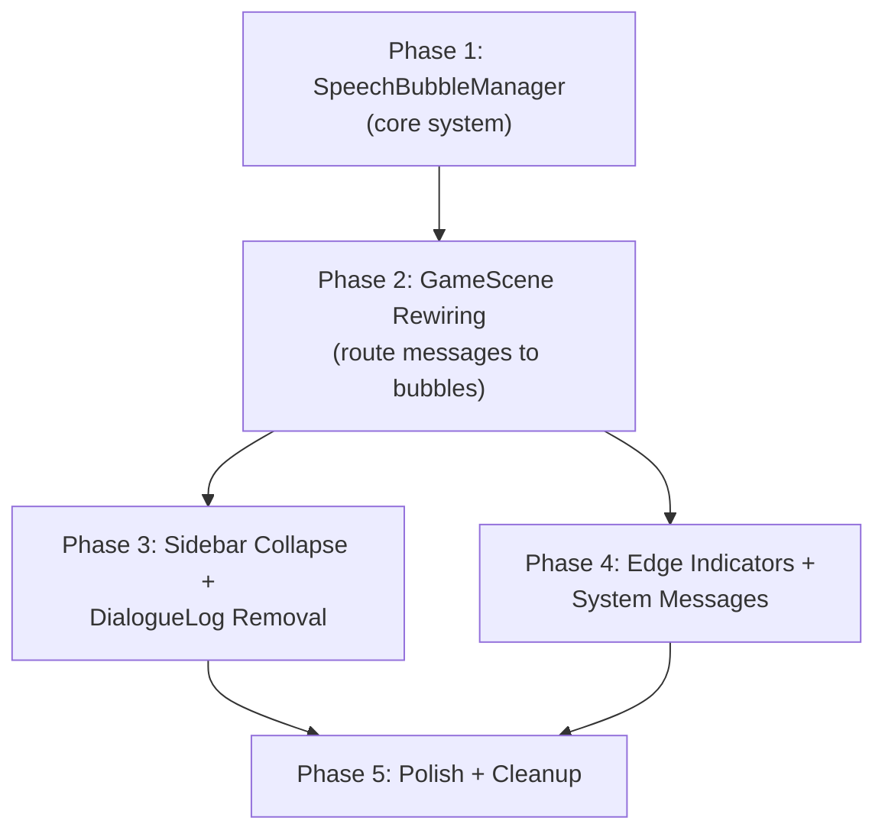

# Plan: Agent Speech Bubbles

## Phase dependency graph

Phases 3 and 4 are independent of each other and can be done in either order. Phase 5 is the final polish pass.

---

## Phase 1: SpeechBubbleManager (core system)

Build the new `SpeechBubbleManager` class in isolation. No wiring to GameScene yet; just the class with its API.

**Tasks:**

1. Create `client/src/systems/SpeechBubbleManager.ts` with:
   - Constructor takes a `Phaser.Scene`
   - `updateBubble(agentId, type, text, x, y, agentColor, agentName)` — creates or updates a bubble
   - `repositionBubble(agentId, x, y)` — moves bubble to follow sprite
   - `removeBubble(agentId)` — destroys bubble and cleans up
   - `update(camera)` — called per-frame; handles off-screen detection and edge indicators
   - Internal `Map<string, AgentBubbleState>` for tracking
2. Implement bubble rendering: Rectangle bg + Text content + Text name tag + Triangle tail
   - `speak` type: solid dark bubble (`0x1a1a3a`), white text, colored name, visible tail pointing down
   - `think` type: darker/transparent bubble (`0x111128`), italic `#a0a0d0` text, no tail (or dotted border)
   - `activity` type: compact single-line, tool icon + text, smallest font, no tail
3. Implement hybrid persistence:
   - `speak`: no auto-fade; persists until replaced by next message from same agent
   - `think`: fade after 4s delay + 2s fade (cancel on new message)
   - `activity`: fade after 3s delay + 1s fade (cancel on new message)
4. Implement text truncation: max ~100 chars, word-boundary truncation with ellipsis
5. Implement overlap/stacking: when creating/updating a bubble, check other bubble positions and offset upward if within collision distance (bubble height + 4px gap)
6. Write unit tests for SpeechBubbleManager

**Test:**
- Unit tests pass for create, update, reposition, remove, truncation, fade behavior
- Can instantiate SpeechBubbleManager in a mock Phaser scene

---

## Phase 2: GameScene Rewiring

Reroute message handling in GameScene from ThoughtBubble/UIScene to SpeechBubbleManager.

**Tasks:**

1. Import and instantiate `SpeechBubbleManager` in GameScene.create()
2. Rewrite `agent:thought` handler: call `speechBubbleManager.updateBubble()` instead of `thoughtBubble.show()`. Remove the UIScene emit for `agent-thought`.
3. Rewrite `agent:activity` handler: call `speechBubbleManager.updateBubble()` instead of emitting to UIScene. Look up agent name/color from the sprite.
4. Rewrite `action:result` handler for `speak` case: call `speechBubbleManager.updateBubble()` instead of emitting `show-dialogue` to UIScene.
5. Rewrite `action:result` handler for `think` case: call `speechBubbleManager.updateBubble()` instead of `thoughtBubble.show()` + UIScene emit.
6. Wire up `repositionBubble()` in the movement handler (`case 'move'` in handleAction) — after walkTo, tween the bubble to the new position.
7. Wire up `removeBubble()` when agents are removed/disconnected.
8. Add `speechBubbleManager.update(this.cameras.main)` to GameScene.update() for per-frame edge indicator logic.
9. Remove ThoughtBubble import and instantiation from GameScene.
10. Update UIScene: remove `dialogueLog` instantiation, remove `onShowDialogue`, `onAgentThought`, `onAgentActivity` handlers and the event listeners. Keep `statusText`, `agentInfo` tracking, `agentDetailsPanel`.

**Test:**
- Start the client, trigger agent messages → bubbles appear above sprites, no right-panel log entries
- Agent walks → bubble follows
- Rapid messages → bubble updates without visual glitch
- Server tests still pass (`npm run test -w server`)
- Client builds clean (`npm run build -w client`)

---

## Phase 3: Sidebar Collapse + DialogueLog Removal

Make the sidebar collapsible and remove DialogueLog artifacts.

**Tasks:**

1. In `index.html`: remove `

` from the sidebar.
2. In `index.html`: add a collapse/expand toggle button at the top of `#sidebar`. Use a simple `<<` / `>>` chevron icon.
3. In `index.html` CSS: add `.sidebar-collapsed` class that sets `width: 0; overflow: hidden; border: none` with a CSS transition. The toggle button should remain visible (positioned absolutely or outside the sidebar flow).
4. Add JS in `main.ts` (or a small `SidebarToggle.ts` helper) to toggle `.sidebar-collapsed` on click.
5. Remove unused DialogueLog CSS (`.chat-bubble`, `.chat-bubble-agent`, `.chat-bubble-thought`, `.chat-bubble-activity`, `.chat-bubble-player`, `.chat-bubble-system`, `.chat-bubble-finding`, `.chat-bubble-stage-announce`, `.chat-bubble-header`, `.chat-agent-name`, `.chat-timestamp`, `.chat-bubble-body`, `.chat-show-more`, `.truncated`, `.activity-icon`).
6. Clean up the text in `session-complete-hint` that references "the dialogue log on the right" — update to match new UX.
7. Verify PromptBar, AgentDetailsPanel, StageProgressBar, Settings still render correctly within the collapsible sidebar.

**Test:**
- Toggle button collapses/expands sidebar with smooth transition
- Game canvas resizes to fill space when sidebar collapses
- PromptBar still accepts input when sidebar is expanded
- No console errors from removed DialogueLog references
- Client builds clean

---

## Phase 4: Edge Indicators + System Messages

Handle off-screen agents and orphaned system messages (findings, stage announcements).

**Tasks:**

1. In `SpeechBubbleManager.update(camera)`: for each agent bubble, check if sprite position is within camera viewport. If not, hide the bubble and show an edge indicator.
2. Edge indicator: small colored triangle (agent's color) at the nearest screen edge, pointing outward. Small text label with agent name beside it. Depth 30 (above bubbles).
3. When agent comes back on-screen, destroy edge indicator and show bubble again.
4. System messages (stage announcements, findings): create a `FloatingAnnouncement` utility (or method on SpeechBubbleManager) that renders centered text in the game world. Styled as a wide semi-transparent banner. Fades after 5s.
5. Reroute window events: `stage-announcement` → FloatingAnnouncement. `findings-posted` → FloatingAnnouncement with agent name prefix. `prompt-system-message` → FloatingAnnouncement.
6. Player messages (`prompt-player-message`): show as a brief floating text near the bottom of the canvas or keep in PromptBar's own UI. Not a speech bubble.

**Test:**
- Move camera so agents are off-screen → edge indicators appear at correct edges
- Move camera back → indicators gone, bubbles visible
- Stage announcement fires → centered floating text appears and fades
- Finding posted → floating text with agent name appears

---

## Phase 5: Polish + Cleanup

Final pass for visual quality, dead code removal, and documentation.

**Tasks:**

1. Delete `client/src/systems/ThoughtBubble.ts` (fully replaced).
2. Review `client/src/panels/DialogueLog.ts` — if no remaining consumers, delete the file. If window events still reference it, ensure they're rerouted first.
3. Adjust bubble styling for visual polish: border radius simulation (rounded rectangle or 9-slice), consistent spacing, font sizes that read well at the 640x480 canvas resolution.
4. Test with 1, 3, 5, and 10+ agents to verify stacking/overlap behavior holds up.
5. Run full test suite: `npm run test -w server && npm run test -w client && npm run build -w client`.
6. Update `docs/diagrams/client-rendering.md` to reflect the new bubble system and removed DialogueLog.

**Test:**
- Full test suite green
- Client builds without warnings
- Visual spot-check: bubbles look polished, readable, correctly positioned
- No dead code / unused imports

---

## Test List

Derived from Brief requirements and Architecture failure modes:

### SpeechBubbleManager unit tests
- [ ] `updateBubble()` creates a new bubble when agent has none
- [ ] `updateBubble()` updates existing bubble text when called again
- [ ] `updateBubble()` with type `speak` does not auto-fade
- [ ] `updateBubble()` with type `think` starts fade tween after 4s
- [ ] `updateBubble()` with type `activity` starts fade tween after 3s
- [ ] New message cancels in-progress fade tween
- [ ] `repositionBubble()` moves all bubble objects to new coordinates
- [ ] `removeBubble()` destroys all Phaser objects and removes from map
- [ ] Text longer than 100 chars is truncated with ellipsis
- [ ] Stacking: two agents at same position → second bubble offset upward
- [ ] Stacking: three agents clustered → all three bubbles visible and separated

### Integration / wiring tests
- [ ] `agent:thought` message → SpeechBubbleManager.updateBubble() called (not DialogueLog)
- [ ] `agent:activity` message → SpeechBubbleManager.updateBubble() called
- [ ] `action:result` with `speak` → SpeechBubbleManager.updateBubble() called
- [ ] `action:result` with `think` → SpeechBubbleManager.updateBubble() called
- [ ] Agent move → `repositionBubble()` called with new coordinates
- [ ] Agent removed → `removeBubble()` called

### Edge cases
- [ ] Off-screen agent → bubble hidden, edge indicator shown
- [ ] Agent returns on-screen → edge indicator removed, bubble restored
- [ ] Agent sends message before sprite exists → no crash, message handled gracefully
- [ ] All agents removed → SpeechBubbleManager has empty state, no orphaned objects

### Sidebar
- [ ] Toggle button collapses sidebar
- [ ] Toggle button expands sidebar
- [ ] Game canvas fills available space when collapsed
- [ ] PromptBar functional in expanded state
- [ ] No console errors from removed DialogueLog

### System messages
- [ ] Stage announcement → floating centered text appears
- [ ] Finding posted → floating text with agent name
- [ ] Floating text fades after ~5 seconds

---

## Definition of Done

- [ ] Per-agent speech bubbles render above sprites for all message types (speak, think, activity)
- [ ] Hybrid persistence works: speech persists, thoughts/activity fade
- [ ] Bubbles follow agents when they move
- [ ] Bubbles stack when agents are clustered (readable, not overlapping)
- [ ] Long text is truncated
- [ ] Sidebar is collapsible with toggle button
- [ ] DialogueLog removed from UI; no interleaved log visible
- [ ] Off-screen edge indicators show for agents outside camera view
- [ ] System messages (stage announcements, findings) render as floating text
- [ ] All existing server tests pass
- [ ] Client builds clean with no type errors
- [ ] `docs/diagrams/client-rendering.md` updated
- [ ] Human has reviewed and approved
