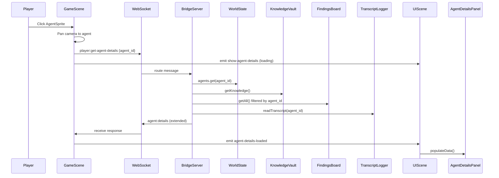

# Design: Agent History Sidebar Panel

## Overview

Clicking an agent sprite opens a sidebar panel showing that agent's full history: findings posted, insights learned, actions taken (tool calls), and internal thoughts. Data is pulled from FindingsBoard (Redis/JSON), KnowledgeVault (JSON), and TranscriptLogger (JSONL) — all filtered to the clicked agent.

## Data Flow



## Server Changes

### 1. Extend `AgentDetailsMessage` (`shared/protocol.ts`)

Add a `transcript` field to the existing response type:

```typescript
export interface AgentDetailsMessage {
  type: 'agent:details';
  agent_id: string;
  info: AgentInfo;
  knowledge: {
    expertise: Record<string, number>;
    insights: string[];
    task_history: Array<{ task: string; outcome: string; timestamp: string }>;
  };
  findings: Array<{
    id: string;
    finding: string;
    severity: 'low' | 'medium' | 'high';
    timestamp: string;
  }>;
  transcript: {
    thoughts: Array<{ text: string; timestamp: string }>;
    actions: Array<{ tool: string; input: string; timestamp: string }>;
  };
}
```

### 2. Add `readTranscript()` to TranscriptLogger

TranscriptLogger is currently write-only. Add a read method:

```typescript
async readTranscript(agentId: string): Promise<Array<{ timestamp: string; message: unknown }>>
```

Reads today's JSONL file for the given agent, parses each line, returns the entries. Returns empty array if file doesn't exist.

### 3. Extend `handleGetAgentDetails` in BridgeServer

After fetching knowledge and findings, also read the transcript. Categorize entries:

- **thoughts**: entries where `message.type` indicates agent thinking/reasoning
- **actions**: entries where `message.type` indicates tool use

Cap each category at 50 most recent entries.

## Client Changes

### 4. AgentDetailsPanel (`client/src/panels/AgentDetailsPanel.ts`)

New DOM overlay panel with 4 collapsible sections:

```
┌─────────────────────────────┐
│  ✕  Agent Name (Role)       │
│      Status: active          │
├─────────────────────────────┤
│ ▾ Findings (3)              │
│   • "We should consider..." │
│   • "Alternative approach..." │
├─────────────────────────────┤
│ ▾ Insights (5)              │
│   • "TypeScript expertise"  │
│   • "Learned about..."      │
├─────────────────────────────┤
│ ▾ Actions (12)              │
│   • PostFindings: "idea..." │
│   • CompleteStage           │
├─────────────────────────────┤
│ ▾ Thoughts (8)              │
│   • "I should focus on..."  │
│   • "Considering the..."    │
└─────────────────────────────┘
```

**Behavior:**
- Click agent → panel slides in from right
- Click same agent or ✕ → panel hides
- Click different agent → content swaps
- Each section scrolls independently
- Sections are collapsible (click header to toggle)

**Methods:**
- `show(agentId, name, color)` — show with loading state
- `hide()` — hide panel
- `populateData(details: AgentDetailsMessage)` — fill all sections
- `clear()` — reset contents

**Styling:** Dungeon stone palette matching existing UI chrome.

### 5. HTML Container (`client/index.html`)

Add `<div id="agent-details-panel" class="panel hidden"></div>` in the sidebar area. Add CSS for the panel layout, collapsible sections, scroll containers, and dungeon styling.

### 6. Wiring (GameScene + UIScene)

**GameScene.ts** — Extend existing `pointerdown` handler:
```typescript
sprite.on('pointerdown', () => {
  // Existing: pan camera
  this.cameraController?.panTo(sprite.getX(), sprite.getY(), agent.agent_id);
  // New: request details
  this.wsClient.send({ type: 'player:get-agent-details', agent_id: agent.agent_id });
  this.scene.get('UIScene').events.emit('show-agent-details', {
    agent_id: agent.agent_id, name: agent.name, color: agent.color,
  });
});
```

Add WebSocket listener:
```typescript
this.wsClient.on('agent:details', (msg) => {
  this.scene.get('UIScene').events.emit('agent-details-loaded', msg);
});
```

**UIScene.ts** — Instantiate AgentDetailsPanel, listen for events, route to panel methods.

## Scope

**In scope:**
- Extend AgentDetailsMessage with transcript data
- Add readTranscript() to TranscriptLogger
- Extend handleGetAgentDetails to include transcript
- Create AgentDetailsPanel.ts (4 collapsible sections)
- Add HTML container + CSS in index.html
- Wire GameScene click → WS → UIScene → panel
- Server test for extended response

**Out of scope:**
- Pagination (cap at 50 per category)
- Real-time streaming updates
- KnowledgeVault Redis migration
- Export/download agent history

## Task Ownership

This is Behrang's domain (Core Engine / Agent Orchestration). Server changes (protocol, handler, TranscriptLogger) are core engine work. Client panel work was originally assigned to Ida (Tasks 55c-55e) but since Behrang is implementing the full feature, he'll handle both sides and leave a bulletin board note for Ida.

## Files Changed

| File | Change |
|------|--------|
| `shared/protocol.ts` | Extend AgentDetailsMessage |
| `server/src/types.ts` | Mirror type changes |
| `client/src/types.ts` | Mirror type changes |
| `server/src/TranscriptLogger.ts` | Add readTranscript() |
| `server/src/BridgeServer.ts` | Extend handleGetAgentDetails |
| `server/src/__tests__/` | Test extended response |
| `client/src/panels/AgentDetailsPanel.ts` | New file |
| `client/index.html` | Sidebar container + CSS |
| `client/src/scenes/GameScene.ts` | Click handler + WS listener |
| `client/src/scenes/UIScene.ts` | Panel instantiation + events |
